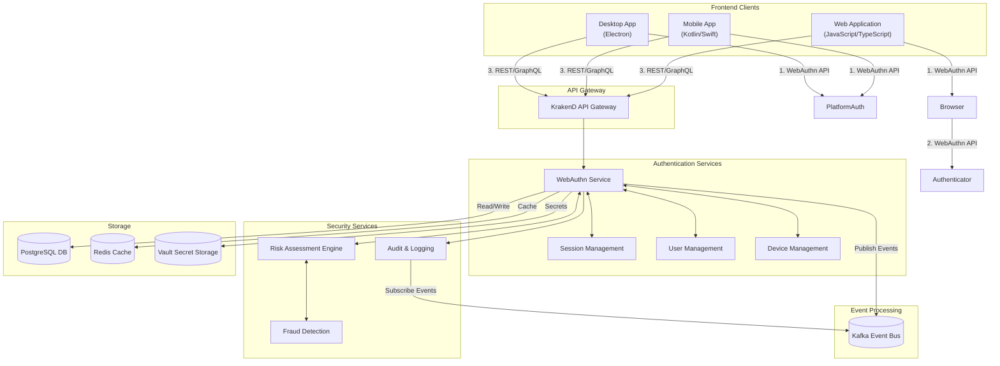
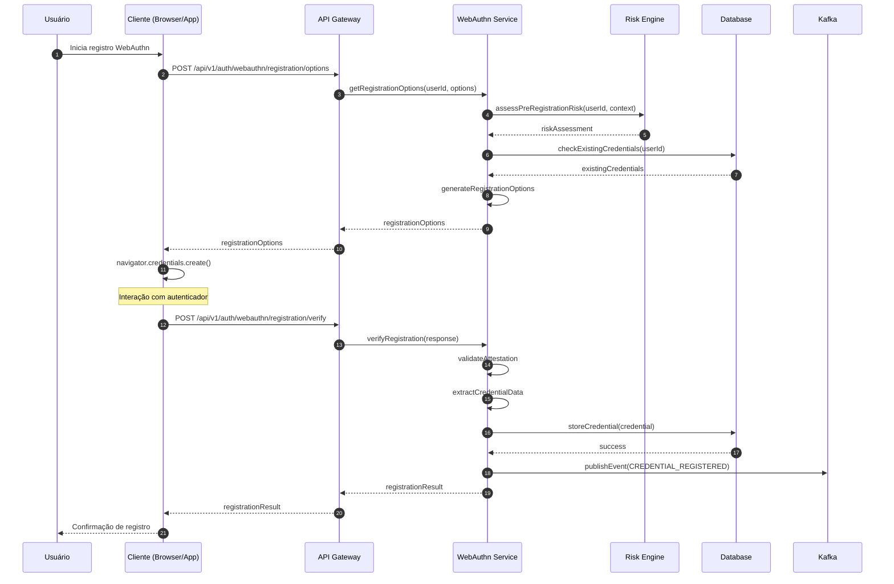
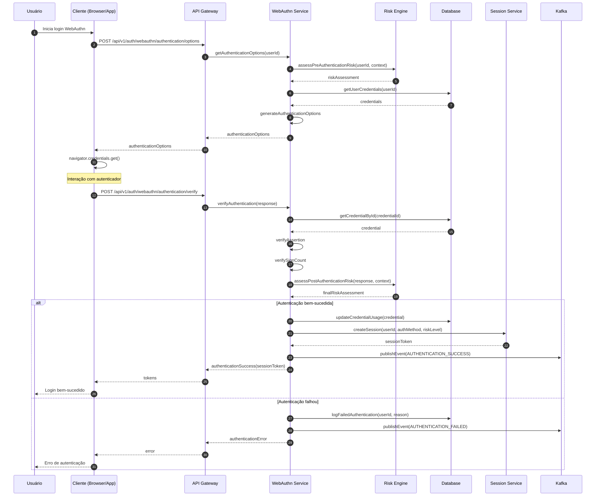
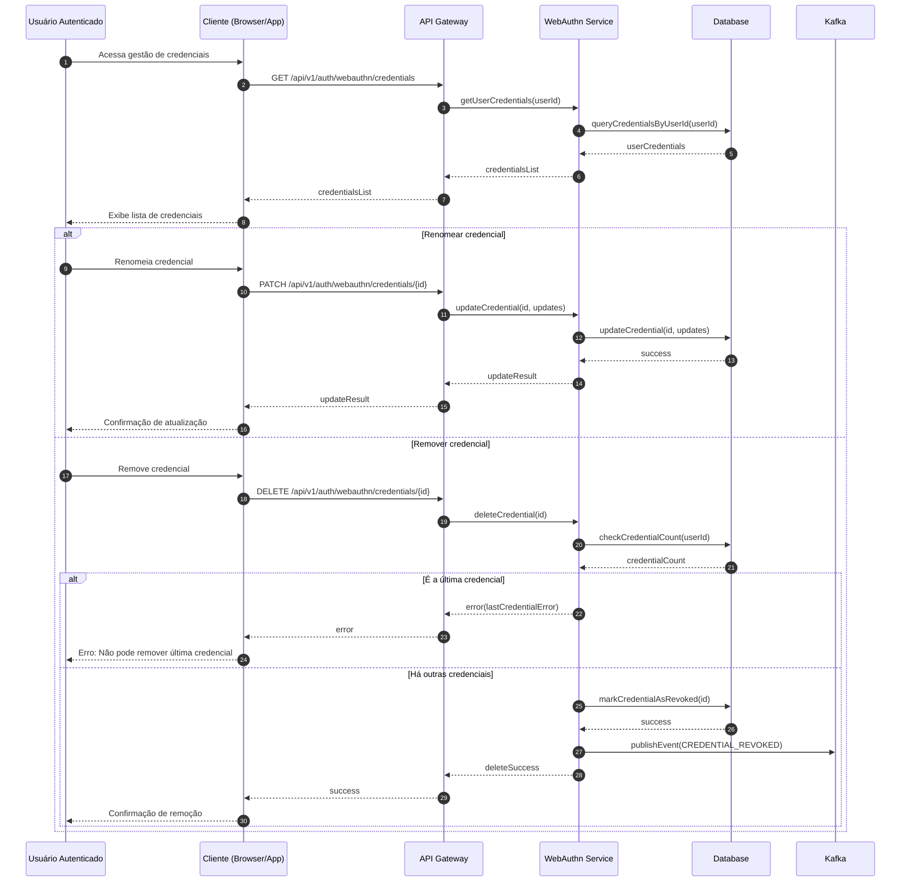

# 🔐 Especificação de Implementação WebAuthn/FIDO2
# INNOVABIZ IAM - Parte 1: Visão Geral e Arquitetura

```
Versão: 1.0.0
Data: 31/07/2025
Status: Em desenvolvimento
Classificação: Confidencial - Interno
```

## 📑 Sumário Executivo

Este documento fornece a especificação técnica detalhada para implementação de autenticação WebAuthn/FIDO2 na plataforma INNOVABIZ IAM. A implementação segue os padrões FIDO Alliance, W3C WebAuthn Level 3, recomendações NIST SP 800-63B para AAL2/AAL3, e atende aos requisitos regulatórios nas regiões de operação da plataforma. A especificação abrange arquitetura, componentes técnicos, fluxos de autenticação, armazenamento seguro, e considerações de implementação para backend, frontend e mobile.

WebAuthn (Web Authentication) combinado com FIDO2 foi priorizado como método crítico (P0) por oferecer autenticação sem senha resistente a phishing, com suporte para múltiplos fatores de autenticação, e excelente equilíbrio entre segurança e experiência do usuário.

### 🎯 Objetivos da Implementação

- Eliminar riscos de phishing e ataques de credenciais
- Reduzir fricção no processo de autenticação
- Suportar AAL2 e AAL3 (NIST SP 800-63B)
- Implementar autenticação sem senha com chaves de segurança e biometria
- Fornecer integração transparente com o ecossistema INNOVABIZ
- Garantir compatibilidade multiplataforma (web, mobile, desktop)

### 📊 Benefícios Esperados

- **Segurança**: Eliminação de ataques de phishing e vazamento de credenciais
- **Experiência**: Redução de 60% no tempo de autenticação
- **Adoção**: Facilidade de uso para 95% dos usuários
- **Compliance**: Atendimento a requisitos regulatórios globais
- **Custo**: Redução de 75% nos incidentes de segurança relacionados a credenciais
- **Operacional**: Diminuição de 85% nas solicitações de redefinição de senha

## 🏛️ Fundamentos e Princípios

### Padrões e Frameworks Aplicáveis

```yaml
standards:
  - name: "W3C Web Authentication (WebAuthn) Level 3"
    version: "Recommendation, Julho 2024"
    url: "https://www.w3.org/TR/webauthn-3/"
    key_aspects:
      - "API para criação e gestão de credenciais de autenticação"
      - "Suporte a autenticadores plataforma e roaming"
      - "Cerimônias de registro e autenticação"
      
  - name: "FIDO2 Client to Authenticator Protocol (CTAP2)"
    version: "2.1, Junho 2023"
    url: "https://fidoalliance.org/specs/fido-v2.1-ps-20210615/fido-client-to-authenticator-protocol-v2.1-ps-20210615.html"
    key_aspects:
      - "Protocolo de comunicação cliente-autenticador"
      - "Suporte a USB, NFC, BLE"
      - "Verificação de usuário no autenticador"
      
  - name: "NIST SP 800-63B Digital Identity Guidelines"
    version: "Rev. 4, Junho 2024"
    url: "https://pages.nist.gov/800-63-4/sp800-63b.html"
    key_aspects:
      - "Requisitos para AAL2 (autenticação multi-fator)"
      - "Requisitos para AAL3 (autenticação multi-fator com hardware)"
      - "Proteção contra ameaças específicas"
```

### Princípios de Implementação

```yaml
implementation_principles:
  security:
    - "Defense-in-depth: múltiplas camadas de segurança"
    - "Zero knowledge: servidores não armazenam segredos privados"
    - "Verificação na origem: validação criptográfica do dispositivo de origem"
    - "Resistência a ataques MitM e phishing"
    
  usability:
    - "Sem senha: eliminação de senhas memoráveis"
    - "Sem transcribing: usuário não precisa copiar ou digitar códigos"
    - "Experiência consistente: fluxos semelhantes em diferentes plataformas"
    - "Fallbacks: mecanismos alternativos quando necessário"
    
  privacy:
    - "Minimização de dados: coleta apenas o necessário"
    - "Attestation anônima: proteção da identidade dos autenticadores"
    - "Pseudonymous identifiers: identificadores não rastreáveis entre sites"
    
  multi_context:
    - "Suporte multi-tenant: isolamento de dados por tenant"
    - "Suporte multi-regional: adequação a leis locais"
    - "Adaptabilidade a diferentes perfis de risco"
    - "Configurações granulares por contexto de negócio"
```

### Casos de Uso e Cenários

| Caso de Uso | Descrição | Requisitos Específicos | Prioridade |
|-------------|-----------|------------------------|------------|
| Registro Inicial | Primeiro registro de credencial WebAuthn | Verificação de identidade pré-existente, registro de múltiplas credenciais | Alta |
| Login Primário | Login usando credencial WebAuthn como único fator | Suporte cross-platform, compatibilidade de navegadores | Alta |
| Login MFA | WebAuthn como segundo fator após outro método | Integração com fluxo MFA, avaliação de risco | Alta |
| Step-up Authentication | Elevação de privilégios para operações sensíveis | Política baseada em risco, transição fluida | Média |
| Transações Críticas | Autorização de transações financeiras de alto valor | Verificação de usuário no autenticador (UV=true) | Alta |
| Gestão de Credenciais | Adição, remoção e edição de credenciais | Interface de administração, auditoria | Média |
| Recuperação de Acesso | Processo quando credenciais não estão disponíveis | Verificação alternativa de identidade | Alta |
| Uso Corporativo | Integração com gestão de identidades corporativas | Attestation verificável, políticas MDM | Média |
| Dispositivos Compartilhados | Uso em terminais públicos ou compartilhados | Remoção de estado residual, detecção de contexto | Baixa |

## 🏗️ Arquitetura Técnica

### Visão Geral da Arquitetura



### Componentes Principais

#### 1. Frontend Components

```yaml
frontend_components:
  web:
    - name: "WebAuthn Client"
      description: "Biblioteca JavaScript para interação com a API WebAuthn"
      responsibilities:
        - "Orquestração do fluxo de autenticação"
        - "Interação com a API WebAuthn do navegador"
        - "Codificação/decodificação de dados"
      implementation_options:
        - name: "@simplewebauthn/browser"
          url: "https://github.com/MasterKale/SimpleWebAuthn"
          recommendation: "Recomendado pela simplicidade e manutenção ativa"
        - name: "@github/webauthn-json"
          url: "https://github.com/github/webauthn-json"
          recommendation: "Alternativa robusta com bom suporte"
    
  mobile:
    - name: "Android FIDO2 Client"
      description: "Integração com a FIDO2 API do Android"
      responsibilities:
        - "Integração com Biometric API e Credential Manager"
        - "Armazenamento seguro de credenciais"
      implementation_options:
        - name: "Android Fido2 API"
          url: "https://developer.android.com/reference/android/security/identity/IdentityCredential"
          recommendation: "API nativa oficial"
    
    - name: "iOS FIDO2 Client"
      description: "Integração com a PassKey API do iOS"
      responsibilities:
        - "Integração com FaceID/TouchID"
        - "Armazenamento no Keychain"
      implementation_options:
        - name: "ASAuthorization API"
          url: "https://developer.apple.com/documentation/authenticationservices/asauthorizationpublickeyrequest"
          recommendation: "API nativa oficial para Passkeys"
```

#### 2. Backend Components

```yaml
backend_components:
  - name: "WebAuthn Service"
    description: "Serviço para registro e verificação de credenciais WebAuthn"
    responsibilities:
      - "Geração de opções de registro e autenticação"
      - "Validação de respostas de registro e autenticação"
      - "Armazenamento e recuperação de credenciais"
      - "Gerenciamento do ciclo de vida de credenciais"
    implementation_options:
      - name: "Simple WebAuthn (server)"
        language: "TypeScript/JavaScript"
        url: "https://github.com/MasterKale/SimpleWebAuthn"
      - name: "Webauthn4j"
        language: "Java"
        url: "https://github.com/webauthn4j/webauthn4j"
      - name: "Yubico java-webauthn-server"
        language: "Java"
        url: "https://github.com/Yubico/java-webauthn-server"
    
  - name: "Session Management Service"
    description: "Gerenciamento de sessões autenticadas"
    responsibilities:
      - "Criação e validação de tokens de sessão"
      - "Armazenamento de estado de sessão"
      - "Expiração e renovação de sessões"
      - "Revogação de sessões"
    
  - name: "Risk Assessment Engine"
    description: "Avaliação de risco para decisões de autenticação adaptativa"
    responsibilities:
      - "Análise de contexto de autenticação"
      - "Determinação de nível de risco"
      - "Recomendação de requisitos adicionais"
    
  - name: "Audit Service"
    description: "Registro e auditoria de eventos de autenticação"
    responsibilities:
      - "Registro imutável de eventos"
      - "Alertas para eventos suspeitos"
      - "Relatórios de conformidade"
```

#### 3. Data Model

```yaml
data_model:
  - entity: "WebAuthnCredential"
    description: "Credencial de autenticação WebAuthn"
    attributes:
      - name: "id"
        type: "UUID"
        description: "Identificador único da credencial no sistema"
      - name: "userId"
        type: "UUID"
        description: "Identificador do usuário associado"
      - name: "tenantId"
        type: "UUID"
        description: "Identificador do tenant para multi-tenancy"
      - name: "credentialId"
        type: "Base64URL String"
        description: "ID da credencial gerado pelo autenticador"
      - name: "publicKey"
        type: "COSE Key (Base64URL)"
        description: "Chave pública para verificação"
      - name: "attestationFormat"
        type: "String"
        description: "Formato da attestation (none, indirect, direct)"
      - name: "attestationData"
        type: "JSON"
        description: "Dados de attestation (opcional, para auditoria)"
      - name: "aaguid"
        type: "UUID"
        description: "ID global do modelo do autenticador"
      - name: "signCount"
        type: "Long"
        description: "Contador de assinaturas para detecção de clonagem"
      - name: "createdAt"
        type: "Timestamp"
        description: "Data de criação da credencial"
      - name: "updatedAt"
        type: "Timestamp"
        description: "Última atualização da credencial"
      - name: "lastUsedAt"
        type: "Timestamp"
        description: "Último uso da credencial"
      - name: "userVerified"
        type: "Boolean"
        description: "Indica se o autenticador suporta verificação do usuário"
      - name: "backupEligible"
        type: "Boolean"
        description: "Indica se a credencial é elegível para backup"
      - name: "backupState"
        type: "Boolean"
        description: "Estado atual de backup"
      - name: "transports"
        type: "String[]"
        description: "Métodos de transporte suportados (USB, NFC, BLE)"
      - name: "deviceType"
        type: "Enum"
        description: "Tipo de dispositivo (platform, cross-platform)"
      - name: "friendlyName"
        type: "String"
        description: "Nome amigável definido pelo usuário"
      - name: "status"
        type: "Enum"
        description: "Status da credencial (active, revoked, suspended)"
      - name: "riskScore"
        type: "Double"
        description: "Score de risco associado à credencial"
    indices:
      - name: "pk_webauthn_credential"
        columns: ["id"]
        type: "PRIMARY KEY"
      - name: "idx_webauthn_credential_user"
        columns: ["userId", "tenantId"]
      - name: "idx_webauthn_credential_id"
        columns: ["credentialId"]
  
  - entity: "WebAuthnAuthentication"
    description: "Registro de eventos de autenticação WebAuthn"
    attributes:
      - name: "id"
        type: "UUID"
        description: "Identificador único do evento"
      - name: "credentialId"
        type: "UUID"
        description: "Referência à credencial utilizada"
      - name: "userId"
        type: "UUID"
        description: "Identificador do usuário"
      - name: "tenantId"
        type: "UUID"
        description: "Identificador do tenant"
      - name: "timestamp"
        type: "Timestamp"
        description: "Momento da autenticação"
      - name: "userVerified"
        type: "Boolean"
        description: "Se houve verificação do usuário"
      - name: "clientData"
        type: "JSON"
        description: "Dados do cliente (user agent, origem, etc)"
      - name: "ipAddress"
        type: "String"
        description: "Endereço IP da autenticação"
      - name: "geoLocation"
        type: "String"
        description: "Localização geográfica aproximada"
      - name: "signCount"
        type: "Long"
        description: "Contador de assinaturas"
      - name: "prevSignCount"
        type: "Long"
        description: "Contador anterior de assinaturas"
      - name: "result"
        type: "Enum"
        description: "Resultado da autenticação"
      - name: "errorCode"
        type: "String"
        description: "Código de erro, se aplicável"
      - name: "riskScore"
        type: "Double"
        description: "Score de risco calculado"
    indices:
      - name: "pk_webauthn_authentication"
        columns: ["id"]
        type: "PRIMARY KEY"
      - name: "idx_webauthn_auth_user"
        columns: ["userId", "tenantId"]
      - name: "idx_webauthn_auth_cred"
        columns: ["credentialId"]
      - name: "idx_webauthn_auth_time"
        columns: ["timestamp"]
```

### Segurança de Dados e Criptografia

```yaml
data_security:
  credential_storage:
    - "Chaves públicas armazenadas em texto plano (são públicas por definição)"
    - "Credenciais vinculadas a um único usuário e tenant"
    - "Row-level security no PostgreSQL para isolamento por tenant"
    - "Identificadores de credencial tratados como dados sensíveis"
    
  data_protection:
    - "Dados em repouso criptografados com TDE no PostgreSQL"
    - "Proteção de campo-nível adicional para dados sensíveis"
    - "Rotação periódica de chaves de criptografia"
    - "Controle de acesso baseado em papéis (RBAC) aos dados"
    
  secure_communications:
    - "TLS 1.3 para todas as comunicações"
    - "Certificate pinning para clientes mobile"
    - "Mutual TLS (mTLS) para comunicações entre serviços"
    
  secrets_management:
    - "Relying Party ID protegido em Vault"
    - "Material de chaves críticas gerenciado em HSM"
```

## 🔄 Fluxos de Autenticação

### Fluxo de Registro WebAuthn



### Fluxo de Autenticação WebAuthn



### Fluxo de Gestão de Credenciais



## 📋 Requisitos de Implementação

### Requisitos Funcionais

1. **Registro de Credenciais**
   - O sistema deve suportar registro de múltiplas credenciais por usuário
   - Deve permitir nomeação amigável de credenciais
   - Deve validar attestation conforme política configurável
   - Deve garantir que credenciais sejam vinculadas ao usuário correto
   - Deve impedir registro duplicado de credenciais

2. **Autenticação**
   - Suporte a autenticação com e sem userVerification
   - Validação criptográfica de asserções
   - Detecção de clonagem via contadores de assinatura
   - Verificação de origem e RP ID
   - Suporte a autenticação sem nome de usuário (discoverable credentials)

3. **Gestão de Credenciais**
   - Interface para visualização de credenciais registradas
   - Capacidade de renomear e remover credenciais
   - Prevenção de remoção da última credencial
   - Backup e sincronização de credenciais (quando suportado)

4. **Resiliência e Recuperação**
   - Processo de recuperação para perda de credenciais
   - Métodos alternativos de autenticação como fallback
   - Detecção e mitigação de ataques

### Requisitos Não-Funcionais

```yaml
non_functional_requirements:
  performance:
    - "Tempo de resposta para verificação < 500ms (P95)"
    - "Capacidade de processar 1000+ autenticações/segundo"
    - "Latência adicional por autenticação < 200ms"
    
  scalability:
    - "Escalável horizontalmente para todos os componentes"
    - "Suporte a múltiplos clusters regionais"
    - "Balanceamento de carga transparente"
    
  availability:
    - "SLA de 99.99% para serviço de autenticação"
    - "Tolerância a falhas com failover automático"
    - "Operação multi-região para resiliência"
    
  security:
    - "Proteção contra replay attacks"
    - "Mitigação de ataques de canal lateral"
    - "Detecção de anomalias em tempo real"
    
  observability:
    - "Logs estruturados para todos os eventos de autenticação"
    - "Métricas detalhadas de uso e performance"
    - "Alertas para atividades anômalas"
    
  compatibility:
    - "Suporte a navegadores modernos: Chrome, Safari, Firefox, Edge"
    - "Compatibilidade com Android 9+ e iOS 15+"
    - "Adaptação para diferentes tipos de autenticadores"
```

### Requisitos de Segurança

| Requisito | Descrição | Implementação |
|-----------|-----------|---------------|
| Proteção contra phishing | Mitigar ataques de phishing e MitM | Verificação de origem e RP ID |
| Resistência a credenciais vazadas | Prevenir uso de credenciais comprometidas | Credenciais específicas por site e verificação criptográfica |
| Verificação de origem | Garantir que requisições venham da origem esperada | Validação de challengeResponse e origin |
| Proteção contra roubo de sessão | Prevenir sequestro de sessão | Tokens de sessão com vínculo ao contexto |
| Proteção contra ataques de força bruta | Limitar tentativas de autenticação | Rate limiting e detecção de anomalias |
| Isolamento multi-tenant | Garantir separação entre tenants | Row-Level Security e validação de contexto |
| Auditoria completa | Registrar todas as atividades críticas | Logs imutáveis e trilhas de auditoria |
| Confidencialidade de dados | Proteger dados sensíveis | Criptografia em repouso e em trânsito |

---

*Este documento continua na Parte 2, que detalha a implementação backend e frontend específica.*

*Preparado pela Equipe de Segurança e Arquitetura INNOVABIZ | Última Atualização: 31/07/2025*