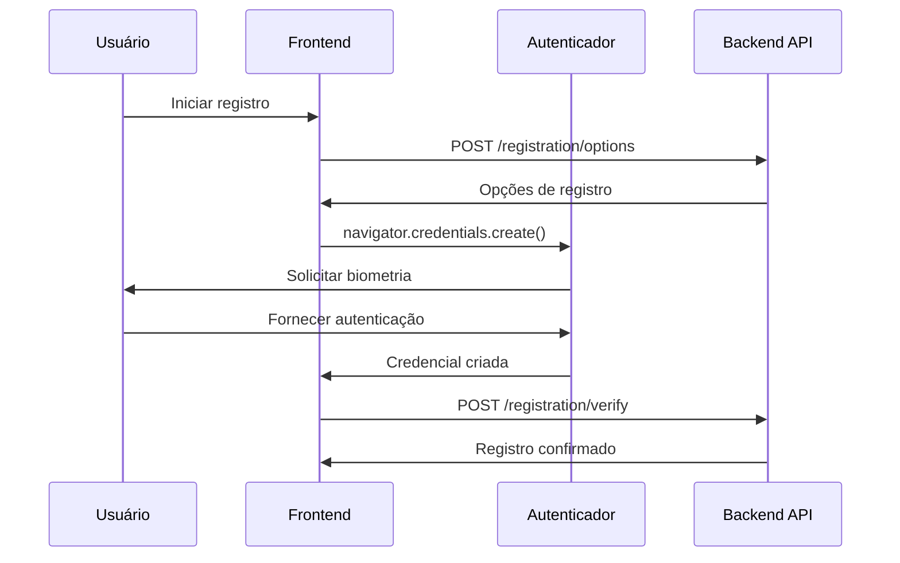

# WebAuthn Frontend Integration Guide

**Documento:** Guia de Integração Frontend WebAuthn/FIDO2  
**Versão:** 1.0.0  
**Data:** 31/07/2025  
**Autor:** Equipe de Desenvolvimento INNOVABIZ  
**Classificação:** Confidencial - Interno  

## Índice

1. [Visão Geral](#1-visão-geral)
2. [Pré-requisitos](#2-pré-requisitos)
3. [Configuração Inicial](#3-configuração-inicial)
4. [Implementação de Registro](#4-implementação-de-registro)
5. [Implementação de Autenticação](#5-implementação-de-autenticação)
6. [Gerenciamento de Credenciais](#6-gerenciamento-de-credenciais)
7. [Tratamento de Erros](#7-tratamento-de-erros)
8. [Boas Práticas](#8-boas-práticas)

## 1. Visão Geral

Este guia fornece instruções para integrar WebAuthn/FIDO2 em aplicações frontend.

### 1.1 Arquitetura de Integração



## 2. Pré-requisitos

### 2.1 Navegadores Suportados

| Navegador | Versão Mínima | Suporte |
|-----------|---------------|---------|
| Chrome | 67+ | ✅ Completo |
| Firefox | 60+ | ✅ Completo |
| Safari | 14+ | ✅ Completo |
| Edge | 18+ | ✅ Completo |

### 2.2 Dependências

```bash
npm install @simplewebauthn/browser
```

## 3. Configuração Inicial

```typescript
// config/webauthn.ts
export const webauthnConfig = {
  apiBaseUrl: process.env.REACT_APP_API_URL || 'https://api.innovabiz.com',
  endpoints: {
    registrationOptions: '/api/v1/webauthn/registration/options',
    registrationVerify: '/api/v1/webauthn/registration/verify',
    authenticationOptions: '/api/v1/webauthn/authentication/options',
    authenticationVerify: '/api/v1/webauthn/authentication/verify',
    credentials: '/api/v1/webauthn/credentials'
  },
  timeouts: {
    registration: 60000,
    authentication: 60000
  }
};
```

## 4. Implementação de Registro

```typescript
// services/registration.ts
import { startRegistration } from '@simplewebauthn/browser';

export class RegistrationService {
  async register(options: RegistrationOptions): Promise<RegistrationResult> {
    try {
      // 1. Obter opções do backend
      const registrationOptions = await webauthnAPI.post(
        webauthnConfig.endpoints.registrationOptions,
        options
      );

      // 2. Iniciar registro no navegador
      const registrationResponse = await startRegistration(registrationOptions);

      // 3. Verificar no backend
      const result = await webauthnAPI.post<RegistrationResult>(
        webauthnConfig.endpoints.registrationVerify,
        registrationResponse
      );

      return result;
    } catch (error) {
      throw this.handleWebAuthnError(error);
    }
  }

  private handleWebAuthnError(error: any): WebAuthnError {
    if (error.name === 'NotSupportedError') {
      return new WebAuthnError('NOT_SUPPORTED', 'WebAuthn não suportado');
    }
    if (error.name === 'NotAllowedError') {
      return new WebAuthnError('USER_CANCELLED', 'Operação cancelada');
    }
    return new WebAuthnError('REGISTRATION_FAILED', 'Falha no registro');
  }
}
```

## 5. Implementação de Autenticação

```typescript
// services/authentication.ts
import { startAuthentication } from '@simplewebauthn/browser';

export class AuthenticationService {
  async authenticate(options: AuthenticationOptions = {}): Promise<AuthenticationResult> {
    try {
      // 1. Obter opções do backend
      const authOptions = await webauthnAPI.post(
        webauthnConfig.endpoints.authenticationOptions,
        options
      );

      // 2. Iniciar autenticação
      const authResponse = await startAuthentication(authOptions);

      // 3. Verificar no backend
      const result = await webauthnAPI.post<AuthenticationResult>(
        webauthnConfig.endpoints.authenticationVerify,
        authResponse
      );

      return result;
    } catch (error) {
      throw this.handleWebAuthnError(error);
    }
  }
}
```

## 6. Gerenciamento de Credenciais

```typescript
// components/CredentialManager.tsx
export const CredentialManager: React.FC = () => {
  const [credentials, setCredentials] = useState<Credential[]>([]);

  const loadCredentials = async () => {
    const creds = await credentialService.getCredentials();
    setCredentials(creds);
  };

  const handleDelete = async (credentialId: string) => {
    await credentialService.deleteCredential(credentialId);
    await loadCredentials();
  };

  return (
    <div className="credential-manager">
      {credentials.map((credential) => (
        <div key={credential.id} className="credential-card">
          <h4>{credential.friendlyName}</h4>
          <p>{credential.deviceType}</p>
          <button onClick={() => handleDelete(credential.id)}>
            Remover
          </button>
        </div>
      ))}
    </div>
  );
};
```

## 7. Tratamento de Erros

```typescript
// utils/errorHandling.ts
export const ERROR_MESSAGES = {
  'NotSupportedError': 'WebAuthn não suportado',
  'SecurityError': 'Erro de segurança - use HTTPS',
  'NotAllowedError': 'Operação cancelada',
  'InvalidStateError': 'Credencial já existe',
  'ConstraintError': 'Restrições não atendidas'
};

export const handleWebAuthnError = (error: any): string => {
  return ERROR_MESSAGES[error.name] || 'Erro desconhecido';
};
```

## 8. Boas Práticas

### 8.1 UX/UI

- **Feedback visual claro** durante operações
- **Instruções específicas** por tipo de autenticador
- **Fallback para métodos tradicionais**
- **Indicadores de progresso**

### 8.2 Segurança

- **Sempre usar HTTPS** em produção
- **Validar origem** no backend
- **Implementar timeouts** adequados
- **Log de eventos** de segurança

### 8.3 Performance

- **Cache de configurações**
- **Lazy loading** de componentes
- **Otimização de bundles**
- **Preload de recursos**

### 8.4 Acessibilidade

- **Labels descritivos**
- **Suporte a teclado**
- **Alto contraste**
- **Screen readers**

---

**Desenvolvido pela equipe INNOVABIZ**  
**© 2025 INNOVABIZ. Todos os direitos reservados.**