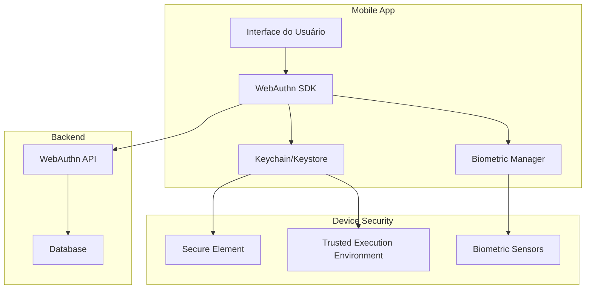

# WebAuthn Mobile SDK Integration Guide

**Documento:** Guia de Integração SDK Mobile WebAuthn/FIDO2  
**Versão:** 1.0.0  
**Data:** 31/07/2025  
**Autor:** Equipe de Desenvolvimento INNOVABIZ  
**Classificação:** Confidencial - Interno  

## Índice

1. [Visão Geral](#1-visão-geral)
2. [Plataformas Suportadas](#2-plataformas-suportadas)
3. [Implementação iOS](#3-implementação-ios)
4. [Implementação Android](#4-implementação-android)
5. [React Native](#5-react-native)
6. [Flutter](#6-flutter)
7. [Xamarin](#7-xamarin)
8. [Configuração de Segurança](#8-configuração-de-segurança)

## 1. Visão Geral

Este guia fornece instruções para integrar WebAuthn/FIDO2 em aplicações móveis nativas e híbridas.

### 1.1 Arquitetura Mobile



## 2. Plataformas Suportadas

### 2.1 Compatibilidade

| Plataforma | Versão Mínima | Biometria | Chaves Externas |
|------------|---------------|-----------|-----------------|
| iOS | 14.0+ | ✅ Face ID, Touch ID | ✅ NFC, Lightning |
| Android | 7.0+ (API 24) | ✅ Fingerprint, Face | ✅ NFC, USB |
| React Native | 0.60+ | ✅ Via bridge | ✅ Via bridge |
| Flutter | 2.0+ | ✅ Via plugins | ✅ Via plugins |
| Xamarin | .NET 6+ | ✅ Via bindings | ✅ Via bindings |

## 3. Implementação iOS

### 3.1 Configuração do Projeto

```xml
<!-- Info.plist -->
<key>NSFaceIDUsageDescription</key>
<string>Use Face ID para autenticação segura</string>
<key>NSCameraUsageDescription</key>
<string>Câmera necessária para autenticação</string>
<key>com.apple.developer.authentication-services.autofill-credential-provider</key>
<true/>
```

### 3.2 Implementação Swift

```swift
// WebAuthnManager.swift
import AuthenticationServices
import LocalAuthentication

@available(iOS 15.0, *)
class WebAuthnManager: NSObject, ObservableObject {
    
    private let relyingPartyIdentifier = "innovabiz.com"
    private let apiBaseURL = "https://api.innovabiz.com"
    
    // MARK: - Registration
    func registerCredential(
        userId: String,
        username: String,
        displayName: String
    ) async throws -> ASAuthorizationPlatformPublicKeyCredentialRegistration {
        
        // 1. Obter opções de registro do backend
        let registrationOptions = try await fetchRegistrationOptions(
            userId: userId,
            username: username,
            displayName: displayName
        )
        
        // 2. Criar provider de credencial
        let provider = ASAuthorizationPlatformPublicKeyCredentialProvider(
            relyingPartyIdentifier: relyingPartyIdentifier
        )
        
        // 3. Criar request de registro
        let request = provider.createCredentialRegistrationRequest(
            challenge: registrationOptions.challenge,
            name: username,
            userID: Data(userId.utf8)
        )
        
        request.displayName = displayName
        request.userVerificationPreference = .preferred
        
        // 4. Executar autorização
        let authController = ASAuthorizationController(authorizationRequests: [request])
        
        return try await withCheckedThrowingContinuation { continuation in
            let delegate = AuthorizationDelegate { result in
                switch result {
                case .success(let authorization):
                    if let credential = authorization.credential as? ASAuthorizationPlatformPublicKeyCredentialRegistration {
                        continuation.resume(returning: credential)
                    } else {
                        continuation.resume(throwing: WebAuthnError.invalidCredential)
                    }
                case .failure(let error):
                    continuation.resume(throwing: error)
                }
            }
            
            authController.delegate = delegate
            authController.presentationContextProvider = delegate
            authController.performRequests()
        }
    }
    
    // MARK: - Authentication
    func authenticateUser() async throws -> ASAuthorizationPlatformPublicKeyCredentialAssertion {
        
        // 1. Obter opções de autenticação
        let authOptions = try await fetchAuthenticationOptions()
        
        // 2. Criar provider
        let provider = ASAuthorizationPlatformPublicKeyCredentialProvider(
            relyingPartyIdentifier: relyingPartyIdentifier
        )
        
        // 3. Criar request de autenticação
        let request = provider.createCredentialAssertionRequest(
            challenge: authOptions.challenge
        )
        
        request.userVerificationPreference = .preferred
        
        // 4. Executar autorização
        let authController = ASAuthorizationController(authorizationRequests: [request])
        
        return try await withCheckedThrowingContinuation { continuation in
            let delegate = AuthorizationDelegate { result in
                switch result {
                case .success(let authorization):
                    if let credential = authorization.credential as? ASAuthorizationPlatformPublicKeyCredentialAssertion {
                        continuation.resume(returning: credential)
                    } else {
                        continuation.resume(throwing: WebAuthnError.invalidCredential)
                    }
                case .failure(let error):
                    continuation.resume(throwing: error)
                }
            }
            
            authController.delegate = delegate
            authController.presentationContextProvider = delegate
            authController.performRequests()
        }
    }
    
    // MARK: - API Calls
    private func fetchRegistrationOptions(
        userId: String,
        username: String,
        displayName: String
    ) async throws -> RegistrationOptions {
        
        let url = URL(string: "\(apiBaseURL)/api/v1/webauthn/registration/options")!
        var request = URLRequest(url: url)
        request.httpMethod = "POST"
        request.setValue("application/json", forHTTPHeaderField: "Content-Type")
        
        let body = [
            "username": username,
            "displayName": displayName
        ]
        
        request.httpBody = try JSONSerialization.data(withJSONObject: body)
        
        let (data, response) = try await URLSession.shared.data(for: request)
        
        guard let httpResponse = response as? HTTPURLResponse,
              httpResponse.statusCode == 200 else {
            throw WebAuthnError.networkError
        }
        
        let apiResponse = try JSONDecoder().decode(APIResponse<RegistrationOptions>.self, from: data)
        return apiResponse.data
    }
}

// MARK: - Supporting Types
struct RegistrationOptions: Codable {
    let challenge: Data
    let rp: RelyingParty
    let user: User
    let pubKeyCredParams: [PublicKeyCredentialParameters]
    let timeout: Int
    let excludeCredentials: [PublicKeyCredentialDescriptor]
    let authenticatorSelection: AuthenticatorSelectionCriteria
    let attestation: String
}

struct APIResponse<T: Codable>: Codable {
    let success: Bool
    let data: T
    let correlationId: String
}

enum WebAuthnError: Error {
    case invalidCredential
    case networkError
    case userCancelled
    case biometricNotAvailable
    case biometricNotEnrolled
}

// MARK: - Authorization Delegate
class AuthorizationDelegate: NSObject, ASAuthorizationControllerDelegate, ASAuthorizationControllerPresentationContextProviding {
    
    private let completion: (Result<ASAuthorization, Error>) -> Void
    
    init(completion: @escaping (Result<ASAuthorization, Error>) -> Void) {
        self.completion = completion
    }
    
    func authorizationController(controller: ASAuthorizationController, didCompleteWithAuthorization authorization: ASAuthorization) {
        completion(.success(authorization))
    }
    
    func authorizationController(controller: ASAuthorizationController, didCompleteWithError error: Error) {
        completion(.failure(error))
    }
    
    func presentationAnchor(for controller: ASAuthorizationController) -> ASPresentationAnchor {
        return UIApplication.shared.windows.first { $0.isKeyWindow } ?? UIWindow()
    }
}
```

### 3.3 SwiftUI Integration

```swift
// ContentView.swift
import SwiftUI

struct WebAuthnView: View {
    @StateObject private var webauthnManager = WebAuthnManager()
    @State private var isRegistering = false
    @State private var isAuthenticating = false
    @State private var message = ""
    
    var body: some View {
        VStack(spacing: 20) {
            Text("WebAuthn Authentication")
                .font(.title)
                .padding()
            
            Button(action: registerCredential) {
                HStack {
                    Image(systemName: "person.badge.plus")
                    Text("Registrar Biometria")
                }
                .padding()
                .background(Color.blue)
                .foregroundColor(.white)
                .cornerRadius(10)
            }
            .disabled(isRegistering)
            
            Button(action: authenticate) {
                HStack {
                    Image(systemName: "faceid")
                    Text("Autenticar")
                }
                .padding()
                .background(Color.green)
                .foregroundColor(.white)
                .cornerRadius(10)
            }
            .disabled(isAuthenticating)
            
            if !message.isEmpty {
                Text(message)
                    .padding()
                    .background(Color.gray.opacity(0.1))
                    .cornerRadius(8)
            }
        }
        .padding()
    }
    
    private func registerCredential() {
        isRegistering = true
        message = "Registrando credencial..."
        
        Task {
            do {
                let credential = try await webauthnManager.registerCredential(
                    userId: "user123",
                    username: "usuario@innovabiz.com",
                    displayName: "Usuário INNOVABIZ"
                )
                
                await MainActor.run {
                    message = "Credencial registrada com sucesso!"
                    isRegistering = false
                }
            } catch {
                await MainActor.run {
                    message = "Erro no registro: \(error.localizedDescription)"
                    isRegistering = false
                }
            }
        }
    }
    
    private func authenticate() {
        isAuthenticating = true
        message = "Autenticando..."
        
        Task {
            do {
                let assertion = try await webauthnManager.authenticateUser()
                
                await MainActor.run {
                    message = "Autenticação realizada com sucesso!"
                    isAuthenticating = false
                }
            } catch {
                await MainActor.run {
                    message = "Erro na autenticação: \(error.localizedDescription)"
                    isAuthenticating = false
                }
            }
        }
    }
}
```

## 4. Implementação Android

### 4.1 Configuração do Projeto

```xml
<!-- AndroidManifest.xml -->
<uses-permission android:name="android.permission.USE_FINGERPRINT" />
<uses-permission android:name="android.permission.USE_BIOMETRIC" />
<uses-permission android:name="android.permission.NFC" />

<application>
    <activity android:name=".MainActivity"
              android:exported="true"
              android:theme="@style/Theme.App">
        <intent-filter>
            <action android:name="android.intent.action.MAIN" />
            <category android:name="android.intent.category.LAUNCHER" />
        </intent-filter>
    </activity>
</application>
```

```gradle
// build.gradle (app)
dependencies {
    implementation 'androidx.biometric:biometric:1.1.0'
    implementation 'com.google.android.gms:play-services-fido:20.0.1'
    implementation 'androidx.credentials:credentials:1.2.0'
    implementation 'androidx.credentials:credentials-play-services-auth:1.2.0'
}
```

### 4.2 Implementação Kotlin

```kotlin
// WebAuthnManager.kt
import androidx.biometric.BiometricManager
import androidx.biometric.BiometricPrompt
import androidx.core.content.ContextCompat
import androidx.fragment.app.FragmentActivity
import androidx.credentials.*
import androidx.credentials.exceptions.*
import kotlinx.coroutines.Dispatchers
import kotlinx.coroutines.withContext

class WebAuthnManager(private val activity: FragmentActivity) {
    
    private val credentialManager = CredentialManager.create(activity)
    private val apiBaseUrl = "https://api.innovabiz.com"
    
    suspend fun registerCredential(
        userId: String,
        username: String,
        displayName: String
    ): CreatePublicKeyCredentialResponse {
        return withContext(Dispatchers.IO) {
            try {
                // 1. Obter opções de registro do backend
                val registrationOptions = fetchRegistrationOptions(userId, username, displayName)
                
                // 2. Criar request de registro
                val createRequest = CreatePublicKeyCredentialRequest(
                    requestJson = registrationOptions.toJson(),
                    preferImmediatelyAvailableCredentials = true
                )
                
                // 3. Executar criação de credencial
                val result = credentialManager.createCredential(
                    request = createRequest,
                    activity = activity
                )
                
                result as CreatePublicKeyCredentialResponse
                
            } catch (e: CreateCredentialException) {
                throw handleCreateCredentialException(e)
            }
        }
    }
    
    suspend fun authenticateUser(): GetCredentialResponse {
        return withContext(Dispatchers.IO) {
            try {
                // 1. Obter opções de autenticação
                val authOptions = fetchAuthenticationOptions()
                
                // 2. Criar request de autenticação
                val getRequest = GetCredentialRequest(
                    credentialOptions = listOf(
                        GetPublicKeyCredentialOption(
                            requestJson = authOptions.toJson(),
                            preferImmediatelyAvailableCredentials = true
                        )
                    )
                )
                
                // 3. Executar autenticação
                credentialManager.getCredential(
                    request = getRequest,
                    activity = activity
                )
                
            } catch (e: GetCredentialException) {
                throw handleGetCredentialException(e)
            }
        }
    }
    
    fun checkBiometricSupport(): BiometricSupportStatus {
        val biometricManager = BiometricManager.from(activity)
        
        return when (biometricManager.canAuthenticate(BiometricManager.Authenticators.BIOMETRIC_STRONG)) {
            BiometricManager.BIOMETRIC_SUCCESS -> BiometricSupportStatus.AVAILABLE
            BiometricManager.BIOMETRIC_ERROR_NO_HARDWARE -> BiometricSupportStatus.NO_HARDWARE
            BiometricManager.BIOMETRIC_ERROR_HW_UNAVAILABLE -> BiometricSupportStatus.HARDWARE_UNAVAILABLE
            BiometricManager.BIOMETRIC_ERROR_NONE_ENROLLED -> BiometricSupportStatus.NOT_ENROLLED
            else -> BiometricSupportStatus.UNKNOWN
        }
    }
    
    private suspend fun fetchRegistrationOptions(
        userId: String,
        username: String,
        displayName: String
    ): RegistrationOptions {
        // Implementar chamada HTTP para o backend
        // Similar à implementação iOS
        TODO("Implementar chamada HTTP")
    }
    
    private suspend fun fetchAuthenticationOptions(): AuthenticationOptions {
        // Implementar chamada HTTP para o backend
        TODO("Implementar chamada HTTP")
    }
    
    private fun handleCreateCredentialException(e: CreateCredentialException): WebAuthnException {
        return when (e) {
            is CreatePublicKeyCredentialDomException -> {
                when (e.domError.type) {
                    "NotSupportedError" -> WebAuthnException.NotSupported
                    "SecurityError" -> WebAuthnException.SecurityError
                    "NotAllowedError" -> WebAuthnException.UserCancelled
                    else -> WebAuthnException.Unknown(e.message ?: "Unknown error")
                }
            }
            else -> WebAuthnException.Unknown(e.message ?: "Unknown error")
        }
    }
    
    private fun handleGetCredentialException(e: GetCredentialException): WebAuthnException {
        return when (e) {
            is GetPublicKeyCredentialDomException -> {
                when (e.domError.type) {
                    "NotSupportedError" -> WebAuthnException.NotSupported
                    "SecurityError" -> WebAuthnException.SecurityError
                    "NotAllowedError" -> WebAuthnException.UserCancelled
                    else -> WebAuthnException.Unknown(e.message ?: "Unknown error")
                }
            }
            else -> WebAuthnException.Unknown(e.message ?: "Unknown error")
        }
    }
}

// Supporting Types
enum class BiometricSupportStatus {
    AVAILABLE,
    NO_HARDWARE,
    HARDWARE_UNAVAILABLE,
    NOT_ENROLLED,
    UNKNOWN
}

sealed class WebAuthnException(message: String) : Exception(message) {
    object NotSupported : WebAuthnException("WebAuthn not supported")
    object SecurityError : WebAuthnException("Security error")
    object UserCancelled : WebAuthnException("User cancelled")
    data class Unknown(val msg: String) : WebAuthnException(msg)
}
```

## 5. React Native

### 5.1 Configuração

```bash
npm install react-native-webauthn
npm install react-native-biometrics
cd ios && pod install
```

### 5.2 Implementação

```typescript
// WebAuthnService.ts
import { NativeModules } from 'react-native';
import ReactNativeBiometrics from 'react-native-biometrics';

const { WebAuthnModule } = NativeModules;

export class ReactNativeWebAuthnService {
  private rnBiometrics = new ReactNativeBiometrics();
  
  async checkBiometricSupport(): Promise<boolean> {
    const { available } = await this.rnBiometrics.isSensorAvailable();
    return available;
  }
  
  async registerCredential(options: RegistrationOptions): Promise<RegistrationResult> {
    try {
      // Verificar suporte biométrico
      const isSupported = await this.checkBiometricSupport();
      if (!isSupported) {
        throw new Error('Biometric authentication not available');
      }
      
      // Chamar módulo nativo
      const result = await WebAuthnModule.registerCredential(options);
      return result;
    } catch (error) {
      throw new WebAuthnError('REGISTRATION_FAILED', error.message);
    }
  }
  
  async authenticate(): Promise<AuthenticationResult> {
    try {
      const result = await WebAuthnModule.authenticate();
      return result;
    } catch (error) {
      throw new WebAuthnError('AUTHENTICATION_FAILED', error.message);
    }
  }
}
```

## 6. Flutter

### 6.1 Configuração

```yaml
# pubspec.yaml
dependencies:
  flutter:
    sdk: flutter
  local_auth: ^2.1.6
  webauthn: ^0.1.0
  http: ^0.13.5
```

### 6.2 Implementação

```dart
// webauthn_service.dart
import 'package:local_auth/local_auth.dart';
import 'package:webauthn/webauthn.dart';

class FlutterWebAuthnService {
  final LocalAuthentication _localAuth = LocalAuthentication();
  final WebAuthn _webauthn = WebAuthn();
  
  Future<bool> checkBiometricSupport() async {
    final bool isAvailable = await _localAuth.canCheckBiometrics;
    final bool isDeviceSupported = await _localAuth.isDeviceSupported();
    return isAvailable && isDeviceSupported;
  }
  
  Future<List<BiometricType>> getAvailableBiometrics() async {
    return await _localAuth.getAvailableBiometrics();
  }
  
  Future<RegistrationResult> registerCredential({
    required String userId,
    required String username,
    required String displayName,
  }) async {
    try {
      // Verificar autenticação biométrica
      final bool didAuthenticate = await _localAuth.authenticate(
        localizedReason: 'Registrar credencial de segurança',
        options: const AuthenticationOptions(
          biometricOnly: true,
          stickyAuth: true,
        ),
      );
      
      if (!didAuthenticate) {
        throw Exception('Autenticação biométrica falhou');
      }
      
      // Registrar credencial WebAuthn
      final options = await _fetchRegistrationOptions(userId, username, displayName);
      final credential = await _webauthn.createCredential(options);
      
      return await _verifyRegistration(credential);
    } catch (e) {
      throw WebAuthnException('Falha no registro: $e');
    }
  }
  
  Future<AuthenticationResult> authenticate() async {
    try {
      final options = await _fetchAuthenticationOptions();
      final assertion = await _webauthn.getAssertion(options);
      
      return await _verifyAuthentication(assertion);
    } catch (e) {
      throw WebAuthnException('Falha na autenticação: $e');
    }
  }
}
```

## 7. Xamarin

### 7.1 Configuração

```xml
<!-- Xamarin.Forms -->
<PackageReference Include="Xamarin.Essentials" Version="1.7.0" />
<PackageReference Include="Plugin.Fingerprint" Version="2.1.5" />
<PackageReference Include="Xamarin.AndroidX.Biometric" Version="1.1.0" />
```

### 7.2 Implementação

```csharp
// WebAuthnService.cs
using Plugin.Fingerprint;
using Plugin.Fingerprint.Abstractions;
using System.Threading.Tasks;

public class XamarinWebAuthnService
{
    public async Task<bool> CheckBiometricSupportAsync()
    {
        return await CrossFingerprint.Current.IsAvailableAsync();
    }
    
    public async Task<RegistrationResult> RegisterCredentialAsync(
        string userId, 
        string username, 
        string displayName)
    {
        try
        {
            // Verificar suporte biométrico
            var isAvailable = await CrossFingerprint.Current.IsAvailableAsync();
            if (!isAvailable)
            {
                throw new WebAuthnException("Biometric authentication not available");
            }
            
            // Solicitar autenticação biométrica
            var request = new AuthenticationRequestConfiguration(
                "Registrar Credencial",
                "Use sua biometria para registrar uma nova credencial de segurança")
            {
                AllowAlternativeAuthentication = false,
                CancelTitle = "Cancelar",
                FallbackTitle = "Usar senha"
            };
            
            var result = await CrossFingerprint.Current.AuthenticateAsync(request);
            if (!result.Succeeded)
            {
                throw new WebAuthnException("Biometric authentication failed");
            }
            
            // Implementar registro WebAuthn
            return await RegisterWebAuthnCredential(userId, username, displayName);
        }
        catch (Exception ex)
        {
            throw new WebAuthnException($"Registration failed: {ex.Message}");
        }
    }
    
    private async Task<RegistrationResult> RegisterWebAuthnCredential(
        string userId, 
        string username, 
        string displayName)
    {
        // Implementar chamadas para API WebAuthn
        // Similar às outras implementações
        throw new NotImplementedException();
    }
}
```

## 8. Configuração de Segurança

### 8.1 Certificados e Attestation

```typescript
// security/attestation.ts
export const AttestationConfig = {
  // iOS - App Attest
  ios: {
    teamId: 'YOUR_TEAM_ID',
    bundleId: 'com.innovabiz.app',
    environment: 'production', // ou 'development'
    attestationRootCerts: [
      // Certificados raiz da Apple
    ]
  },
  
  // Android - SafetyNet/Play Integrity
  android: {
    packageName: 'com.innovabiz.app',
    sha256CertFingerprints: [
      'SHA256_FINGERPRINT_OF_SIGNING_CERT'
    ],
    playIntegrityApiKey: 'YOUR_PLAY_INTEGRITY_API_KEY'
  }
};
```

### 8.2 Configuração de Rede

```typescript
// security/network.ts
export const NetworkConfig = {
  apiBaseUrl: 'https://api.innovabiz.com',
  certificatePinning: {
    enabled: true,
    pins: [
      'sha256/AAAAAAAAAAAAAAAAAAAAAAAAAAAAAAAAAAAAAAAAAAA=',
      'sha256/BBBBBBBBBBBBBBBBBBBBBBBBBBBBBBBBBBBBBBBBBBB='
    ]
  },
  timeout: 30000,
  retryPolicy: {
    maxRetries: 3,
    backoffMultiplier: 2
  }
};
```

---

**Desenvolvido pela equipe INNOVABIZ**  
**© 2025 INNOVABIZ. Todos os direitos reservados.**