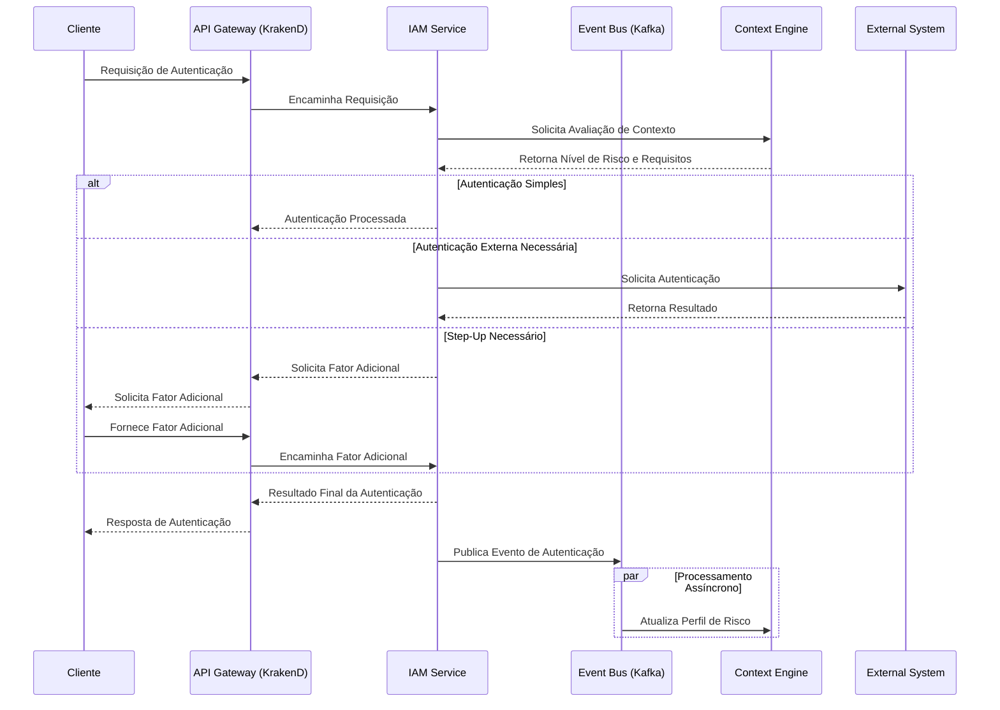

# 🔄 Matriz de Integração de Autenticação - INNOVABIZ IAM

## 📖 Visão Geral

Este documento técnico define a matriz de integração entre os métodos de autenticação do módulo IAM e os demais componentes da plataforma INNOVABIZ, seguindo os princípios de Arquitetura de Integração Total, alinhado com os frameworks TOGAF, BIAN, ISO/IEC 27001, e requisitos regulatórios internacionais.

## 🏗️ Arquitetura de Integração

A arquitetura de integração segue o modelo de Event-Driven Architecture (EDA) com APIs RESTful e GraphQL, comunicação assíncrona via mensageria, e contratos de serviço bem definidos:

```mermaid
graph TD
    IAM[IAM - Identity & Access Management]
    APIGateway[API Gateway - KrakenD]
    EventBus[Event Bus - Kafka]
    
    IAM --> APIGateway
    IAM --> EventBus
    
    subgraph "Core Modules"
        CRM[CRM]
        ERP[ERP]
        Payments[Payment Gateway]
        Risk[Central de Risco]
        MobileMoney[Mobile Money]
        Marketplace[Marketplace]
        Ecommerce[E-Commerce]
    end
    
    subgraph "Security Services"
        FraudDetection[Detecção de Fraude]
        AuditLog[Log de Auditoria]
        Encryption[Criptografia & Chaves]
        RBAC[Controle de Acesso]
    end
    
    subgraph "External Systems"
        DigitalBanking[Banking]
        Insurance[Seguros]
        SocialLogins[Login Social]
        IdentityProviders[Provedores de Identidade]
        BiometricProviders[Provedores Biométricos]
    end
    
    APIGateway --> CRM
    APIGateway --> ERP
    APIGateway --> Payments
    APIGateway --> Risk
    APIGateway --> MobileMoney
    APIGateway --> Marketplace
    APIGateway --> Ecommerce
    
    IAM --> FraudDetection
    IAM --> AuditLog
    IAM --> Encryption
    IAM --> RBAC
    
    IAM --- DigitalBanking
    IAM --- Insurance
    IAM --- SocialLogins
    IAM --- IdentityProviders
    IAM --- BiometricProviders
```



## 📊 Matriz de Integração de Autenticação

### 1. Integração com Módulos Core INNOVABIZ

```yaml
Authentication Integration Matrix - Core Modules:
  CRM:
    integration_points:
      - customer_identity_verification:
          methods:
            - biometric_authentication
            - mfa
            - passwordless
          data_exchange:
            - customer_identity
            - authentication_events
            - identity_verification_status
          standards:
            - oauth2_token_exchange
            - openid_connect
            - event_driven_notifications
          
      - customer_onboarding:
          methods:
            - step_up_authentication
            - biometric_enrollment
            - identity_proofing
          data_exchange:
            - identity_verification_documents
            - biometric_templates
            - verification_status
          standards:
            - fido_enrollment
            - iso_biometric_templates
            - zero_knowledge_proofs
          
  Payment_Gateway:
    integration_points:
      - transaction_authentication:
          methods:
            - transaction_signing
            - step_up_authentication
            - push_approval
            - behavioral_biometrics
          data_exchange:
            - transaction_details
            - risk_scores
            - authentication_strength
            - device_binding
          standards:
            - psd2_sca
            - emv_3ds
            - iso8583_extensions
            - fido_authentication
            
      - recurring_payment_authorization:
          methods:
            - delegated_authentication
            - token_based_authentication
            - continuous_authentication
          data_exchange:
            - payment_tokens
            - merchant_context
            - authorization_levels
          standards:
            - tokenization_frameworks
            - oauth2_rich_authorization
            
  Mobile_Money:
    integration_points:
      - wallet_authentication:
          methods:
            - mobile_biometrics
            - app_based_approval
            - device_binding
            - behavioral_patterns
          data_exchange:
            - wallet_identifiers
            - device_fingerprints
            - transaction_context
          standards:
            - mobile_connect
            - gsma_mobile_identity
            - fido_authenticators
            
      - agent_authentication:
          methods:
            - multi_party_approval
            - location_verified_authentication
            - hardware_tokens
            - certificate_based
          data_exchange:
            - agent_credentials
            - branch_identifiers
            - authorization_hierarchy
          standards:
            - x509_certificates
            - oauth2_delegation
            
  Central_de_Risco:
    integration_points:
      - credit_decisioning_authentication:
          methods:
            - document_based_verification
            - biometric_matching
            - official_database_validation
          data_exchange:
            - identity_documents
            - verification_scores
            - third_party_validations
          standards:
            - iso_identity_verification
            - zero_knowledge_proofs
            - verified_credentials
            
      - report_access_authorization:
          methods:
            - delegated_authority
            - purpose_based_access_control
            - consent_based_authentication
          data_exchange:
            - purpose_codes
            - consent_tokens
            - access_scopes
          standards:
            - uma_authorization
            - oauth2_rich_authorization
            - consent_receipts
            
  Marketplace:
    integration_points:
      - seller_verification:
          methods:
            - business_identity_verification
            - multi_factor_authentication
            - document_verification
          data_exchange:
            - business_credentials
            - verification_status
            - trust_scores
          standards:
            - business_identity_apis
            - verified_credentials
            
      - buyer_authentication:
          methods:
            - social_authentication
            - passwordless_options
            - device_fingerprinting
          data_exchange:
            - user_identities
            - social_provider_tokens
            - reputation_scores
          standards:
            - openid_connect
            - webauthn
            - social_identity_protocols
```

### 2. Integração com Serviços de Segurança

```yaml
Authentication Integration Matrix - Security Services:
  Fraud_Detection:
    integration_points:
      - authentication_risk_assessment:
          methods_providing_data:
            - all_authentication_methods
          data_exchange:
            direction: "Authentication → Fraud Detection"
            data_elements:
              - authentication_context
              - device_signals
              - behavioral_patterns
              - geolocation_data
              - authentication_strength
            standards:
              - oasis_cef
              - stix_taxii
          
      - risk_based_authentication:
          methods_consuming_data:
            - adaptive_mfa
            - risk_based_authentication
            - continuous_authentication
          data_exchange:
            direction: "Fraud Detection → Authentication"
            data_elements:
              - risk_scores
              - threat_indicators
              - recommended_auth_level
              - confidence_level
            standards:
              - nist_risk_framework
              - oauth_rich_authorization_requests
              
  Audit_Logging:
    integration_points:
      - authentication_event_logging:
          methods_providing_data:
            - all_authentication_methods
          data_exchange:
            direction: "Authentication → Audit"
            data_elements:
              - auth_event_type
              - timestamp
              - user_identifier
              - auth_method
              - result
              - context_data
            standards:
              - rfc5424_syslog
              - cis_critical_controls
              - oauth_jwt_secured_logs
              
      - compliance_reporting:
          methods_consuming_data:
            - privileged_access_management
            - certification_workflows
          data_exchange:
            direction: "Audit → Authentication"
            data_elements:
              - compliance_status
              - authentication_patterns
              - risk_indicators
            standards:
              - iso27001_controls
              - nist_csf
              - pci_dss_requirements
              
  Encryption_Key_Management:
    integration_points:
      - credential_encryption:
          methods_consuming_service:
            - all_password_based_methods
            - biometric_template_storage
            - token_management
          data_exchange:
            direction: "Bidirectional"
            data_elements:
              - encryption_keys
              - key_rotation_policies
              - key_usage_context
            standards:
              - pkcs11
              - jwe
              - fips_140_3
              
      - signature_verification:
          methods_consuming_service:
            - certificate_based_auth
            - digital_signatures
            - jwt_tokens
          data_exchange:
            direction: "Bidirectional"
            data_elements:
              - public_keys
              - certificate_chains
              - revocation_status
            standards:
              - x509_pkcs
              - ocsp_protocols
              - certificate_transparency
              
  Access_Control_RBAC_ABAC:
    integration_points:
      - authorization_policy_enforcement:
          methods_providing_data:
            - all_authentication_methods
          data_exchange:
            direction: "Authentication → Access Control"
            data_elements:
              - identity_assertions
              - authentication_context
              - assurance_levels
              - session_parameters
            standards:
              - xacml
              - oauth_scopes
              - jwt_claims
              
      - just_in_time_access:
          methods_consuming_service:
            - privileged_access_management
            - emergency_access_procedures
            - step_up_authentication
          data_exchange:
            direction: "Access Control → Authentication"
            data_elements:
              - required_authentication_strength
              - escalation_requirements
              - temporary_access_parameters
            standards:
              - oauth_stepped_up_authentication
              - uma_pep
```

### 3. Integração com Sistemas Externos

```yaml
Authentication Integration Matrix - External Systems:
  Digital_Banking:
    integration_points:
      - account_access:
          authentication_methods:
            - multi_factor_authentication
            - biometric_verification
            - push_approval
            - behavioral_biometrics
          integration_patterns:
            - oauth2_federation
            - openid_connect
            - jwt_token_exchange
            - saml2_assertions
          data_exchange:
            - identity_assertions
            - authentication_context
            - authorization_scopes
            - consent_tokens
          compliance:
            - psd2_sca
            - ffiec_authentication
            - open_banking_security
            
      - payment_authorization:
          authentication_methods:
            - transaction_signing
            - dynamic_linking
            - out_of_band_approval
            - hardware_security_keys
          integration_patterns:
            - oauth2_rich_authorization
            - psd2_sca_protocols
            - decentralized_identifiers
          data_exchange:
            - transaction_details
            - signing_requests
            - approval_confirmations
          compliance:
            - psd2_dynamic_linking
            - emv_3ds
            - iso20022_security
            
  Insurance:
    integration_points:
      - policy_management:
          authentication_methods:
            - document_signing
            - identity_verification
            - step_up_authentication
          integration_patterns:
            - federated_identity
            - verified_credentials
            - electronic_signatures
          data_exchange:
            - verified_identity_claims
            - document_signatures
            - consent_records
          compliance:
            - nist_digital_identity
            - eidas_signatures
            - insurance_regulatory_frameworks
            
      - claim_processing:
          authentication_methods:
            - document_verification
            - liveness_detection
            - progressive_identity_verification
          integration_patterns:
            - zero_knowledge_proofs
            - verifiable_credentials
            - selective_disclosure
          data_exchange:
            - identity_verification_results
            - document_authenticity
            - fraud_indicators
          compliance:
            - anti_fraud_regulations
            - kyc_requirements
            - data_protection_laws
            
  Social_Login_Providers:
    integration_points:
      - social_authentication:
          providers:
            - google
            - facebook
            - apple
            - twitter
            - linkedin
          integration_patterns:
            - openid_connect
            - oauth2_authorization_code
            - pkce_extension
          data_exchange:
            - identity_tokens
            - user_profile_data
            - scope-limited_attributes
          security_controls:
            - strict_csp_policies
            - origin_validation
            - token_validation
            - session_binding
            
      - enhanced_verification:
          methods:
            - social_identity_verification
            - document_verification_with_social
            - account_linking
          integration_patterns:
            - hybrid_flow
            - aggregated_claims
            - distributed_claims
          data_exchange:
            - verified_attributes
            - identity_confidence_scores
            - cross_provider_validations
          security_controls:
            - claims_encryption
            - minimal_disclosure
            - purpose_limitation
            
  Identity_Providers_IdPs:
    integration_points:
      - federated_authentication:
          protocols:
            - saml2
            - openid_connect
            - ws_federation
          integration_patterns:
            - token_exchange
            - attribute_mapping
            - just_in_time_provisioning
          data_exchange:
            - authentication_assertions
            - identity_attributes
            - session_context
          security_controls:
            - signature_validation
            - audience_restriction
            - assertion_encryption
            - metadata_validation
            
      - b2b_federation:
          methods:
            - enterprise_federation
            - multi_tenant_sso
            - delegated_authentication
          integration_patterns:
            - scim_provisioning
            - entity_attribute_mapping
            - role_mapping
          data_exchange:
            - organizational_identity
            - role_assertions
            - entitlement_mappings
          security_controls:
            - trust_framework_compliance
            - metadata_security
            - certificate_management
            
  Biometric_Service_Providers:
    integration_points:
      - biometric_verification:
          modalities:
            - fingerprint
            - facial_recognition
            - voice_recognition
            - behavioral_biometrics
          integration_patterns:
            - rest_api_integration
            - grpc_streaming
            - websocket_real_time
          data_exchange:
            - biometric_samples
            - verification_results
            - liveness_indicators
            - matching_scores
          security_controls:
            - template_protection
            - secure_transmission
            - sample_encryption
            - purpose_binding
            
      - biometric_enrollment:
          methods:
            - supervised_enrollment
            - self_enrollment_with_verification
            - progressive_enrollment
          integration_patterns:
            - multi_step_workflow
            - asynchronous_processing
            - status_callbacks
          data_exchange:
            - raw_biometric_data
            - quality_assessments
            - enrollment_status
            - template_generation
          security_controls:
            - data_minimization
            - purpose_limitation
            - template_isolation
            - consent_management
```

## 🔀 Padrões de Integração

### Padrões de Comunicação

```yaml
Integration Patterns:
  synchronous_patterns:
    - rest_apis:
        usage: "Interações em tempo real com sistemas cliente"
        implementation:
          - openapi_specification
          - json_hal_hypermedia
          - rate_limiting
          - circuit_breakers
        security:
          - oauth2_protection
          - mtls
          - api_keys
          
    - graphql:
        usage: "Consultas complexas e agregação de dados"
        implementation:
          - federation
          - schema_stitching
          - batching
        security:
          - persisted_queries
          - depth_limiting
          - complexity_analysis
          
  asynchronous_patterns:
    - event_streaming:
        usage: "Notificações de eventos de autenticação"
        implementation:
          - kafka
          - event_schema_registry
          - message_ordering
        security:
          - topic_acls
          - message_encryption
          - idempotent_processing
          
    - message_queuing:
        usage: "Operações de autenticação assíncronas"
        implementation:
          - rabbitmq
          - dead_letter_queues
          - message_priorities
        security:
          - message_signing
          - queue_authentication
          - transport_encryption
          
    - webhooks:
        usage: "Notificações para sistemas externos"
        implementation:
          - subscription_management
          - delivery_retries
          - idempotency_keys
        security:
          - signature_verification
          - replay_protection
          - rate_control
```

### Estratégias de Resiliência

```yaml
Resilience Strategies:
  circuit_breaking:
    description: "Prevenção de falhas em cascata"
    implementation:
      - threshold_configuration: "Baseado em taxas de erro"
      - half_open_state: "Recuperação gradual"
      - isolation_policies: "Por dependência"
      
  rate_limiting:
    description: "Proteção contra sobrecarga"
    implementation:
      - adaptive_limits: "Baseados em capacidade"
      - client_quotas: "Limites por consumidor"
      - degradation_tiers: "Serviço reduzido sob pressão"
      
  caching:
    description: "Redução de dependências externas"
    implementation:
      - token_caching: "Armazenamento temporário seguro"
      - validation_results: "Cache de decisões recentes"
      - stale_while_revalidate: "Atualização em background"
      
  bulkheads:
    description: "Isolamento de falhas"
    implementation:
      - resource_pools: "Separados por criticidade"
      - timeout_management: "Tempos limite apropriados"
      - graceful_degradation: "Alternativas de menor segurança"
```

## 🛠️ Considerações de Implementação

### Segurança da Integração

```yaml
Integration Security:
  data_protection:
    - in_transit:
        requirements:
          - tls_1_3_minimum
          - perfect_forward_secrecy
          - strong_cipher_suites
        implementation:
          - certificate_pinning
          - encrypted_client_hello
          - strict_transport_security
        
    - at_rest:
        requirements:
          - field_level_encryption
          - key_rotation
          - encrypted_storage
        implementation:
          - envelope_encryption
          - key_management_service
          - secure_key_storage
        
  integrity_protection:
    - message_signing:
        requirements:
          - request_response_validation
          - non_repudiation
          - tamper_detection
        implementation:
          - jws_signatures
          - hmac_validation
          - digital_signatures
          
    - transaction_verification:
        requirements:
          - end_to_end_verification
          - replay_protection
          - sequence_validation
        implementation:
          - nonces
          - timestamping
          - idempotency_keys
          
  identity_protection:
    - minimal_disclosure:
        requirements:
          - attribute_minimization
          - purpose_limitation
          - data_segregation
        implementation:
          - selective_disclosure
          - blinded_identifiers
          - purpose_binding
          
    - pseudonymization:
        requirements:
          - identifier_separation
          - cross_domain_privacy
          - correlation_resistance
        implementation:
          - pairwise_identifiers
          - sector_specific_identifiers
          - rotating_identifiers
```

### Governança da Integração

```yaml
Integration Governance:
  versioning:
    - api_versioning:
        strategy:
          - semantic_versioning
          - uri_versioning
          - header_versioning
        compatibility:
          - backward_compatibility
          - deprecation_policy
          - migration_paths
          
    - schema_evolution:
        strategy:
          - additive_changes
          - optional_fields
          - extensibility_points
        compatibility:
          - schema_validation
          - compatibility_testing
          - version_negotiation
          
  monitoring:
    - service_health:
        metrics:
          - availability
          - response_time
          - error_rates
          - authentication_success_rates
        alerts:
          - slo_breaches
          - anomaly_detection
          - failure_patterns
          
    - security_monitoring:
        metrics:
          - authentication_anomalies
          - token_misuse
          - suspicious_patterns
        alerts:
          - attack_signatures
          - brute_force_attempts
          - unusual_activity_volumes
          
  compliance:
    - audit_trail:
        requirements:
          - integration_event_logging
          - non_repudiation
          - temporal_consistency
        implementation:
          - signed_audit_logs
          - tamper_evident_storage
          - standardized_formats
          
    - regulatory_alignment:
        frameworks:
          - LGPD_requirements
          - GDPR_requirements
          - PSD2_requirements
          - SOC2_requirements
        implementation:
          - control_mapping
          - evidence_collection
          - compliance_reporting
```

## 📑 Matriz de Capacidades de Integração por Método

### Métodos Biométricos

| Método de Autenticação | Integração Síncrona | Integração Assíncrona | Federação | Offline | Degradação Graceful |
|------------------------|:-------------------:|:---------------------:|:---------:|:-------:|:-------------------:|
| Impressão Digital      | ✅                  | ✅                    | ⚠️        | ✅      | ✅                  |
| Reconhecimento Facial  | ✅                  | ✅                    | ✅        | ⚠️      | ✅                  |
| Reconhecimento de Voz  | ✅                  | ✅                    | ⚠️        | ⚠️      | ✅                  |
| Padrões de Comportamento | ✅               | ✅                    | ❌        | ✅      | ✅                  |

### Métodos Sem Senha

| Método de Autenticação | Integração Síncrona | Integração Assíncrona | Federação | Offline | Degradação Graceful |
|------------------------|:-------------------:|:---------------------:|:---------:|:-------:|:-------------------:|
| Magic Links            | ✅                  | ✅                    | ❌        | ❌      | ⚠️                  |
| WebAuthn/FIDO2         | ✅                  | ❌                    | ⚠️        | ✅      | ✅                  |
| Push Notifications     | ✅                  | ✅                    | ✅        | ❌      | ✅                  |
| QR Code                | ✅                  | ✅                    | ⚠️        | ⚠️      | ✅                  |

### Métodos Multi-Fator

| Método de Autenticação     | Integração Síncrona | Integração Assíncrona | Federação | Offline | Degradação Graceful |
|----------------------------|:-------------------:|:---------------------:|:---------:|:-------:|:-------------------:|
| TOTP                       | ✅                  | ❌                    | ✅        | ✅      | ✅                  |
| SMS                        | ✅                  | ✅                    | ✅        | ❌      | ✅                  |
| Hardware Token             | ✅                  | ❌                    | ✅        | ✅      | ✅                  |
| Risk-Based Authentication  | ✅                  | ✅                    | ✅        | ⚠️      | ✅                  |

### Autenticação Contextual

| Método de Autenticação     | Integração Síncrona | Integração Assíncrona | Federação | Offline | Degradação Graceful |
|----------------------------|:-------------------:|:---------------------:|:---------:|:-------:|:-------------------:|
| Geolocalização             | ✅                  | ✅                    | ✅        | ⚠️      | ✅                  |
| Verificação de Dispositivo | ✅                  | ✅                    | ✅        | ✅      | ✅                  |
| Análise de Rede            | ✅                  | ✅                    | ⚠️        | ❌      | ✅                  |
| Perfil de Comportamento    | ✅                  | ✅                    | ⚠️        | ⚠️      | ✅                  |

## 🌐 Modelo de Comunicação



---

*Documento Preparado pela Equipe de Arquitetura INNOVABIZ | Última Atualização: 31/07/2025*