# Diagrama de Interconexão do Framework de Observabilidade INNOVABIZ

## Visão Geral

Este documento apresenta o diagrama completo de interconexão dos componentes do Framework de Observabilidade da plataforma INNOVABIZ, demonstrando como os diferentes elementos se comunicam e integram para fornecer observabilidade end-to-end multi-dimensional.

## Diagrama Arquitetural de Interconexão

```mermaid
graph TD
    %% Componentes de origem
    subgraph "Origem dos Dados"
        APP[Aplicações INNOVABIZ]
        IAM[IAM Service]
        PG[Payment Gateway]
        MM[Mobile Money]
        MKT[Marketplaces]
        EC[E-Commerce]
        MC[Microcrédito]
        INS[Seguros]
        BRKS[Corretoras]
        MF[Microfinanças]
        INV[Investimentos]
        CR[Central de Risco]
        CRM[CRM]
        ERP[ERP]
    end

    %% Instrumentação
    subgraph "Instrumentação"
        OTEL_SDK[OpenTelemetry SDKs]
        MANUAL[Instrumentação Manual]
        AUTO[Instrumentação Automática]
        ASPECT[Instrumentação por Aspecto]
    end

    %% Coleta e Processamento
    subgraph "Coleta e Processamento"
        OTEL[OpenTelemetry Collector]
        FLUENTD[Fluentd]
        VECTOR[Vector]
        KAFKA[Apache Kafka]
    end

    %% Armazenamento
    subgraph "Armazenamento"
        PROM[Prometheus]
        LOKI[Loki]
        TEMPO[Tempo]
        ES[Elasticsearch]
        CLICKHOUSE[ClickHouse]
    end

    %% Visualização e Alertas
    subgraph "Visualização e Alertas"
        GRAFANA[Grafana]
        KIBANA[Kibana]
        ALERT[AlertManager]
        OBSERVABILITY_PORTAL[Portal de Observabilidade]
        DASHBOARDS[Dashboards]
    end

    %% Integração e Governança
    subgraph "Integração e Governança"
        API_GATEWAY[KrakenD API Gateway]
        IAM_AUTH[IAM Autenticação]
        AUDIT[Audit Service]
        RBAC[Controle de Acesso RBAC]
        POLICY[Policy Engine]
    end

    %% Integrações Externas
    subgraph "Integrações Externas"
        CLOUD_MONITORING[Cloud Monitoring]
        SIEM[SIEM]
        TICKETING[Sistema de Ticketing]
        NOTIFICATION[Sistemas de Notificação]
        BI[Business Intelligence]
    end

    %% Multi-contexto
    subgraph "Multi-contexto"
        CONTEXT_REGISTRY[Context Registry]
        CONTEXT_PROPAGATION[Context Propagation]
        CONTEXT_FILTERING[Context Filtering]
    end

    %% Conexões - Origem para Instrumentação
    APP --> OTEL_SDK
    IAM --> OTEL_SDK
    PG --> OTEL_SDK
    MM --> OTEL_SDK
    MKT --> OTEL_SDK
    EC --> OTEL_SDK
    MC --> OTEL_SDK
    INS --> OTEL_SDK
    BRKS --> OTEL_SDK
    MF --> OTEL_SDK
    INV --> OTEL_SDK
    CR --> OTEL_SDK
    CRM --> OTEL_SDK
    ERP --> OTEL_SDK
    
    APP --> MANUAL
    APP --> AUTO
    APP --> ASPECT

    %% Conexões - Instrumentação para Coleta
    OTEL_SDK --> OTEL
    MANUAL --> OTEL
    AUTO --> OTEL
    ASPECT --> OTEL
    
    OTEL_SDK --> FLUENTD
    OTEL_SDK --> VECTOR
    OTEL_SDK --> KAFKA

    %% Conexões - Coleta para Armazenamento
    OTEL --> PROM
    OTEL --> LOKI
    OTEL --> TEMPO
    OTEL --> ES
    OTEL --> CLICKHOUSE
    
    FLUENTD --> ES
    FLUENTD --> LOKI
    
    VECTOR --> PROM
    VECTOR --> LOKI
    VECTOR --> ES
    
    KAFKA --> ES
    KAFKA --> CLICKHOUSE

    %% Conexões - Armazenamento para Visualização
    PROM --> GRAFANA
    LOKI --> GRAFANA
    TEMPO --> GRAFANA
    ES --> GRAFANA
    ES --> KIBANA
    CLICKHOUSE --> GRAFANA
    
    PROM --> ALERT
    ALERT --> NOTIFICATION
    
    PROM --> OBSERVABILITY_PORTAL
    LOKI --> OBSERVABILITY_PORTAL
    TEMPO --> OBSERVABILITY_PORTAL
    ES --> OBSERVABILITY_PORTAL
    
    GRAFANA --> DASHBOARDS
    KIBANA --> DASHBOARDS
    OBSERVABILITY_PORTAL --> DASHBOARDS

    %% Conexões - Integração e Governança
    API_GATEWAY --> OBSERVABILITY_PORTAL
    IAM_AUTH --> OBSERVABILITY_PORTAL
    IAM_AUTH --> GRAFANA
    IAM_AUTH --> KIBANA
    
    OBSERVABILITY_PORTAL --> AUDIT
    GRAFANA --> AUDIT
    KIBANA --> AUDIT
    
    RBAC --> OBSERVABILITY_PORTAL
    RBAC --> GRAFANA
    RBAC --> KIBANA
    
    POLICY --> RBAC
    POLICY --> AUDIT

    %% Conexões - Multi-contexto
    CONTEXT_REGISTRY --> OTEL_SDK
    CONTEXT_REGISTRY --> OTEL
    
    CONTEXT_PROPAGATION --> OTEL
    CONTEXT_PROPAGATION --> KAFKA
    
    CONTEXT_FILTERING --> OBSERVABILITY_PORTAL
    CONTEXT_FILTERING --> GRAFANA
    CONTEXT_FILTERING --> KIBANA
    CONTEXT_FILTERING --> PROM
    CONTEXT_FILTERING --> LOKI
    CONTEXT_FILTERING --> TEMPO
    CONTEXT_FILTERING --> ES

    %% Conexões - Integrações Externas
    OBSERVABILITY_PORTAL --> CLOUD_MONITORING
    ALERT --> TICKETING
    ALERT --> NOTIFICATION
    GRAFANA --> BI
    KIBANA --> BI
    OBSERVABILITY_PORTAL --> SIEM
```

## Componentes e Integrações

### 1. Origem dos Dados

Todos os módulos e serviços da plataforma INNOVABIZ produzem dados de observabilidade (métricas, logs, traces) através de instrumentação padronizada:

- **IAM Service**: Autenticação, autorização, gestão de identidades
- **Payment Gateway**: Processamento de pagamentos e transações
- **Mobile Money**: Serviços de dinheiro móvel
- **Marketplaces**: Plataformas de marketplace
- **E-Commerce**: Plataformas de comércio eletrônico
- **Microcrédito**: Gestão de microcrédito e scoring
- **Seguros**: Gestão de apólices e sinistros
- **Corretoras**: Plataformas de corretagem
- **Microfinanças**: Serviços de microfinanças
- **Investimentos**: Plataformas de investimentos
- **Central de Risco**: Avaliação e gestão de risco
- **CRM**: Gestão de relacionamento com clientes
- **ERP**: Planejamento de recursos empresariais

### 2. Instrumentação

A instrumentação é implementada através de:

- **OpenTelemetry SDKs**: Instrumentação principal para todas as linguagens utilizadas (Java, Go, Node.js, Python, .NET)
- **Instrumentação Manual**: Implementação personalizada em pontos críticos do código
- **Instrumentação Automática**: Auto-instrumentação para frameworks comuns
- **Instrumentação por Aspecto**: Implementação via AOP (Aspect-Oriented Programming)

### 3. Coleta e Processamento

Os dados são coletados e processados por:

- **OpenTelemetry Collector**: Componente central para recebimento, processamento e exportação de telemetria
- **Fluentd**: Coleta e processamento avançado de logs
- **Vector**: Processamento de alta performance para todos os tipos de telemetria
- **Apache Kafka**: Pipeline de eventos para processamento assíncrono de telemetria

### 4. Armazenamento

Os dados são armazenados em diferentes backends especializados:

- **Prometheus**: Séries temporais para métricas
- **Loki**: Armazenamento e indexação de logs
- **Tempo**: Armazenamento e consulta de traces distribuídos
- **Elasticsearch**: Análise avançada de logs e métricas
- **ClickHouse**: Análise de alta performance para grandes volumes de dados

### 5. Visualização e Alertas

Os dados são visualizados e alertas são gerados através de:

- **Grafana**: Dashboards, visualizações e alertas
- **Kibana**: Exploração avançada de logs e análises
- **AlertManager**: Roteamento, agrupamento e notificação de alertas
- **Portal de Observabilidade**: Interface centralizada para todos os componentes de observabilidade
- **Dashboards**: Conjuntos específicos de painéis para diferentes stakeholders

### 6. Integração e Governança

A segurança e governança são implementadas através de:

- **KrakenD API Gateway**: Gateway para exposição segura de APIs
- **IAM Authentication**: Autenticação centralizada
- **Audit Service**: Registro de auditoria completo
- **Controle de Acesso RBAC**: Autorização baseada em papéis
- **Policy Engine**: Motor de políticas para decisões de acesso

### 7. Multi-contexto

O suporte multi-contexto é implementado por:

- **Context Registry**: Registro central de contextos
- **Context Propagation**: Propagação de contexto entre serviços
- **Context Filtering**: Filtragem baseada em contexto

### 8. Integrações Externas

Integração com sistemas externos:

- **Cloud Monitoring**: Integração com serviços de monitoramento em nuvem
- **SIEM**: Integração com sistemas de gerenciamento de eventos de segurança
- **Sistema de Ticketing**: Integração com sistemas de tickets para gestão de incidentes
- **Sistemas de Notificação**: SMS, email, chat, etc.
- **Business Intelligence**: Integração com plataformas de BI

## Fluxos de Dados Principais

1. **Fluxo de Métricas**: Aplicações → OpenTelemetry SDK → OpenTelemetry Collector → Prometheus → Grafana → Alertas
2. **Fluxo de Logs**: Aplicações → OpenTelemetry SDK/Fluentd → OpenTelemetry Collector → Loki/Elasticsearch → Grafana/Kibana
3. **Fluxo de Traces**: Aplicações → OpenTelemetry SDK → OpenTelemetry Collector → Tempo → Grafana
4. **Fluxo de Alertas**: Prometheus/Grafana → AlertManager → Notificação/Ticketing
5. **Fluxo de Auditoria**: Todos os componentes → Audit Service → Elasticsearch → Kibana/SIEM

## Requisitos de Comunicação

- Comunicação segura via TLS 1.3
- Autenticação mTLS entre componentes
- Network Policies Kubernetes para isolamento
- Comunicação entre zonas de segurança via API Gateway
- Comunicação entre regiões via Federation Services

## Resiliência e Redundância

- Alta disponibilidade para todos os componentes
- Replicação de dados entre zonas de disponibilidade
- Retenção configurável por tipo de dado e importância
- Políticas de backup e restauração

## Conformidade

Este diagrama de interconexão está em conformidade com:

- OWASP Security Architecture
- PCI DSS 4.0 requirements
- GDPR/LGPD Data Protection
- ISO 27001:2022
- NIST Cybersecurity Framework

---

© 2025 INNOVABIZ. Todos os direitos reservados.