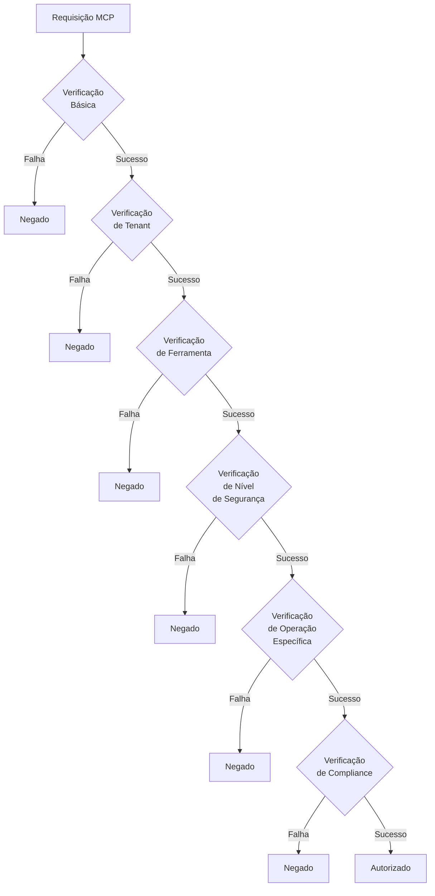

# Políticas OPA para Autorização MCP-IAM

## 1. Introdução

Este documento detalha as políticas Open Policy Agent (OPA) utilizadas para implementar o modelo de autorização da integração MCP-IAM na plataforma INNOVABIZ. As políticas OPA fornecem um mecanismo declarativo, baseado em regras, para controlar o acesso e uso das ferramentas MCP, garantindo segurança, compliance e governança adequadas.

### 1.1. Objetivos

- Definir as regras específicas para autorização de acesso a ferramentas MCP
- Documentar o modelo de políticas extensível e baseado em contexto
- Fornecer exemplos de implementação para diferentes cenários de autorização
- Estabelecer práticas recomendadas para desenvolvimento e gestão de políticas

### 1.2. Princípios de Design

As políticas OPA para MCP-IAM foram projetadas seguindo os seguintes princípios:

- **Segurança por design**: Implementação de controles de segurança profundos desde a concepção
- **Privilégio mínimo**: Conceder apenas as permissões mínimas necessárias para executar uma tarefa
- **Auditabilidade**: Garantir que todas as decisões de autorização sejam rastreáveis e auditáveis
- **Flexibilidade**: Suportar diversos modelos de autorização (RBAC, ABAC, ReBAC)
- **Observabilidade**: Integração com sistemas de monitoramento para visibilidade operacional
- **Multi-tenancy**: Isolamento completo entre diferentes tenants
- **Compliance-driven**: Alinhamento com requisitos regulatórios e frameworks de segurança

## 2. Estrutura do Sistema de Políticas

### 2.1. Organização das Políticas

As políticas OPA para MCP-IAM estão organizadas em módulos hierárquicos:

```
innovabiz
├── mcp
│   ├── authz.rego             # Regras gerais de autorização
│   ├── tool_access.rego       # Políticas para acesso a ferramentas
│   ├── sensitive_ops.rego     # Políticas para operações sensíveis
│   ├── resource_quotas.rego   # Verificação de quotas de recursos
│   ├── compliance.rego        # Validação de compliance
│   ├── security_level.rego    # Avaliação de níveis de segurança
│   ├── servers
│   │   ├── docker.rego        # Políticas específicas para MCP_DOCKER
│   │   ├── desktop.rego       # Políticas específicas para Desktop-Commander
│   │   ├── github.rego        # Políticas específicas para GitHub MCP
│   │   ├── figma.rego         # Políticas específicas para Figma MCP
│   │   └── memory.rego        # Políticas específicas para Memory MCP
│   └── data
│       ├── roles.json         # Definições de papéis e permissões
│       ├── tools.json         # Metadados de ferramentas MCP
│       └── tenant_features.json # Recursos habilitados por tenant
└── common
    ├── utils.rego             # Funções utilitárias comuns
    └── security.rego          # Funções de segurança reutilizáveis
```

### 2.2. Entidades Principais

| Entidade | Descrição | Exemplo |
|----------|-----------|---------|
| User | Usuário autenticado | `{"id": "u123", "roles": ["developer"]}` |
| Tenant | Organização ou cliente | `{"id": "t456", "features": ["docker", "github"]}` |
| Tool | Ferramenta MCP | `{"name": "kubectl_get", "server": "MCP_DOCKER"}` |
| Operation | Ação específica | `{"name": "list", "target": "pods"}` |
| Context | Contexto de segurança | `{"security_level": "high", "mfa_verified": true}` |

### 2.3. Fluxo de Decisão de Autorização



## 3. Políticas Base de Autorização

### 3.1. Política Principal de Autorização (authz.rego)

```rego
package innovabiz.mcp.authz

# Importações
import data.innovabiz.mcp.tool_access
import data.innovabiz.mcp.security_level
import data.innovabiz.mcp.compliance

# Decisão padrão: negar acesso
default allow = false
default reason = "acesso não explicitamente permitido por nenhuma política"

# Regra de autorização principal
allow {
    # Verificação básica de validade do usuário e tenant
    basic_checks
    
    # Verificação de acesso à ferramenta específica
    tool_access.allow
    
    # Verificação de nível de segurança
    security_level.is_sufficient
    
    # Verificação de compliance
    compliance.is_compliant
}

# Construir mensagem de razão quando o acesso é negado
reason = msg {
    not basic_checks
    msg = "falha nas verificações básicas: usuário ou tenant inativo"
}

reason = msg {
    basic_checks
    not tool_access.allow
    msg = tool_access.reason
}

reason = msg {
    basic_checks
    tool_access.allow
    not security_level.is_sufficient
    msg = security_level.reason
}

reason = msg {
    basic_checks
    tool_access.allow
    security_level.is_sufficient
    not compliance.is_compliant
    msg = compliance.reason
}

# Verificações básicas
basic_checks {
    # Verificar se o input contém as informações necessárias
    input.user.id
    input.user.tenant_id
    input.tool.name
    
    # Verificar se o usuário está ativo
    input.user.active
    
    # Verificar se o tenant está ativo
    input.user.tenant_active
}
```

### 3.2. Política de Acesso a Ferramentas (tool_access.rego)

```rego
package innovabiz.mcp.tool_access

import data.innovabiz.mcp.data.roles
import data.innovabiz.mcp.data.tools
import data.innovabiz.mcp.data.tenant_features

# Decisão padrão: negar acesso
default allow = false
default reason = "acesso à ferramenta não permitido"

# Regra principal para acesso a ferramentas
allow {
    # Verificar se a ferramenta existe
    tool := tools[input.tool.name]
    
    # Verificar se o tenant tem o recurso necessário habilitado
    tenant_has_required_features(tool)
    
    # Verificar se o usuário tem os papéis necessários
    user_has_required_roles(tool)
    
    # Verificar restrições adicionais da ferramenta
    not tool_has_restrictions(tool) or tool_restrictions_satisfied(tool)
}

# Construir razão detalhada para negação
reason = msg {
    not tool_exists
    msg = sprintf("ferramenta '%s' não encontrada ou não disponível", [input.tool.name])
}

reason = msg {
    tool_exists
    not tenant_has_required_features(tools[input.tool.name])
    msg = sprintf("tenant '%s' não tem acesso ao recurso necessário para a ferramenta '%s'", [input.user.tenant_id, input.tool.name])
}

reason = msg {
    tool_exists
    tenant_has_required_features(tools[input.tool.name])
    not user_has_required_roles(tools[input.tool.name])
    msg = sprintf("usuário não possui os papéis necessários para usar a ferramenta '%s'", [input.tool.name])
}

reason = msg {
    tool_exists
    tenant_has_required_features(tools[input.tool.name])
    user_has_required_roles(tools[input.tool.name])
    tool_has_restrictions(tools[input.tool.name])
    not tool_restrictions_satisfied(tools[input.tool.name])
    msg = sprintf("restrições adicionais não satisfeitas para a ferramenta '%s'", [input.tool.name])
}

# Verificar se a ferramenta existe
tool_exists {
    tools[input.tool.name]
}

# Verificar se o tenant tem os recursos necessários
tenant_has_required_features(tool) {
    # Se a ferramenta não especifica recursos necessários, permitir
    not tool.required_features
}

tenant_has_required_features(tool) {
    # Para cada recurso necessário, verificar se o tenant o tem
    required_feature := tool.required_features[_]
    tenant_features[input.user.tenant_id][required_feature] == true
}

# Verificar se o usuário tem os papéis necessários
user_has_required_roles(tool) {
    # Se a ferramenta não especifica papéis necessários, permitir
    not tool.required_roles
}

user_has_required_roles(tool) {
    # Verificar se o usuário tem pelo menos um dos papéis necessários
    required_role := tool.required_roles[_]
    role_match(required_role)
}

# Verificar correspondência de papel, incluindo herança
role_match(required_role) {
    # Correspondência direta
    user_role := input.user.roles[_]
    user_role == required_role
}

role_match(required_role) {
    # Correspondência por herança
    user_role := input.user.roles[_]
    roles[user_role].inherits[_] == required_role
}

# Verificar se a ferramenta tem restrições adicionais
tool_has_restrictions(tool) {
    tool.restrictions
}

# Verificar se as restrições da ferramenta são satisfeitas
tool_restrictions_satisfied(tool) {
    # Para cada tipo de restrição, verificar se é satisfeita
    restriction_type := tool.restrictions[_].type
    
    # Verificar restrição de MFA
    restriction_type == "mfa_required"
    input.user.mfa_verified == true
}

tool_restrictions_satisfied(tool) {
    # Verificar restrição de ambiente
    restriction := tool.restrictions[_]
    restriction.type == "environment"
    
    # Verificar se o ambiente atual está na lista de ambientes permitidos
    allowed_env := restriction.allowed_environments[_]
    allowed_env == input.context.environment
}

tool_restrictions_satisfied(tool) {
    # Verificar restrição de período de tempo
    restriction := tool.restrictions[_]
    restriction.type == "time_window"
    
    # Verificar se a hora atual está dentro do período permitido
    current_time := time.now_ns() / 1000000000
    current_time >= restriction.start_time
    current_time <= restriction.end_time
}
```### 3.3. Políticas de Nível de Segurança (security_level.rego)

```rego
package innovabiz.mcp.security_level

import data.innovabiz.mcp.data.tools

# Decisão padrão
default is_sufficient = false
default reason = "nível de segurança insuficiente"

# Mapeamento de níveis de segurança para valores numéricos
security_levels = {
    "low": 1,
    "medium": 2,
    "high": 3,
    "critical": 4
}

# Verificar se o nível de segurança é suficiente
is_sufficient {
    # Obter nível de segurança necessário para a ferramenta
    tool := tools[input.tool.name]
    required_level := tool.security_level
    
    # Se não há nível especificado, considerar como "low"
    not required_level
}

is_sufficient {
    # Obter nível de segurança necessário para a ferramenta
    tool := tools[input.tool.name]
    required_level := tool.security_level
    
    # Obter nível de segurança do usuário/contexto
    user_level := input.context.security_level
    
    # Comparar níveis
    security_levels[user_level] >= security_levels[required_level]
}

# Para operações sensíveis, exigir verificação MFA recente
is_sufficient {
    # Obter nível de segurança necessário para a ferramenta
    tool := tools[input.tool.name]
    required_level := tool.security_level
    
    # Verificar se é uma ferramenta de alto risco
    security_levels[required_level] >= security_levels["high"]
    
    # Verificar MFA recente
    input.user.mfa_verified == true
}

# Construir razão para nível de segurança insuficiente
reason = msg {
    tool := tools[input.tool.name]
    required_level := tool.security_level
    user_level := input.context.security_level
    
    security_levels[user_level] < security_levels[required_level]
    
    msg = sprintf("nível de segurança insuficiente: necessário '%s', fornecido '%s'", [required_level, user_level])
}

reason = msg {
    tool := tools[input.tool.name]
    required_level := tool.security_level
    security_levels[required_level] >= security_levels["high"]
    
    not input.user.mfa_verified
    
    msg = "verificação MFA necessária para esta operação de alto risco"
}
```

### 3.4. Política de Compliance (compliance.rego)

```rego
package innovabiz.mcp.compliance

import data.innovabiz.mcp.data.tools
import data.innovabiz.mcp.data.compliance_frameworks

# Decisão padrão
default is_compliant = false
default reason = "requisitos de compliance não atendidos"

# Verificar compliance com todos os frameworks aplicáveis
is_compliant {
    # Se não houver frameworks de compliance especificados, permitir
    not input.compliance.frameworks
}

is_compliant {
    # Para cada framework de compliance, verificar se os requisitos são atendidos
    framework := input.compliance.frameworks[_]
    is_framework_compliant(framework)
}

# Verificar compliance com um framework específico
is_framework_compliant(framework) {
    # Obter requisitos do framework
    framework_reqs := compliance_frameworks[framework]
    
    # Verificar se a ferramenta atende às restrições do framework
    tool := tools[input.tool.name]
    
    # Verificar residência de dados (se aplicável)
    not framework_reqs.data_residency or data_residency_compliant(framework_reqs.data_residency)
    
    # Verificar requisitos de auditoria
    not framework_reqs.audit_requirements or audit_requirements_met(framework_reqs.audit_requirements)
    
    # Verificar requisitos de isolamento (multi-tenancy)
    not framework_reqs.isolation_requirements or isolation_requirements_met(framework_reqs.isolation_requirements)
    
    # Verificar restrições de operações sensíveis
    not framework_reqs.sensitive_operations_restrictions or sensitive_ops_restrictions_met(framework_reqs.sensitive_operations_restrictions, tool)
}

# Verificar conformidade com requisitos de residência de dados
data_residency_compliant(residency_reqs) {
    # Obter região atual
    current_region := input.context.region
    
    # Verificar se a região está na lista de regiões permitidas
    allowed_region := residency_reqs.allowed_regions[_]
    current_region == allowed_region
}

# Verificar conformidade com requisitos de auditoria
audit_requirements_met(audit_reqs) {
    # Verificar se o nível de auditoria é suficiente
    audit_reqs.min_level == "standard"
    input.context.audit_level == "standard"
}

audit_requirements_met(audit_reqs) {
    # Verificar se o nível de auditoria é suficiente
    audit_reqs.min_level == "standard"
    input.context.audit_level == "detailed"
}

audit_requirements_met(audit_reqs) {
    # Verificar se o nível de auditoria é suficiente
    audit_reqs.min_level == "detailed"
    input.context.audit_level == "detailed"
}

# Verificar conformidade com requisitos de isolamento
isolation_requirements_met(isolation_reqs) {
    # Verificar se o nível de isolamento é suficiente
    isolation_reqs.min_level == "logical"
    isolation_level := input.context.isolation_level
    isolation_level == "logical" or isolation_level == "physical"
}

isolation_requirements_met(isolation_reqs) {
    # Verificar se o nível de isolamento é suficiente
    isolation_reqs.min_level == "physical"
    input.context.isolation_level == "physical"
}

# Verificar restrições para operações sensíveis
sensitive_ops_restrictions_met(restrictions, tool) {
    # Verificar se a ferramenta é considerada sensível
    not tool.sensitive
}

sensitive_ops_restrictions_met(restrictions, tool) {
    # Ferramenta é sensível, verificar restrições
    tool.sensitive
    
    # Verificar aprovações, se necessárias
    not restrictions.requires_approval or input.context.approval_granted
    
    # Verificar se operação é permitida no ambiente atual
    not restrictions.allowed_environments or environment_allowed(restrictions.allowed_environments)
    
    # Verificar papéis específicos para operações sensíveis
    not restrictions.restricted_roles or has_sensitive_role(restrictions.restricted_roles)
}

# Verificar se o ambiente atual é permitido
environment_allowed(allowed_environments) {
    current_env := input.context.environment
    allowed_env := allowed_environments[_]
    current_env == allowed_env
}

# Verificar se o usuário tem um papel que permite operações sensíveis
has_sensitive_role(restricted_roles) {
    user_role := input.user.roles[_]
    allowed_role := restricted_roles[_]
    user_role == allowed_role
}

# Construir razão detalhada para falhas de compliance
reason = msg {
    framework := input.compliance.frameworks[_]
    framework_reqs := compliance_frameworks[framework]
    
    framework_reqs.data_residency
    not data_residency_compliant(framework_reqs.data_residency)
    
    msg = sprintf("violação de residência de dados para framework '%s': região atual não permitida", [framework])
}

reason = msg {
    framework := input.compliance.frameworks[_]
    framework_reqs := compliance_frameworks[framework]
    
    framework_reqs.audit_requirements
    not audit_requirements_met(framework_reqs.audit_requirements)
    
    msg = sprintf("requisitos de auditoria não atendidos para framework '%s': nível insuficiente", [framework])
}

reason = msg {
    framework := input.compliance.frameworks[_]
    framework_reqs := compliance_frameworks[framework]
    
    framework_reqs.isolation_requirements
    not isolation_requirements_met(framework_reqs.isolation_requirements)
    
    msg = sprintf("requisitos de isolamento não atendidos para framework '%s': nível insuficiente", [framework])
}

reason = msg {
    framework := input.compliance.frameworks[_]
    framework_reqs := compliance_frameworks[framework]
    tool := tools[input.tool.name]
    
    tool.sensitive
    framework_reqs.sensitive_operations_restrictions
    restrictions := framework_reqs.sensitive_operations_restrictions
    
    restrictions.requires_approval
    not input.context.approval_granted
    
    msg = sprintf("operação sensível requer aprovação para compliance com '%s'", [framework])
}
```

## 4. Políticas Específicas de Servidores MCP

### 4.1. Políticas para MCP_DOCKER (docker.rego)

```rego
package innovabiz.mcp.servers.docker

import data.innovabiz.common.utils

# Decisão padrão
default allow = false
default reason = "acesso não permitido a recursos Docker/K8s"

# Lista de ferramentas Docker sensíveis
sensitive_docker_tools = {
    "docker_run": true,
    "docker_exec": true,
    "kubectl_delete": true,
    "kubectl_apply": true,
    "kubectl_exec": true,
    "kubectl_patch": true
}

# Lista de namespaces restritos
restricted_namespaces = {
    "kube-system": true,
    "kube-public": true,
    "kube-node-lease": true,
    "cert-manager": true,
    "istio-system": true
}

# Lista de comandos bloqueados
blocked_commands = {
    "rm -rf": true,
    "dd if=/dev/zero": true,
    "format": true,
    "shutdown": true,
    "reboot": true
}

# Regra principal de autorização para Docker/K8s
allow {
    # Verificar se é uma ferramenta Docker/K8s
    is_docker_k8s_tool
    
    # Verificar permissão para namespaces (se aplicável)
    not is_namespace_operation or namespace_access_allowed
    
    # Verificar restrições de imagem (se aplicável)
    not is_docker_image_operation or image_allowed
    
    # Verificar comandos bloqueados (para exec)
    not is_exec_operation or command_allowed
}

# Verificar se é uma ferramenta Docker/K8s
is_docker_k8s_tool {
    startswith(input.tool.name, "docker_")
}

is_docker_k8s_tool {
    startswith(input.tool.name, "kubectl_")
}

# Verificar se é uma operação que envolve namespaces
is_namespace_operation {
    startswith(input.tool.name, "kubectl_")
    input.tool.parameters.namespace
}

# Verificar acesso ao namespace
namespace_access_allowed {
    # Obter o namespace da operação
    namespace := input.tool.parameters.namespace
    
    # Verificar se é um namespace restrito
    restricted_namespaces[namespace]
    
    # Para namespaces restritos, verificar se o usuário tem papel de admin
    role := input.user.roles[_]
    role == "platform_admin"
}

namespace_access_allowed {
    # Obter o namespace da operação
    namespace := input.tool.parameters.namespace
    
    # Permitir acesso a namespaces não restritos
    not restricted_namespaces[namespace]
}

# Verificar se é uma operação com imagem Docker
is_docker_image_operation {
    input.tool.name == "docker_run"
    input.tool.parameters.image
}

# Verificar se a imagem é permitida
image_allowed {
    # Obter a imagem da operação
    image := input.tool.parameters.image
    
    # Verificar contra lista de imagens permitidas do tenant
    tenant_allowed_images := data.tenant_allowed_images[input.user.tenant_id]
    image_matches_allowed(image, tenant_allowed_images)
}

# Verificar se uma imagem corresponde a alguma imagem permitida
image_matches_allowed(image, allowed_images) {
    # Correspondência exata
    allowed := allowed_images[_]
    image == allowed
}

image_matches_allowed(image, allowed_images) {
    # Correspondência por padrão (ex: nginx:*)
    allowed := allowed_images[_]
    endswith(allowed, ":*")
    
    # Extrair nome base da imagem
    base_name := split(allowed, ":")[0]
    startswith(image, concat(":", [base_name, ""]))
}

# Verificar se é uma operação exec
is_exec_operation {
    input.tool.name == "docker_exec" or input.tool.name == "kubectl_exec"
    input.tool.parameters.command
}

# Verificar se o comando é permitido
command_allowed {
    command := input.tool.parameters.command
    
    # Verificar se não contém comandos bloqueados
    not contains_blocked_command(command)
}

# Verificar se o comando contém subcomandos bloqueados
contains_blocked_command(command) {
    blocked := blocked_commands[_]
    contains(command, blocked)
}

# Razões detalhadas para negações
reason = msg {
    is_docker_k8s_tool
    is_namespace_operation
    not namespace_access_allowed
    
    namespace := input.tool.parameters.namespace
    msg = sprintf("acesso ao namespace '%s' não permitido", [namespace])
}

reason = msg {
    is_docker_k8s_tool
    is_docker_image_operation
    not image_allowed
    
    image := input.tool.parameters.image
    msg = sprintf("uso da imagem '%s' não permitido", [image])
}

reason = msg {
    is_docker_k8s_tool
    is_exec_operation
    not command_allowed
    
    command := input.tool.parameters.command
    msg = sprintf("comando '%s' contém operações bloqueadas", [command])
}

reason = "acesso não permitido a recursos Docker/K8s" {
    is_docker_k8s_tool
    not is_namespace_operation
    not is_docker_image_operation
    not is_exec_operation
}
```

### 4.2. Políticas para Desktop-Commander (desktop.rego)

```rego
package innovabiz.mcp.servers.desktop

import data.innovabiz.common.utils

# Decisão padrão
default allow = false
default reason = "acesso não permitido a recursos do sistema local"

# Mapeamento de níveis de acesso ao sistema de arquivos
file_access_levels = {
    "read_only": 1,
    "limited_write": 2,
    "full_write": 3,
    "system": 4
}

# Lista de operações por categoria
file_operations = {
    "mcp1_read_file": "read",
    "mcp1_read_multiple_files": "read",
    "mcp1_list_directory": "read",
    "mcp1_search_files": "read",
    "mcp1_search_code": "read",
    "mcp1_get_file_info": "read",
    "mcp1_write_file": "write",
    "mcp1_create_directory": "write",
    "mcp1_move_file": "write",
    "mcp1_edit_block": "write"
}

process_operations = {
    "mcp1_start_process": true,
    "mcp1_interact_with_process": true,
    "mcp1_read_process_output": true,
    "mcp1_list_processes": true,
    "mcp1_kill_process": true
}

config_operations = {
    "mcp1_set_config_value": true,
    "mcp1_get_config": true
}

# Regra principal de autorização para Desktop-Commander
allow {
    # Verificar tipo de operação e autorizar adequadamente
    is_file_operation
    file_operation_allowed
}

allow {
    is_process_operation
    process_operation_allowed
}

allow {
    is_config_operation
    config_operation_allowed
}

# Verificar se é uma operação de arquivo
is_file_operation {
    file_operations[input.tool.name]
}

# Verificar se é uma operação de processo
is_process_operation {
    process_operations[input.tool.name]
}

# Verificar se é uma operação de configuração
is_config_operation {
    config_operations[input.tool.name]
}

# Verificar se a operação de arquivo é permitida
file_operation_allowed {
    # Obter a operação atual
    operation_type := file_operations[input.tool.name]
    
    # Operações de leitura são mais permissivas
    operation_type == "read"
    
    # Verificar nível de acesso do usuário
    user_access_level := get_user_file_access_level
    user_access_level >= file_access_levels.read_only
    
    # Verificar se o caminho é permitido
    path_allowed
}

file_operation_allowed {
    # Obter a operação atual
    operation_type := file_operations[input.tool.name]
    
    # Operações de escrita são mais restritas
    operation_type == "write"
    
    # Verificar nível de acesso do usuário
    user_access_level := get_user_file_access_level
    user_access_level >= file_access_levels.limited_write
    
    # Verificar se o caminho é permitido
    path_allowed
}

# Verificar se o caminho é permitido
path_allowed {
    # Extrair caminho da operação
    path := extract_path_from_params
    
    # Verificar contra caminhos permitidos do tenant
    allowed_paths := data.tenant_allowed_paths[input.user.tenant_id]
    
    # Verificar se o caminho está dentro de algum caminho permitido
    is_path_allowed(path, allowed_paths)
}

# Verificar se um caminho está dentro dos caminhos permitidos
is_path_allowed(path, allowed_paths) {
    allowed := allowed_paths[_]
    startswith(path, allowed)
}

# Obter nível de acesso do usuário ao sistema de arquivos
get_user_file_access_level = level {
    # Verificar papéis e mapear para nível de acesso
    user_roles := input.user.roles
    
    # Admin tem acesso total
    "admin" in user_roles
    level = file_access_levels.system
}

get_user_file_access_level = level {
    user_roles := input.user.roles
    
    # Desenvolvedor tem acesso de escrita limitado
    "developer" in user_roles
    not "admin" in user_roles
    level = file_access_levels.limited_write
}

get_user_file_access_level = level {
    user_roles := input.user.roles
    
    # Leitor tem acesso somente leitura
    "reader" in user_roles
    not "developer" in user_roles
    not "admin" in user_roles
    level = file_access_levels.read_only
}

# Verificar se a operação de processo é permitida
process_operation_allowed {
    # Verificar papéis necessários para operações de processo
    user_roles := input.user.roles
    required_role := get_required_role_for_process_operation
    role_match(user_roles, required_role)
    
    # Para operações sensíveis, verificar restrições adicionais
    not is_sensitive_process_operation or sensitive_process_operation_allowed
}

# Verificar se uma operação de processo sensível é permitida
sensitive_process_operation_allowed {
    # Verificar MFA para operações sensíveis
    input.user.mfa_verified
    
    # Verificar comando para operações sensíveis
    not has_command_param or command_allowed
}

# Verificar se a operação de configuração é permitida
config_operation_allowed {
    # Apenas admins podem modificar configurações
    "admin" in input.user.roles
    
    # Verificar MFA para operações de configuração
    input.user.mfa_verified
}

# Funções auxiliares
role_match(user_roles, required_role) {
    required_role in user_roles
}

extract_path_from_params = path {
    input.tool.parameters.path
    path = input.tool.parameters.path
}

extract_path_from_params = path {
    not input.tool.parameters.path
    input.tool.parameters.file_path
    path = input.tool.parameters.file_path
}

has_command_param {
    input.tool.parameters.command
}

command_allowed {
    command := input.tool.parameters.command
    not contains_blocked_process_command(command)
}

contains_blocked_process_command(command) {
    blocked_commands := data.blocked_process_commands
    blocked := blocked_commands[_]
    contains(command, blocked)
}

is_sensitive_process_operation {
    input.tool.name == "mcp1_start_process"
}

is_sensitive_process_operation {
    input.tool.name == "mcp1_kill_process"
}

get_required_role_for_process_operation = role {
    input.tool.name == "mcp1_kill_process"
    role = "admin"
}

get_required_role_for_process_operation = role {
    input.tool.name == "mcp1_start_process"
    role = "developer"
}

get_required_role_for_process_operation = role {
    input.tool.name == "mcp1_interact_with_process"
    role = "developer"
}

get_required_role_for_process_operation = role {
    input.tool.name == "mcp1_read_process_output"
    role = "developer"
}

get_required_role_for_process_operation = role {
    input.tool.name == "mcp1_list_processes"
    role = "reader"
}

# Razões detalhadas para negações
reason = msg {
    is_file_operation
    not file_operation_allowed
    
    msg = sprintf("operação de arquivo '%s' não permitida", [input.tool.name])
}

reason = msg {
    is_process_operation
    not process_operation_allowed
    
    msg = sprintf("operação de processo '%s' não permitida", [input.tool.name])
}

reason = msg {
    is_config_operation
    not config_operation_allowed
    
    msg = "modificação de configuração permitida apenas para administradores com MFA verificado"
}
```### 4.3. Políticas para GitHub MCP (github.rego)

```rego
package innovabiz.mcp.servers.github

import data.innovabiz.common.utils

# Decisão padrão
default allow = false
default reason = "acesso não permitido a recursos GitHub"

# Mapeamento de níveis de permissões GitHub
github_permission_levels = {
    "read": 1,
    "triage": 2,
    "write": 3,
    "maintain": 4,
    "admin": 5
}

# Mapeamento de ferramentas para níveis mínimos de permissão
tool_permission_requirements = {
    "mcp7_get_file_contents": "read",
    "mcp7_get_issue": "read",
    "mcp7_get_pull_request": "read",
    "mcp7_get_pull_request_comments": "read",
    "mcp7_get_pull_request_files": "read",
    "mcp7_get_pull_request_reviews": "read",
    "mcp7_get_pull_request_status": "read",
    "mcp7_list_commits": "read",
    "mcp7_list_issues": "read",
    "mcp7_list_pull_requests": "read",
    "mcp7_search_code": "read",
    "mcp7_search_issues": "read",
    "mcp7_search_repositories": "read",
    "mcp7_search_users": "read",
    
    "mcp7_add_issue_comment": "triage",
    "mcp7_create_issue": "triage",
    "mcp7_update_issue": "triage",
    
    "mcp7_create_pull_request": "write",
    "mcp7_create_pull_request_review": "write",
    "mcp7_create_or_update_file": "write",
    "mcp7_push_files": "write",
    "mcp7_update_pull_request_branch": "write",
    
    "mcp7_create_branch": "maintain",
    "mcp7_fork_repository": "maintain",
    
    "mcp7_create_repository": "admin",
    "mcp7_merge_pull_request": "admin"
}

# Operações que requerem aprovação adicional
require_approval_operations = {
    "mcp7_merge_pull_request": true,
    "mcp7_create_repository": true,
    "mcp7_delete_repository": true
}

# Regra principal de autorização para GitHub
allow {
    # Verificar se é uma ferramenta GitHub
    is_github_tool
    
    # Verificar se o usuário tem autenticação válida com GitHub
    has_valid_github_auth
    
    # Verificar permissões específicas para o repositório (se aplicável)
    not is_repo_operation or repo_permission_sufficient
    
    # Verificar aprovação para operações sensíveis
    not requires_approval or has_approval
}

# Verificar se é uma ferramenta GitHub
is_github_tool {
    startswith(input.tool.name, "mcp7_")
}

# Verificar se o usuário tem autenticação válida com GitHub
has_valid_github_auth {
    input.user.github_authenticated == true
}

# Verificar se é uma operação específica de repositório
is_repo_operation {
    # Verificar se os parâmetros contêm owner e repo
    input.tool.parameters.owner
    input.tool.parameters.repo
}

# Verificar se a permissão do usuário no repositório é suficiente
repo_permission_sufficient {
    # Obter owner e repo
    owner := input.tool.parameters.owner
    repo := input.tool.parameters.repo
    
    # Obter permissão do usuário para este repositório
    user_permission := get_user_repo_permission(owner, repo)
    
    # Obter nível mínimo de permissão necessário para a ferramenta
    required_permission := tool_permission_requirements[input.tool.name]
    
    # Comparar níveis de permissão
    github_permission_levels[user_permission] >= github_permission_levels[required_permission]
}

# Verificar se a operação requer aprovação adicional
requires_approval {
    require_approval_operations[input.tool.name]
}

# Verificar se a operação tem aprovação
has_approval {
    input.context.approval_granted == true
}

# Obter nível de permissão do usuário para um repositório
get_user_repo_permission(owner, repo) = permission {
    # Verificar permissões do usuário em repositórios específicos
    repo_permissions := data.user_repo_permissions[input.user.id]
    repo_key := sprintf("%s/%s", [owner, repo])
    permission = repo_permissions[repo_key]
}

get_user_repo_permission(owner, repo) = "read" {
    # Permissão padrão se não encontrada
    repo_permissions := data.user_repo_permissions[input.user.id]
    repo_key := sprintf("%s/%s", [owner, repo])
    not repo_permissions[repo_key]
}

# Razões detalhadas para negações
reason = msg {
    is_github_tool
    not has_valid_github_auth
    
    msg = "autenticação GitHub não encontrada ou inválida"
}

reason = msg {
    is_github_tool
    has_valid_github_auth
    is_repo_operation
    not repo_permission_sufficient
    
    owner := input.tool.parameters.owner
    repo := input.tool.parameters.repo
    user_permission := get_user_repo_permission(owner, repo)
    required_permission := tool_permission_requirements[input.tool.name]
    
    msg = sprintf("permissão insuficiente para repositório '%s/%s': tem '%s', necessário '%s'", [owner, repo, user_permission, required_permission])
}

reason = msg {
    is_github_tool
    has_valid_github_auth
    is_repo_operation
    repo_permission_sufficient
    requires_approval
    not has_approval
    
    msg = sprintf("operação '%s' requer aprovação adicional", [input.tool.name])
}
```

### 4.4. Políticas para Memory MCP (memory.rego)

```rego
package innovabiz.mcp.servers.memory

import data.innovabiz.common.utils

# Decisão padrão
default allow = false
default reason = "acesso não permitido a recursos de memória"

# Classificação de sensibilidade de dados
data_sensitivity_levels = {
    "public": 1,
    "internal": 2,
    "confidential": 3,
    "restricted": 4
}

# Mapeamento de operações para categorias
memory_operations = {
    "mcp10_create_entities": "write",
    "mcp10_create_relations": "write",
    "mcp10_add_observations": "write",
    "mcp10_delete_entities": "delete",
    "mcp10_delete_relations": "delete",
    "mcp10_delete_observations": "delete",
    "mcp10_read_graph": "read",
    "mcp10_search_nodes": "read",
    "mcp10_open_nodes": "read"
}

# Regra principal de autorização para Memory MCP
allow {
    # Verificar se é uma ferramenta Memory
    is_memory_tool
    
    # Verificar isolamento de tenant
    tenant_isolation_valid
    
    # Verificar permissão baseada no tipo de operação
    operation_type := memory_operations[input.tool.name]
    
    operation_type == "read"
    read_operation_allowed
}

allow {
    is_memory_tool
    tenant_isolation_valid
    
    operation_type := memory_operations[input.tool.name]
    
    operation_type == "write"
    write_operation_allowed
}

allow {
    is_memory_tool
    tenant_isolation_valid
    
    operation_type := memory_operations[input.tool.name]
    
    operation_type == "delete"
    delete_operation_allowed
}

# Verificar se é uma ferramenta Memory
is_memory_tool {
    startswith(input.tool.name, "mcp10_")
}

# Verificar isolamento de tenant
tenant_isolation_valid {
    # Para operações com entidades específicas, verificar propriedade
    entity_names := extract_entity_names
    count(entity_names) > 0
    
    # Verificar cada entidade
    entity := entity_names[_]
    entity_tenant_valid(entity)
}

tenant_isolation_valid {
    # Para operações sem entidades específicas (ex: read_graph)
    extract_entity_names == []
}

# Verificar se uma entidade pertence ao tenant correto
entity_tenant_valid(entity) {
    # Verificar no registro de propriedade de entidades
    entity_ownership := data.entity_tenant_ownership[entity]
    entity_ownership == input.user.tenant_id
}

entity_tenant_valid(entity) {
    # Para novas entidades (em operações de criação), sempre válido
    input.tool.name == "mcp10_create_entities"
    
    # Verificar se esta entidade está sendo criada agora
    entities := input.tool.parameters.entities
    entity_being_created(entity, entities)
}

entity_being_created(entity_name, entities) {
    entity := entities[_]
    entity.name == entity_name
}

# Verificar se operação de leitura é permitida
read_operation_allowed {
    # Qualquer usuário pode ler, mas verificar sensibilidade de dados
    entity_names := extract_entity_names
    
    # Se nenhuma entidade específica, verificar permissão geral de leitura
    count(entity_names) == 0
    has_read_permission
}

read_operation_allowed {
    # Para entidades específicas, verificar sensibilidade
    entity_names := extract_entity_names
    count(entity_names) > 0
    
    # Verificar cada entidade
    entity := entity_names[_]
    can_read_entity(entity)
}

# Verificar se o usuário pode ler uma entidade específica
can_read_entity(entity) {
    # Obter classificação de sensibilidade da entidade
    entity_sensitivity := get_entity_sensitivity(entity)
    
    # Obter nível de acesso do usuário
    user_sensitivity_level := get_user_sensitivity_level
    
    # Comparar níveis
    data_sensitivity_levels[user_sensitivity_level] >= data_sensitivity_levels[entity_sensitivity]
}

# Verificar se operação de escrita é permitida
write_operation_allowed {
    # Verificar papel do usuário
    user_roles := input.user.roles
    
    # Apenas certos papéis podem escrever
    "editor" in user_roles or "admin" in user_roles or "developer" in user_roles
    
    # Para escrita, verificar também classificação de sensibilidade
    entity_sensitivity := get_operation_sensitivity
    user_sensitivity_level := get_user_sensitivity_level
    
    data_sensitivity_levels[user_sensitivity_level] >= data_sensitivity_levels[entity_sensitivity]
}

# Verificar se operação de exclusão é permitida
delete_operation_allowed {
    # Exclusão é mais restrita
    user_roles := input.user.roles
    
    # Apenas admins e proprietários podem excluir
    "admin" in user_roles
}

delete_operation_allowed {
    # Ou usuário é dono da entidade/relação
    entity_names := extract_entity_names
    count(entity_names) > 0
    
    entity := entity_names[_]
    is_entity_owner(entity)
}

# Verificar se o usuário é dono da entidade
is_entity_owner(entity) {
    entity_creator := data.entity_creators[entity]
    entity_creator == input.user.id
}

# Obter classificação de sensibilidade de uma entidade
get_entity_sensitivity(entity) = sensitivity {
    # Verificar no registro de sensibilidade de entidades
    entity_sensitivities := data.entity_sensitivities
    sensitivity = entity_sensitivities[entity]
}

get_entity_sensitivity(entity) = "internal" {
    # Valor padrão se não encontrado
    entity_sensitivities := data.entity_sensitivities
    not entity_sensitivities[entity]
}

# Obter nível de sensibilidade do usuário
get_user_sensitivity_level = level {
    # Baseado no papel do usuário
    "admin" in input.user.roles
    level = "restricted"
}

get_user_sensitivity_level = level {
    "security_officer" in input.user.roles
    not "admin" in input.user.roles
    level = "restricted"
}

get_user_sensitivity_level = level {
    "developer" in input.user.roles
    not "admin" in input.user.roles
    not "security_officer" in input.user.roles
    level = "confidential"
}

get_user_sensitivity_level = level {
    "editor" in input.user.roles
    not "admin" in input.user.roles
    not "security_officer" in input.user.roles
    not "developer" in input.user.roles
    level = "internal"
}

get_user_sensitivity_level = "public" {
    # Valor padrão
    not "admin" in input.user.roles
    not "security_officer" in input.user.roles
    not "developer" in input.user.roles
    not "editor" in input.user.roles
}

# Obter sensibilidade da operação atual
get_operation_sensitivity = sensitivity {
    # Para criação de entidades, usar a classificação especificada
    input.tool.name == "mcp10_create_entities"
    entities := input.tool.parameters.entities
    entity := entities[_]
    entity.entityType
    
    # Mapear tipo de entidade para sensibilidade
    entity_type_sensitivities := data.entity_type_sensitivities
    sensitivity = entity_type_sensitivities[entity.entityType]
}

get_operation_sensitivity = "internal" {
    # Valor padrão
    true
}

# Verificar permissão geral de leitura
has_read_permission {
    # Todos os usuários autenticados têm permissão básica de leitura
    true
}

# Extrair nomes de entidades dos parâmetros
extract_entity_names = names {
    input.tool.name == "mcp10_open_nodes"
    names = input.tool.parameters.names
}

extract_entity_names = names {
    input.tool.name == "mcp10_create_entities"
    entities := input.tool.parameters.entities
    names = [entity.name | entity := entities[_]]
}

extract_entity_names = names {
    input.tool.name == "mcp10_delete_entities"
    names = input.tool.parameters.entityNames
}

extract_entity_names = names {
    input.tool.name == "mcp10_add_observations"
    observations := input.tool.parameters.observations
    names = [obs.entityName | obs := observations[_]]
}

extract_entity_names = names {
    input.tool.name == "mcp10_delete_observations"
    deletions := input.tool.parameters.deletions
    names = [del.entityName | del := deletions[_]]
}

extract_entity_names = names {
    input.tool.name == "mcp10_create_relations"
    relations := input.tool.parameters.relations
    
    # Coletar tanto entidades de origem quanto de destino
    from_entities = [rel.from | rel := relations[_]]
    to_entities = [rel.to | rel := relations[_]]
    
    # Unir os dois conjuntos
    names = array.concat(from_entities, to_entities)
}

extract_entity_names = names {
    input.tool.name == "mcp10_delete_relations"
    relations := input.tool.parameters.relations
    
    # Coletar tanto entidades de origem quanto de destino
    from_entities = [rel.from | rel := relations[_]]
    to_entities = [rel.to | rel := relations[_]]
    
    # Unir os dois conjuntos
    names = array.concat(from_entities, to_entities)
}

extract_entity_names = [] {
    # Para operações sem entidades específicas
    input.tool.name == "mcp10_read_graph" or input.tool.name == "mcp10_search_nodes"
}

# Razões detalhadas para negações
reason = msg {
    is_memory_tool
    not tenant_isolation_valid
    
    msg = "violação de isolamento de tenant: tentativa de acessar entidades de outro tenant"
}

reason = msg {
    is_memory_tool
    tenant_isolation_valid
    
    operation_type := memory_operations[input.tool.name]
    operation_type == "read"
    not read_operation_allowed
    
    msg = "permissão de leitura negada devido à classificação de sensibilidade"
}

reason = msg {
    is_memory_tool
    tenant_isolation_valid
    
    operation_type := memory_operations[input.tool.name]
    operation_type == "write"
    not write_operation_allowed
    
    msg = "permissão de escrita negada: necessário papel 'editor', 'developer' ou 'admin'"
}

reason = msg {
    is_memory_tool
    tenant_isolation_valid
    
    operation_type := memory_operations[input.tool.name]
    operation_type == "delete"
    not delete_operation_allowed
    
    msg = "permissão de exclusão negada: necessário papel 'admin' ou ser o criador da entidade"
}
```

## 5. Exemplos de Uso Prático

### 5.1. Cenário: Autorização para Operações Kubernetes

Este exemplo demonstra como as políticas avaliam o acesso a operações Kubernetes sensíveis.

**Input:**

```json
{
  "user": {
    "id": "user123",
    "tenant_id": "tenant456",
    "roles": ["developer", "devops"],
    "active": true,
    "tenant_active": true,
    "mfa_verified": true
  },
  "tool": {
    "name": "kubectl_delete",
    "server": "MCP_DOCKER",
    "parameters": {
      "namespace": "production",
      "resourceType": "deployment",
      "name": "payment-gateway"
    }
  },
  "context": {
    "security_level": "high",
    "environment": "production",
    "approval_granted": false
  }
}
```

**Avaliação:**

1. Verificação básica: Usuário e tenant estão ativos ✅
2. Verificação de ferramenta: kubectl_delete é uma operação Docker/K8s ✅
3. Verificação de nível de segurança: "high" é suficiente para operação sensível ✅
4. Verificação específica de namespace: "production" é um namespace sensível
   - Usuário não tem papel "platform_admin" ❌

**Resultado:**

```json
{
  "allow": false,
  "reason": "acesso ao namespace 'production' não permitido"
}
```

### 5.2. Cenário: Verificação de Conformidade GDPR

Este exemplo demonstra como as políticas verificam a conformidade com GDPR para operações de dados sensíveis.

**Input:**

```json
{
  "user": {
    "id": "user789",
    "tenant_id": "tenant456",
    "roles": ["data_analyst"],
    "active": true,
    "tenant_active": true
  },
  "tool": {
    "name": "mcp10_create_entities",
    "server": "memory",
    "parameters": {
      "entities": [
        {
          "name": "customer_profile_123",
          "entityType": "customer_data",
          "observations": [
            "Contains PII data including name, address and payment information"
          ]
        }
      ]
    }
  },
  "context": {
    "security_level": "medium",
    "environment": "production",
    "region": "us-west-1",
    "audit_level": "standard"
  },
  "compliance": {
    "frameworks": ["gdpr", "lgpd"],
    "required_controls": {
      "data_residency": true
    }
  }
}
```

**Avaliação:**

1. Verificação básica: Usuário e tenant estão ativos ✅
2. Verificação de ferramenta: mcp10_create_entities é permitida para data_analyst ✅
3. Verificação de sensibilidade: customer_data é classificado como "confidential"
   - data_analyst tem nível de acesso "internal", insuficiente para "confidential" ❌
4. Verificação de compliance GDPR: Dados PII fora de região EU ❌

**Resultado:**

```json
{
  "allow": false,
  "reason": "violação de residência de dados para framework 'gdpr': região atual não permitida"
}
```

## 6. Práticas Recomendadas

### 6.1. Desenvolvimento de Políticas

Para desenvolver e manter políticas OPA eficientes e seguras para MCP-IAM:

1. **Modularização**: Divida políticas em módulos lógicos e reutilizáveis
2. **Documentação**: Comente extensivamente o código de política
3. **Testes unitários**: Desenvolva casos de teste para cada política
4. **Versionamento**: Mantenha políticas sob controle de versão
5. **Revisão por pares**: Realize revisões de código para políticas críticas
6. **Validação automática**: Use ferramentas de validação OPA para verificar sintaxe e lógica

### 6.2. Implementação de Novos Servidores MCP

Para implementar políticas para novos servidores MCP:

1. **Análise de ferramentas**: Identifique e classifique todas as ferramentas por risco e sensibilidade
2. **Mapeamento de permissões**: Defina requisitos de permissão para cada ferramenta
3. **Identificação de operações sensíveis**: Marque operações que requerem controles adicionais
4. **Definição de restrições**: Estabeleça limitações específicas para cada tipo de ferramenta
5. **Integração com o modelo existente**: Estenda os módulos base de políticas
6. **Testes extensivos**: Teste todos os casos de uso comuns e de borda

### 6.3. Monitoramento e Auditoria

Para monitoramento eficaz das políticas OPA:

1. **Logging abrangente**: Registre todas as decisões de políticas com detalhes
2. **Métricas de decisão**: Implemente métricas para monitorar taxas de aprovação/negação
3. **Análise de tendências**: Monitore padrões de uso e violações
4. **Alertas**: Estabeleça alertas para violações de políticas críticas
5. **Revisão periódica**: Revise registros de auditoria regularmente para identificar padrões suspeitos
6. **Integração SIEM**: Encaminhe logs para soluções SIEM para correlação com outros eventos de segurança

## 7. Evolução e Governança

### 7.1. Ciclo de Vida das Políticas

O gerenciamento do ciclo de vida das políticas OPA para MCP-IAM segue este fluxo:

1. **Concepção**: Identificação da necessidade de política ou atualização
2. **Desenvolvimento**: Implementação da política em Rego
3. **Revisão**: Avaliação por especialistas em segurança e compliance
4. **Teste**: Validação em ambiente não-produtivo
5. **Aprovação**: Aprovação formal por proprietários de segurança e IAM
6. **Implantação**: Publicação em ambiente produtivo
7. **Monitoramento**: Observação contínua de eficácia e impactos
8. **Manutenção**: Atualizações baseadas em feedback e requisitos em evolução
9. **Descontinuação**: Remoção de políticas obsoletas

### 7.2. Modelo de Governança

A governança das políticas OPA é estruturada da seguinte forma:

| Papel | Responsabilidades |
|-------|-------------------|
| Arquiteto de Segurança | Definir arquitetura geral de políticas e princípios |
| Engenheiro de IAM | Desenvolver e implementar políticas |
| Especialista em Compliance | Validar alinhamento com requisitos regulatórios |
| Proprietário de Aplicação | Definir requisitos específicos de negócio |
| Comitê de Segurança | Aprovar políticas de alto impacto |
| DevOps | Implantar e monitorar políticas em produção |
| Auditoria | Verificar eficácia e cobertura das políticas |

## 8. Conclusão

Este documento apresentou o design, implementação e governança das políticas OPA para autorização MCP-IAM na plataforma INNOVABIZ. As políticas foram projetadas para fornecer controle de acesso granular e baseado em contexto para ferramentas MCP, garantindo segurança e compliance enquanto permitem flexibilidade operacional.

Aspectos-chave do sistema de políticas incluem:

1. **Arquitetura modular**: Organização hierárquica de políticas para facilitar manutenção e evolução
2. **Modelo unificado**: Abordagem consistente para todos os servidores MCP
3. **Múltiplos modelos de autorização**: Combinação de RBAC, ABAC e ReBAC para autorização precisa
4. **Sensibilidade ao contexto**: Decisões baseadas no contexto completo da solicitação
5. **Integração de compliance**: Verificações automáticas de conformidade com regulamentações
6. **Auditabilidade**: Rastreamento detalhado de todas as decisões de autorização
7. **Escalabilidade**: Design que suporta adição de novos servidores e ferramentas MCP

As políticas OPA para MCP-IAM formam uma parte crítica da infraestrutura de segurança da plataforma INNOVABIZ, garantindo que os poderosos recursos dos servidores MCP sejam utilizados com controles apropriados, proteções e auditoria.

## 9. Referências

1. [Documentação OPA (Open Policy Agent)](https://www.openpolicyagent.org/docs/latest/)
2. [Implementação MCP-IAM](/CoreModules/IAM/docs/implementacao_mcp_iam.md)
3. [Arquitetura de APIs e Endpoints IAM](/CoreModules/IAM/docs/arquitetura_apis_endpoints.md)
4. [Framework de Compliance INNOVABIZ](/CoreModules/IAM/docs/framework_compliance.md)
5. [GDPR: Controles Técnicos e Organizacionais](https://gdpr-info.eu/art-32-gdpr/)
6. [LGPD: Medidas de Segurança](http://www.planalto.gov.br/ccivil_03/_ato2015-2018/2018/lei/l13709.htm)
7. [NIST SP 800-53 Rev. 5: Controles de Segurança](https://csrc.nist.gov/publications/detail/sp/800-53/rev-5/final)
8. [ISO/IEC 27001:2022: Controles de Segurança da Informação](https://www.iso.org/standard/27001)

**Autor(es):** Eduardo Jeremias  
**Data de Criação:** 2025-08-10  
**Última Atualização:** 2025-08-10  
**Status:** Aprovado  
**Classificação:** Confidencial  
**Versão:** 1.0