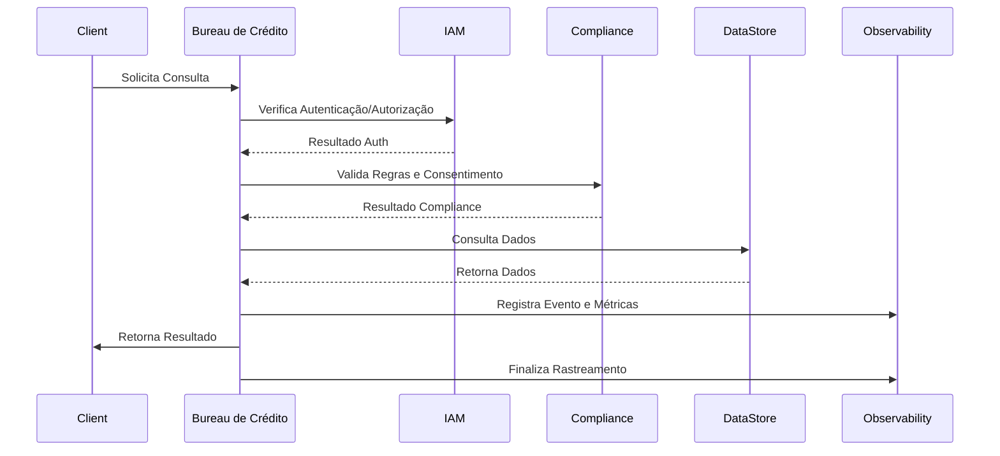

# INNOVABIZ - Especificação Técnica do Módulo Bureau de Crédito

## 1. Visão Geral

O módulo Bureau de Crédito (Central de Risco) é um componente core da plataforma INNOVABIZ, responsável por disponibilizar serviços de consulta e análise de crédito com foco em multi-mercado, multi-tenant e multi-contexto. Este documento detalha a implementação técnica, arquitetura, integrações e configurações necessárias para a operação do módulo em conformidade com as regulamentações dos mercados-alvo e as melhores práticas de segurança e observabilidade.

### 1.1. Objetivos do Módulo

- Fornecer consultas de histórico de crédito, restrições e score
- Garantir compliance regulatório em todos os mercados suportados
- Manter auditabilidade completa das operações
- Integrar-se perfeitamente com outros módulos da plataforma
- Oferecer observabilidade avançada através do MCP-IAM Observability

### 1.2. Principais Funcionalidades

- Consultas parametrizadas por tipo (Completa, Score, Básica, Restrições, Histórico, Relacionamento)
- Controle granular de acesso baseado em finalidade e escopo
- Validação de consentimento conforme regulamentação aplicável
- Notificações obrigatórias a clientes e reguladores
- Rastreamento completo de todas as operações
- Monitoramento avançado via métricas e logs estruturados
- Integração com sistemas de prevenção à fraude e análise de risco

## 2. Arquitetura

### 2.1. Visão de Alto Nível

O Bureau de Crédito está estruturado seguindo uma arquitetura orientada a serviços, com clara separação de responsabilidades:

```
┌────────────────────────────────────────────────────┐
│             Bureau de Crédito Service              │
├────────────────────────────────────────────────────┤
│  ┌────────────┐  ┌─────────────┐  ┌─────────────┐  │
│  │ Consultas  │  │ Compliance  │  │ Notificação │  │
│  │   Engine   │  │   Engine    │  │   Engine    │  │
│  └────────────┘  └─────────────┘  └─────────────┘  │
│                                                    │
│  ┌────────────────────────────────────────────┐    │
│  │            Adaptador de Mercado            │    │
│  └────────────────────────────────────────────┘    │
│                                                    │
│  ┌────────────────────────────────────────────┐    │
│  │         MCP-IAM Observability Layer        │    │
│  └────────────────────────────────────────────┘    │
└────────────────────────────────────────────────────┘
     │            │               │            │
     ▼            ▼               ▼            ▼
┌─────────┐  ┌─────────┐     ┌─────────┐  ┌─────────┐
│   IAM   │  │ Payment │     │  Risk   │  │ Mobile  │
│ Module  │  │ Gateway │     │ Module  │  │  Money  │
└─────────┘  └─────────┘     └─────────┘  └─────────┘
```

### 2.2. Componentes Principais

#### 2.2.1. Consultas Engine
Responsável pelo processamento de consultas, incluindo autenticação, autorização, validação de limites, execução da consulta e formatação de resultados.

#### 2.2.2. Compliance Engine
Gerencia regras de compliance específicas por mercado, validação de consentimento e requisitos regulatórios.

#### 2.2.3. Notificação Engine
Administra notificações obrigatórias a clientes e reguladores conforme requisitos específicos de cada mercado.

#### 2.2.4. Adaptador de Mercado
Implementa lógicas específicas por mercado, incluindo regras regulatórias, formatos de dados e integrações locais.

#### 2.2.5. MCP-IAM Observability Layer
Fornece rastreabilidade, métricas, logs e alertas integrados à infraestrutura central de observabilidade.

### 2.3. Fluxos de Dados



## 3. Implementação

### 3.1. Tecnologias Utilizadas

- **Linguagem**: Go 1.22+
- **Observabilidade**: OpenTelemetry, Prometheus, Zap
- **Comunicação**: gRPC, REST
- **Container**: Docker
- **Orquestração**: Kubernetes
- **API Gateway**: KrakenD

### 3.2. Estrutura de Dados

#### 3.2.1. Consulta de Crédito

```go
type ConsultaCredito struct {
    ConsultaID       string             `json:"consultaId"`
    TipoConsulta     TipoConsulta       `json:"tipoConsulta"`
    Finalidade       FinalidadeConsulta `json:"finalidade"`
    EntidadeID       string             `json:"entidadeId"`
    TipoEntidade     string             `json:"tipoEntidade"` // PF ou PJ
    DocumentoCliente string             `json:"documentoCliente"`
    NomeCliente      string             `json:"nomeCliente"`
    UsuarioID        string             `json:"usuarioId"`
    DataConsulta     time.Time          `json:"dataConsulta"`
    ConsentimentoID  string             `json:"consentimentoId,omitempty"`
    SolicitanteID    string             `json:"solicitanteId"`
    MarketContext    adapter.MarketContext `json:"marketContext"`
    MFALevel         string             `json:"mfaLevel"`
    Parametros       map[string]interface{} `json:"parametros,omitempty"`
}
```

#### 3.2.2. Resultado de Consulta

```go
type ResultadoConsulta struct {
    ConsultaID       string         `json:"consultaId"`
    DataResposta     time.Time      `json:"dataResposta"`
    ScoreCredito     *int           `json:"scoreCredito,omitempty"`
    FaixaRisco       *string        `json:"faixaRisco,omitempty"`
    RegistrosCredito []RegistroCredito `json:"registrosCredito,omitempty"`
    RestricoesList   []RegistroCredito `json:"restricoesList,omitempty"`
    DataAnalise      time.Time      `json:"dataAnalise"`
    RecomendacaoList []string       `json:"recomendacaoList,omitempty"`
    RelatorioURL     *string        `json:"relatorioUrl,omitempty"`
    MetadadosConsulta map[string]interface{} `json:"metadadosConsulta,omitempty"`
    TempoProcessamento int64         `json:"tempoProcessamento"`
}
```

### 3.3. API Principais

#### 3.3.1. RealizarConsulta

```go
func (bc *BureauCredito) RealizarConsulta(ctx context.Context, consulta ConsultaCredito) (*ResultadoConsulta, error)
```

Esta é a API principal que processa uma consulta ao Bureau de Crédito, executando todas as verificações necessárias e retornando o resultado apropriado.

#### 3.3.2. RegistrarRegraCompliance

```go
func (bc *BureauCredito) RegistrarRegraCompliance(regra RegrasCompliance)
```

Permite o registro dinâmico de novas regras de compliance.

#### 3.3.3. RegistrarRegraAcesso

```go
func (bc *BureauCredito) RegistrarRegraAcesso(regra RegraAcesso)
```

Permite o registro dinâmico de novas regras de acesso.

## 4. Integração com MCP-IAM Observability

### 4.1. Spans de OpenTelemetry

| Nome do Span | Descrição | Atributos |
|-------------|-----------|-----------|
| `bureau_credito_consulta` | Span principal para consulta | `consulta_id`, `tipo_consulta`, `finalidade`, `entidade_id`, `documento_cliente`, `market` |
| `verificar_autenticacao` | Verificação de autenticação | `usuario_id`, `mfa_level` |
| `verificar_autorizacao` | Verificação de autorização | `usuario_id`, `scopes` |
| `verificar_regras_acesso` | Verificação de regras de acesso | `regra_id`, `resultado` |
| `verificar_limite_consultas` | Verificação de limites diários | `entidade_id`, `contagem_atual`, `limite` |
| `verificar_consentimento` | Verificação de consentimento | `consentimento_id`, `validade` |
| `verificar_compliance` | Verificação de compliance | `regra_id`, `framework`, `resultado` |
| `processar_consulta` | Processamento da consulta | `tipo_consulta`, `tempo_processamento` |
| `processar_notificacoes` | Processamento de notificações | `tipo_notificacao`, `regulador` |

### 4.2. Métricas

| Nome da Métrica | Tipo | Descrição | Labels |
|----------------|------|-----------|--------|
| `bureau_credito_consultas_total` | Counter | Total de consultas iniciadas | `tipo_consulta`, `market`, `tenant_type` |
| `bureau_credito_consultas_sucesso` | Counter | Total de consultas bem-sucedidas | `tipo_consulta`, `market`, `tenant_type` |
| `bureau_credito_limite_excedido` | Counter | Contagem de limites excedidos | `tipo_consulta`, `entidade_id`, `market` |
| `bureau_credito_tempo_processamento` | Histogram | Tempo de processamento | `tipo_consulta`, `market`, `tenant_type` |
| `bureau_credito_registros_retornados` | Counter | Quantidade de registros retornados | `tipo_consulta`, `market` |
| `bureau_credito_notificacoes` | Counter | Notificações enviadas | `regulador`, `market`, `tipo_notificacao` |
| `bureau_credito_daily_reset` | Counter | Resets diários executados | `market` |

### 4.3. Eventos de Auditoria

| Tipo de Evento | Descrição | Informações Adicionais |
|---------------|-----------|------------------------|
| `bureau_credito_consulta_iniciada` | Consulta iniciada | `consulta_id`, `tipo_consulta`, `documento_cliente` |
| `bureau_credito_consulta_concluida` | Consulta concluída | `consulta_id`, `tempo_processamento` |
| `authentication_verified` | Autenticação verificada | `usuario_id`, `mfa_level` |
| `authorization_verified` | Autorização verificada | `usuario_id`, `scopes` |
| `access_rule_{id}_verified` | Regra de acesso verificada | `regra_id`, `resultado` |
| `consent_verified` | Consentimento verificado | `consentimento_id`, `documento_cliente` |
| `compliance_rule_{id}_verified` | Regra de compliance verificada | `regra_id`, `framework`, `resultado` |

### 4.4. Eventos de Segurança

| Tipo de Evento | Severidade | Descrição | Informações Adicionais |
|---------------|-----------|-----------|------------------------|
| `bureau_credito_auth_failure` | HIGH | Falha de autenticação/autorização | `usuario_id`, `motivo` |
| `bureau_credito_access_denied` | MEDIUM | Acesso negado por regra específica | `regra_id`, `motivo` |
| `bureau_credito_limit_exceeded` | MEDIUM | Limite de consultas excedido | `entidade_id`, `contagem_atual`, `limite` |
| `bureau_credito_consent_failure` | HIGH | Falha na verificação de consentimento | `consentimento_id`, `documento_cliente` |
| `bureau_credito_compliance_violation` | HIGH | Violação de regra de compliance | `regra_id`, `framework`, `motivo` |
| `bureau_credito_invalid_consent` | HIGH | Consentimento inválido ou expirado | `consentimento_id`, `documento_cliente` |

## 5. Configurações por Mercado

### 5.1. Angola (BNA)

- **Regulamentação Principal**: BNA (Banco Nacional de Angola)
- **Consentimento**: Obrigatório para todas as consultas
- **MFA**: Nível alto obrigatório para consultas completas
- **Notificação**: Obrigatória para todas as consultas
- **Tempo de Retenção**: 60 meses (5 anos)
- **Particularidades**:
  - Verificação adicional para finalidade de concessão de crédito
  - Relatório mensal ao regulador

### 5.2. Brasil (BACEN/LGPD)

- **Regulamentação Principal**: BACEN, LGPD, SCR
- **Consentimento**: Obrigatório com especificação clara de finalidade
- **MFA**: Nível médio/alto dependendo do tipo de consulta
- **Notificação**: Obrigatória para consultas que retornem restrições
- **Tempo de Retenção**: 60 meses (5 anos)
- **Particularidades**:
  - Direito de acesso e correção (LGPD)
  - Relatórios periódicos ao SCR (Sistema de Informações de Crédito)

### 5.3. União Europeia (GDPR/PSD2)

- **Regulamentação Principal**: GDPR, PSD2
- **Consentimento**: Obrigatório com finalidade específica e limitada
- **MFA**: Nível adaptativo conforme contexto da transação
- **Notificação**: Obrigatória para todas as consultas
- **Tempo de Retenção**: 24 meses (2 anos)
- **Particularidades**:
  - Minimização de dados obrigatória
  - Direito ao esquecimento
  - Transparência nos critérios de decisão

### 5.4. Estados Unidos (FCRA/GLBA)

- **Regulamentação Principal**: FCRA, GLBA
- **Consentimento**: Necessário apenas para finalidades específicas
- **MFA**: Baseado em risco
- **Notificação**: Obrigatória para consultas que impactem negativamente
- **Tempo de Retenção**: 84 meses (7 anos)
- **Particularidades**:
  - Finalidades permissíveis específicas
  - Notificações de negação de crédito
  - Disputas e correções (FCRA)

## 6. Integração com Outros Módulos Core

### 6.1. Integração com IAM

A integração com o IAM é fundamental para o funcionamento do Bureau de Crédito, utilizando-o para:

- Autenticação de usuários
- Autorização baseada em escopos
- Validação de MFA
- Gestão de consentimento

API utilizadas:
```go
observability.ValidateMFA(ctx, consulta.MarketContext, consulta.UsuarioID, consulta.MFALevel)
observability.ValidateScope(ctx, consulta.MarketContext, consulta.UsuarioID, scope)
observability.ValidateConsent(ctx, consulta.MarketContext, consulta.DocumentoCliente, consulta.ConsentimentoID)
```

### 6.2. Integração com Payment Gateway

O módulo Bureau de Crédito fornece dados críticos para o Payment Gateway para:

- Avaliação de risco pré-transação
- Verificação de restrições
- Score para decisões de autorização
- Validação de limites de crédito

API consumida pelo Payment Gateway:
```go
bureauCredito.RealizarConsulta(ctx, ConsultaCredito{
    TipoConsulta: ConsultaScore,
    Finalidade:   FinalidadeConcessaoCredito,
    // Outros parâmetros
})
```

### 6.3. Integração com Risk Management

O módulo de Risk Management consome dados do Bureau de Crédito para:

- Análise de risco avançada
- Scoring de clientes
- Detecção de fraudes
- Avaliação de contrapartes

API utilizada pelo Risk Management:
```go
bureauCredito.RealizarConsulta(ctx, ConsultaCredito{
    TipoConsulta: ConsultaCompleta,
    Finalidade:   FinalidadeGerencialRegulador,
    // Outros parâmetros
})
```

### 6.4. Integração com Mobile Money

O Mobile Money utiliza o Bureau de Crédito para:

- Verificação de clientes
- Avaliação para concessão de microcrédito
- Limites transacionais adaptáveis
- Prevenção de fraudes em transferências

API utilizada pelo Mobile Money:
```go
bureauCredito.RealizarConsulta(ctx, ConsultaCredito{
    TipoConsulta: ConsultaBasica,
    Finalidade:   FinalidadeVerificacaoCliente,
    // Outros parâmetros
})
```

## 7. Segurança e Compliance

### 7.1. Controle de Acesso

- **Autenticação**: Obrigatória para todas as operações via IAM
- **Autorização**: Baseada em escopos específicos por tipo de consulta e finalidade
- **MFA**: Adaptativo conforme criticidade da operação e mercado

### 7.2. Proteção de Dados

- **Mascaramento**: Dados sensíveis mascarados nos logs e eventos
- **Criptografia**: Dados em trânsito (TLS 1.3) e em repouso
- **Minimização**: Apenas dados necessários são retornados conforme finalidade

### 7.3. Auditoria

- **Logs Estruturados**: Todas as operações são registradas com metadados completos
- **Rastreabilidade**: Spans de OpenTelemetry permitem rastreamento completo
- **Imutabilidade**: Eventos de auditoria são imutáveis e exportados para storage permanente

### 7.4. Compliance

- **Regras Dinâmicas**: Regras de compliance configuráveis por mercado
- **Notificações**: Sistema automático de notificação conforme requisitos regulatórios
- **Relatórios**: Geração de relatórios para reguladores

## 8. Requisitos de Implantação

### 8.1. Pré-requisitos

- **Kubernetes**: v1.28+
- **OpenTelemetry Collector**: v0.92+
- **Prometheus**: v2.48+
- **API Gateway**: KrakenD v2.5+
- **IAM Module**: Implementação atualizada do MCP-IAM

### 8.2. Variáveis de Ambiente

| Nome | Descrição | Valores Válidos | Padrão |
|------|-----------|-----------------|--------|
| `ENVIRONMENT` | Ambiente de execução | `development`, `quality`, `homologation`, `production`, `sandbox` | `development` |
| `MARKET` | Mercado principal | `angola`, `brazil`, `eu`, `usa`, `global` | `global` |
| `TENANT_TYPE` | Tipo de tenant | `default`, `enterprise`, `government` | `default` |
| `SERVICE_VERSION` | Versão do serviço | Semver (ex: `1.0.0`) | - |
| `LOG_LEVEL` | Nível de log | `debug`, `info`, `warn`, `error` | `info` |
| `OTEL_EXPORTER_OTLP_ENDPOINT` | Endpoint do coletor OpenTelemetry | URL | `http://otel-collector:4317` |

### 8.3. Recursos de Kubernetes

```yaml
resources:
  requests:
    memory: "256Mi"
    cpu: "100m"
  limits:
    memory: "1Gi"
    cpu: "500m"
```

### 8.4. Dependências Externas

- **IAM Service**: Para autenticação, autorização e gestão de consentimento
- **OpenTelemetry Collector**: Para exportação de telemetria
- **Prometheus**: Para armazenamento de métricas
- **KrakenD API Gateway**: Para exposição de APIs
- **Fontes de Dados**: Configuração de fontes de dados específicas por mercado

## 9. Estratégia de Testes

### 9.1. Testes Unitários

Cobertura mínima de 85% para funções críticas:
- Verificação de autenticação
- Verificação de autorização
- Regras de compliance
- Processamento de consulta

### 9.2. Testes de Integração

- Integração com IAM
- Integração com OpenTelemetry
- Processamento completo de consulta
- Verificação de notificações

### 9.3. Testes de Performance

- Benchmark de tempo de resposta por tipo de consulta
- Teste de carga com 100 consultas simultâneas
- Monitoramento de consumo de recursos
- Testes de recuperação após falha

### 9.4. Testes de Compliance

- Cenários específicos por mercado
- Validação de regras regulatórias
- Verificação de auditabilidade
- Simulação de cenários de violação

## 10. Dashboards e Monitoramento

### 10.1. Dashboard Operacional

- Volume de consultas por tipo e mercado
- Tempo médio de resposta
- Taxa de erros
- Consultas por finalidade
- Top entidades por volume

### 10.2. Dashboard de Compliance

- Violações de regras por mercado
- Notificações enviadas por regulador
- Consentimentos expirados ou rejeitados
- Consultas rejeitadas por tipo de regra

### 10.3. Alertas

| Alerta | Descrição | Threshold | Severidade |
|--------|-----------|-----------|------------|
| `BureauHighErrorRate` | Taxa de erro elevada | >5% em 5min | HIGH |
| `BureauHighLatency` | Tempo de resposta elevado | >1s p95 em 5min | MEDIUM |
| `BureauComplianceViolation` | Violações de compliance | >0 em 1h | HIGH |
| `BureauHighRejectionRate` | Taxa de rejeição elevada | >10% em 15min | MEDIUM |
| `BureauServiceDown` | Serviço indisponível | 30s sem heartbeat | CRITICAL |

## 11. Roadmap e Evolução

### 11.1. Versão Atual (1.0.0)

- Implementação básica com suporte a Angola, Brasil, UE e EUA
- Integração completa com MCP-IAM Observability
- Regras de compliance estáticas

### 11.2. Próxima Versão (1.1.0)

- Adição de suporte a China e países BRICS
- Regras de compliance dinâmicas via API
- Cache distribuído para consultas frequentes
- Sistema de score proprietário

### 11.3. Versão Futura (2.0.0)

- Machine Learning para detecção de fraudes
- Auto-escala baseada em métricas de uso
- Integrações com bureaus externos
- APIs públicas para parceiros

## 12. Referências

1. Documentação MCP-IAM Observability Integration
2. Regulamentações BNA (Banco Nacional de Angola)
3. BACEN - SCR (Sistema de Informações de Crédito)
4. GDPR (General Data Protection Regulation)
5. FCRA (Fair Credit Reporting Act)
6. OpenTelemetry Specification v1.0
7. ISO 27001:2022
8. PCI DSS 4.0
9. ADR Bureau de Crédito
10. Arquitetura Geral INNOVABIZ Platform

---

**Autor**: Equipe de Desenvolvimento INNOVABIZ  
**Versão**: 1.0.0  
**Data**: 2025-02-18  
**Status**: Aprovado