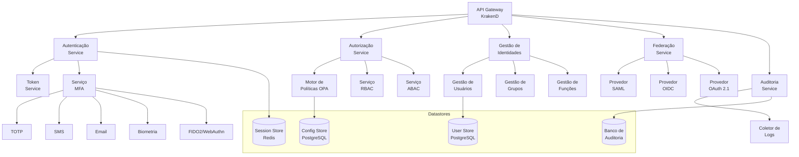

# Especificação Técnica: Módulo IAM (Identity and Access Management)

**Projeto:** INNOVABIZ - Plataforma de Inovação Empresarial  
**Versão:** 1.0.0  
**Data:** 2025-08-04  
**Autor:** Eduardo Jeremias - InnovaBiz DevOps  
**Status:** Desenvolvimento  
**Classificação:** Restrito

## 1. Visão Geral

O módulo IAM (Identity and Access Management) é um componente crítico da plataforma INNOVABIZ, responsável pela gestão de identidades, autenticação, autorização e auditoria de acessos em toda a plataforma. Projetado como uma solução avançada, multi-tenant, multi-contexto e multi-regional, o IAM implementa os mais rigorosos padrões de segurança, conformidade e interoperabilidade, atendendo às regulamentações específicas dos mercados-alvo (Angola, Europa, América, China, CPLP, SADC, PALOP, BRICS e Brasil).

### 1.1. Objetivos do Módulo

- Fornecer um sistema de gestão de identidades robusto e escalável
- Implementar mecanismos de autenticação multifator adaptados a diferentes contextos
- Garantir autorização baseada em RBAC (Role-Based Access Control) e ABAC (Attribute-Based Access Control)
- Integrar com provedores de identidade externos (OpenID Connect, SAML, OAuth 2.1)
- Assegurar rastreabilidade completa e auditoria de acessos
- Garantir conformidade com regulamentações regionais de proteção de dados
- Proporcionar uma experiência de usuário segura e sem atrito

### 1.2. Funcionalidades Principais

- Gestão de identidades (usuários, grupos, roles)
- Autenticação multifator (MFA) adaptativa
- Autorização contextual (RBAC, ABAC)
- Single Sign-On (SSO)
- Federação de identidades
- Gestão de políticas de acesso
- Auditoria e relatórios de segurança
- Auto-serviço de credenciais
- Proteção contra ameaças avançadas

## 2. Arquitetura Técnica

### 2.1. Visão Arquitetural

O IAM é implementado como um conjunto de microserviços independentes, altamente coesos e fracamente acoplados, organizados em torno de domínios de negócio específicos. A comunicação entre os serviços é realizada através de APIs REST e mensageria assíncrona.

### 2.2. Componentes Principais

#### 2.2.1. Serviço de Autenticação

Responsável pela verificação de identidade dos usuários através de diversos mecanismos:

- **Autenticação por senha** - Com políticas configuráveis de complexidade e expiração
- **Autenticação multifator** - TOTP, SMS, email, biometria, FIDO2/WebAuthn
- **Autenticação social** - Integração com provedores sociais (Google, Microsoft, Facebook)
- **Autenticação sem senha** - Magic links, FIDO2/WebAuthn
- **Gestão de sessão** - Incluindo expiração, renovação e revogação

Tecnologias: TypeScript, Node.js, Express, Redis

#### 2.2.2. Serviço de Autorização

Implementa mecanismos avançados para controle de acesso:

- **Motor de políticas OPA (Open Policy Agent)** - Para decisões de autorização baseadas em políticas
- **RBAC (Role-Based Access Control)** - Controle de acesso baseado em funções
- **ABAC (Attribute-Based Access Control)** - Controle de acesso baseado em atributos
- **ReBAC (Relationship-Based Access Control)** - Para cenários complexos de relacionamento
- **Hierarquia de permissões** - Suporte para herança e delegação de permissões

Tecnologias: Go, OPA, PostgreSQL

#### 2.2.3. Gestão de Identidades

Gerencia o ciclo de vida completo das identidades no sistema:

- **Provisão de usuários** - Manual e automática (JIT)
- **Auto-serviço de registro** - Com verificação e aprovação configuráveis
- **Gestão de perfil** - Incluindo campos personalizáveis e metadados
- **Gestão de grupos e funções** - Criação, modificação e atribuição
- **Workflows de aprovação** - Para operações críticas e mudanças de acesso

Tecnologias: Java, Spring Boot, PostgreSQL, Kafka

#### 2.2.4. Federação de Identidades

Permite a integração com provedores de identidade externos:

- **SAML 2.0** - Para integração com sistemas corporativos
- **OpenID Connect** - Para autenticação moderna e federada
- **OAuth 2.1** - Para autorização de APIs
- **SCIM 2.0** - Para provisionamento e sincronização de usuários

Tecnologias: Java, Spring Security, PostgreSQL

#### 2.2.5. Auditoria e Logs

Registra e analisa todas as atividades relacionadas à segurança:

- **Registro de eventos** - Autenticação, autorização, modificações
- **Alertas de segurança** - Notificações para eventos suspeitos
- **Relatórios de conformidade** - GDPR, LGPD, PCI DSS, etc.
- **Retenção de logs** - Políticas configuráveis por região/regulamentação

Tecnologias: Elasticsearch, Logstash, Kibana, Kafka

### 2.3. Integrações

O IAM integra-se com:

- **API Gateway (KrakenD)** - Para proteção de endpoints e validação de tokens
- **Demais módulos da plataforma INNOVABIZ** - Payment Gateway, RiskManagement, Mobile Money, etc.
- **Provedores externos de identidade** - Azure AD, Okta, Auth0, etc.
- **Serviços de verificação de identidade** - Incluindo KYC (Know Your Customer) e AML (Anti-Money Laundering)
- **Sistemas de monitoramento e observabilidade** - Prometheus, Grafana, Jaeger

### 2.4. Banco de Dados

A camada de persistência utiliza uma abordagem poliglota para atender diferentes necessidades:

- **PostgreSQL** - Para dados de usuários, permissões e configurações
- **Redis** - Para sessões, cache e dados temporários
- **Elasticsearch** - Para logs de auditoria e pesquisa avançada
- **Neo4j** - Para modelagem de relacionamentos e análise de grafos (opcional para cenários complexos de ReBAC)

Características de armazenamento:

- Sharding para escalabilidade horizontal
- Multi-tenancy com isolamento de dados
- Criptografia em repouso para dados sensíveis
- Backup automatizado e replicação geográfica

## 3. Segurança e Conformidade

### 3.1. Modelo de Segurança

O IAM implementa o princípio de defesa em profundidade (defense in depth) com múltiplas camadas de segurança:

- **Criptografia** - TLS 1.3 para comunicação, criptografia de dados sensíveis em repouso (AES-256)
- **Proteção contra ameaças** - Limitação de taxa, proteção contra força bruta, detecção de anomalias
- **Segredos** - Gerenciamento de segredos via HashiCorp Vault ou AWS KMS
- **Ciclo de vida de credenciais** - Rotação automática, expiração e revogação
- **Princípio de menor privilégio** - Aplicado em todos os níveis do sistema

### 3.2. Conformidade Regulatória

O módulo atende às seguintes regulamentações, com configurações específicas por região:

- **Europa**: GDPR, PSD2, eIDAS
- **Brasil**: LGPD, Resolução BCB nº 85/2021
- **Angola**: Lei de Proteção de Dados Pessoais (Lei n.º 22/11), regulamentos do BNA
- **Global**: PCI DSS, SOC 2, ISO 27001, NIST Cybersecurity Framework

### 3.3. Auditoria e Logs

Todos os eventos de segurança são registrados em logs imutáveis:

- Tentativas de login (bem-sucedidas e falhas)
- Mudanças em permissões e políticas
- Criação, modificação e exclusão de identidades
- Eventos administrativos e exceções de segurança

## 4. Implantação e Escalabilidade

### 4.1. Estratégia de Implantação

- **Containerização** - Todos os componentes são containerizados com Docker
- **Orquestração** - Kubernetes para gerenciamento de containers
- **Helm Charts** - Para implantação consistente nos diferentes ambientes
- **GitOps** - Usando ArgoCD para implantação contínua
- **Múltiplos ambientes** - Desenvolvimento, QA, Staging e Produção

### 4.2. Escalabilidade e Alta Disponibilidade

- **Auto-scaling** - Escalonamento horizontal baseado em métricas de uso
- **Arquitetura stateless** - Para facilitar o escalonamento horizontal
- **Multi-região** - Implantação em múltiplas regiões geográficas
- **Disaster Recovery** - Replicação geográfica e procedimentos de failover
- **SLA alvo** - 99.99% de disponibilidade

### 4.3. Monitoramento e Observabilidade

- **Métricas** - Prometheus para coleta e armazenamento de métricas
- **Dashboards** - Grafana para visualização e alertas
- **Tracing** - Jaeger para rastreamento distribuído
- **Logging** - ELK Stack (Elasticsearch, Logstash, Kibana) para logs centralizados
- **Alertas** - Integração com PagerDuty, Slack e email

## 5. Tecnologias Utilizadas

### 5.1. Linguagens de Programação

- TypeScript/Node.js (Serviços de Autenticação)
- Go (Serviço de Autorização, OPA)
- Java (Gestão de Identidades, Federação)
- Python (Detecção de Anomalias, ML para segurança)

### 5.2. Frameworks e Bibliotecas

- Express.js
- Spring Boot
- Gin (Go)
- OpenPolicyAgent
- Passport.js
- Spring Security
- JWT, PASETO

### 5.3. Banco de Dados e Armazenamento

- PostgreSQL (dados principais)
- Redis (sessões, cache)
- Elasticsearch (logs de auditoria)
- Neo4j (opcional para ReBAC)
- Kafka (mensageria e processamento de eventos)

### 5.4. Infraestrutura e DevOps

- Docker
- Kubernetes
- Helm
- ArgoCD
- Prometheus
- Grafana
- Jaeger
- ELK Stack

## 6. APIs e Interfaces

### 6.1. APIs RESTful

O módulo IAM expõe um conjunto completo de APIs RESTful para integração com outros sistemas:

- **API de Autenticação** - Login, logout, refresh token, MFA
- **API de Usuários** - CRUD de usuários, perfis, credenciais
- **API de Autorização** - Verificação de permissões, políticas, funções
- **API de Administração** - Configuração do sistema, relatórios, auditorias

Documentação detalhada via OpenAPI 3.0 (Swagger).

### 6.2. GraphQL (opcional)

Para casos de uso que requerem consultas complexas e flexíveis:

- **Consulta de dados** - Usuários, grupos, permissões
- **Mutações** - Operações CRUD em recursos IAM
- **Subscrições** - Para notificações em tempo real

### 6.3. Webhooks

Para notificações em tempo real de eventos relacionados à identidade:

- Criação, modificação e exclusão de usuários
- Eventos de login (bem-sucedidos/falhos)
- Alertas de segurança
- Alterações em permissões

### 6.4. Interfaces de Usuário

- **Painel administrativo** - Para gerenciamento de usuários e políticas
- **Portal de auto-serviço** - Para usuários gerenciarem seus próprios perfis e credenciais
- **Widgets incorporáveis** - Para integração de autenticação em aplicações cliente

## 7. Integração com outros Módulos

### 7.1. Payment Gateway

- Autenticação para transações financeiras
- Autorização baseada em limites e perfis de risco
- Verificação de identidade para compliance KYC/AML

### 7.2. RiskManagement

- Compartilhamento de dados de comportamento para análise de risco
- Integração para ajuste dinâmico de políticas de segurança
- Autenticação adaptativa baseada em score de risco

### 7.3. Mobile Money

- Autenticação biométrica para transações móveis
- Autorização contextual (localização, dispositivo, comportamento)
- Federação de identidade para ecossistema de parceiros

### 7.4. E-Commerce/Marketplace

- SSO para experiência unificada de compra
- Gerenciamento de identidades de compradores e vendedores
- Controle de acesso granular para plataformas multi-tenant

### 7.5. HyperInnova

- Integração com módulos de CloudForge para IAM em infraestrutura
- Autorização para DataCoreIoT e Unidata
- Autenticação para interfaces e dashboards do InsightFlow

## 8. Requisitos Não-Funcionais

### 8.1. Performance

- **Latência** - < 200ms para operações de autenticação
- **Throughput** - Suporte para 1000+ transações por segundo por região
- **Escalabilidade** - Capacidade de escalar horizontalmente para milhões de usuários

### 8.2. Segurança

- **Penetration testing** regular
- **SAST, DAST e SCA** integrados no pipeline CI/CD
- **Gestão de vulnerabilidades** com tempo máximo de resolução definido por severidade

### 8.3. Compliance

- Auditoria de conformidade automatizada
- Relatórios de conformidade customizados por região
- Atualizações regulares para novas regulamentações

### 8.4. Manutenibilidade

- Cobertura de testes > 85%
- Documentação técnica completa e atualizada
- Código seguindo princípios SOLID e clean code

## 9. Roadmap Técnico

### Fase 1 - Fundação (Q3 2025)

- Implementação das funcionalidades core de autenticação e autorização
- Integração com API Gateway
- Suporte inicial para RBAC e MFA básico

### Fase 2 - Expansão (Q4 2025)

- Federação de identidades (SAML, OIDC)
- Implementação completa de ABAC
- Integração com módulos Payment Gateway e Mobile Money

### Fase 3 - Avançada (Q1 2026)

- Autenticação adaptativa baseada em ML
- ReBAC para cenários complexos
- Suporte completo para FIDO2/WebAuthn

### Fase 4 - Enterprise (Q2 2026)

- Implantação multi-região completa
- Customizações específicas por mercado
- Integrações avançadas com ecossistemas locais

## 10. Considerações Finais

O módulo IAM da plataforma INNOVABIZ foi projetado para atender aos mais rigorosos requisitos de segurança, conformidade e escalabilidade, adaptando-se às especificidades dos diferentes mercados-alvo. A arquitetura modular e extensível permite a evolução contínua do sistema, incorporando novas tecnologias e atendendo a novas regulamentações conforme necessário.

Esta especificação técnica deve ser revisada e atualizada regularmente, conforme a evolução da plataforma e dos requisitos de negócio.

---

**Histórico de Revisões**

| Data | Versão | Descrição | Autor |
|------|--------|-----------|-------|
| 2025-08-04 | 1.0.0 | Versão inicial | Eduardo Jeremias |