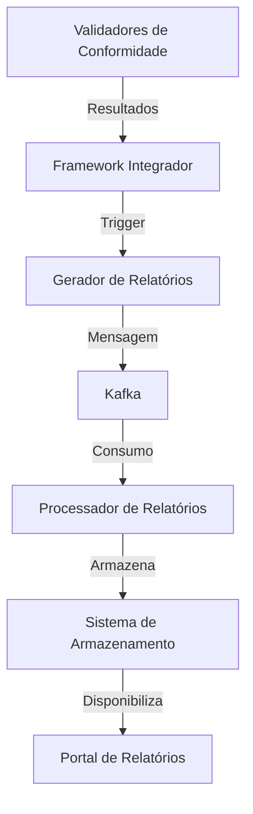

# Integração com Sistema de Gestão de Relatórios

**Autor**: INNOVABIZ DevOps  
**Versão**: 1.0.0  
**Data**: 15/05/2025  
**Status**: ✅ Concluído  

## Índice

1. [Introdução](#1-introdução)
2. [Arquitetura da Integração](#2-arquitetura-da-integração)
3. [Componentes Principais](#3-componentes-principais)
4. [Fluxo de Integração](#4-fluxo-de-integração)
5. [Templates de Relatórios](#5-templates-de-relatórios)
6. [Processamento Assíncrono via Kafka](#6-processamento-assíncrono-via-kafka)
7. [Configuração por Tenant](#7-configuração-por-tenant)
8. [Guia de Implementação](#8-guia-de-implementação)
9. [Referências](#9-referências)

## 1. Introdução

Este documento descreve a integração entre o Framework de Validadores de Conformidade IAM e o Sistema de Gestão de Relatórios da plataforma INNOVABIZ. Esta integração permite a geração automática de relatórios de conformidade a partir dos resultados das validações realizadas pelos validadores setoriais.

### 1.1 Objetivo

Automatizar o processo de geração de relatórios de conformidade com formatos personalizáveis e templates específicos por setor regulatório, criando uma solução integrada e escalável para documentação de conformidade.

### 1.2 Escopo

- Geração de relatórios a partir de resultados de validação de conformidade
- Suporte a múltiplos formatos (PDF, EXCEL, CSV, JSON, HTML)
- Templates personalizáveis por setor regulatório
- Processamento assíncrono via Kafka
- Configuração personalizada por tenant
- Armazenamento do histórico de relatórios gerados

## 2. Arquitetura da Integração

A integração segue uma arquitetura modular e desacoplada, baseada em eventos, que permite o processamento assíncrono dos relatórios e escalabilidade horizontal.



### 2.1 Componentes da Arquitetura

| Componente | Responsabilidade |
|------------|------------------|
| Validadores de Conformidade | Executa validações e gera resultados |
| Framework Integrador | Consolida resultados e dispara eventos |
| Gerador de Relatórios | Prepara dados e envia para processamento |
| Kafka | Gerencia filas de mensagens para processamento assíncrono |
| Processador de Relatórios | Consome mensagens e gera relatórios finais |
| Sistema de Armazenamento | Armazena relatórios gerados |
| Portal de Relatórios | Interface para acesso aos relatórios |

## 3. Componentes Principais

### 3.1 Schema e Tabelas

O módulo utiliza um schema dedicado `compliance_reports` com as seguintes tabelas principais:

- `report_templates`: Armazena templates de relatórios por tipo e setor
- `tenant_report_config`: Configurações personalizadas por tenant
- `report_history`: Histórico de relatórios gerados

### 3.2 Funções de Integração

O módulo implementa as seguintes funções principais:

| Função | Descrição |
|--------|-----------|
| `register_report_template` | Registra novo template de relatório |
| `configure_tenant_reports` | Configura preferências de relatórios por tenant |
| `generate_report_from_validation` | Gera relatório a partir de resultados de validação |
| `update_report_status` | Atualiza status de relatório após processamento |
| `get_tenant_reports` | Consulta relatórios por tenant com filtros |

### 3.3 Triggers

O módulo implementa um trigger `validation_report_trigger` que é disparado após a inserção de novos registros na tabela `compliance_integrator.validation_history`, possibilitando a geração automática de relatórios sempre que uma nova validação é concluída.

## 4. Fluxo de Integração

O fluxo completo de integração segue estas etapas:

1. **Validação de Conformidade**: O Framework Integrador executa validações de conformidade
2. **Registro de Resultados**: Os resultados são registrados na tabela de histórico de validações
3. **Trigger de Relatório**: O trigger de validação é disparado automaticamente
4. **Geração de Relatório**: A função de geração de relatório é executada
5. **Envio para Kafka**: Os dados são enviados para a fila Kafka apropriada
6. **Processamento Assíncrono**: O serviço consumidor processa a mensagem e gera o relatório
7. **Atualização de Status**: O status do relatório é atualizado no histórico
8. **Disponibilização**: O relatório finalizado é armazenado e disponibilizado para acesso

## 5. Templates de Relatórios

O sistema implementa templates de relatórios especializados por setor regulatório, utilizando uma estrutura JSONB flexível que permite personalização completa.

### 5.1 Estrutura dos Templates

Cada template é composto por:

- **Metadados**: Informações sobre o template (nome, tipo, formato)
- **Seções**: Lista de seções do relatório com fontes de dados
- **Gráficos**: Definições de visualizações gráficas
- **Estilos**: Especificações de aparência e formatação

### 5.2 Templates Predefinidos

O sistema inclui templates predefinidos para:

- **Setor de Saúde**: Templates para HIPAA, GDPR e LGPD
- **Setor Financeiro**: Templates para PSD2 e Open Banking
- **Setor Governamental**: Templates para regulamentações específicas
- **Consolidado**: Template multi-setor para visão agregada

## 6. Processamento Assíncrono via Kafka

O sistema utiliza o Apache Kafka para processamento assíncrono de relatórios, permitindo escalabilidade e resiliência.

### 6.1 Tópicos Kafka

- `compliance-reports`: Tópico principal para mensagens de geração de relatórios
- Tópicos específicos por tenant podem ser configurados quando necessário

### 6.2 Estrutura das Mensagens

As mensagens Kafka incluem:

- `report_id`: Identificador único do relatório
- `tenant_id`: Identificador do tenant
- `validation_id`: Identificador da validação de origem
- `template_id`: Template a ser utilizado
- `report_format`: Formato de saída
- `validation_data`: Dados completos da validação
- Dados de configuração e personalização

## 7. Configuração por Tenant

O sistema permite configuração granular por tenant, incluindo:

- Template padrão de relatório
- Formato padrão (PDF, EXCEL, etc.)
- Idioma padrão
- Cabeçalho e rodapé personalizados
- Logo personalizado
- Tópico Kafka específico

## 8. Guia de Implementação

### 8.1 Pré-requisitos

- PostgreSQL 13+
- Apache Kafka
- Framework Integrador de Validadores já implementado

### 8.2 Sequência de Implementação

1. Execute o script `11_reports_integration.sql` para criar schema, tabelas e funções
2. Configure templates adicionais conforme necessário para cada setor
3. Configure cada tenant com suas preferências de relatório
4. Implemente o serviço consumidor Kafka para processamento dos relatórios

### 8.3 Exemplos de Uso

#### Configuração de Template de Relatório

```sql
SELECT compliance_reports.register_report_template(
    'Template LGPD Detalhado',
    'Relatório detalhado de conformidade com a LGPD',
    'LGPD',
    'PDF',
    '{"sections":[...], "charts":[...]}',
    'admin'
);
```

#### Configuração de Tenant

```sql
SELECT compliance_reports.configure_tenant_reports(
    '550e8400-e29b-41d4-a716-446655440000', -- tenant_id
    '71f0c7e1-e29b-41d4-a716-446655440000', -- template_id
    'PDF',
    'pt-BR',
    '{"title":"Relatório de Conformidade"}',
    '{"page":"{{page}}/{{total}}"}',
    'https://tenant.com/logo.png',
    'tenant-reports'
);
```

#### Geração Manual de Relatório

```sql
SELECT compliance_reports.generate_report_from_validation(
    'a1b2c3d4-e5f6-4321-8901-abcdef123456', -- validation_id
    '550e8400-e29b-41d4-a716-446655440000', -- tenant_id
    NULL, -- usar template padrão do tenant
    'PDF',
    'pt-BR'
);
```

## 9. Referências

### 9.1 Frameworks e Padrões

- DAMA-DMBOK (Data Management Body of Knowledge)
- ISO/IEC 27001 (Information Security Management)
- ISO 9001 (Quality Management)
- TOGAF (The Open Group Architecture Framework)
- ITIL (Information Technology Infrastructure Library)
- COBIT (Control Objectives for Information and Related Technologies)

### 9.2 Documentação Relacionada

- [Validadores de Conformidade para Setor de Saúde](validadores_conformidade_saude.md)
- [Validadores de Conformidade para Setor Financeiro](validadores_conformidade_financas.md)
- [Framework Integrador de Validadores](integrador_validadores_conformidade.md)
- [Integração com Sistema de Gestão de Incidentes](integracao_incidentes.md)
