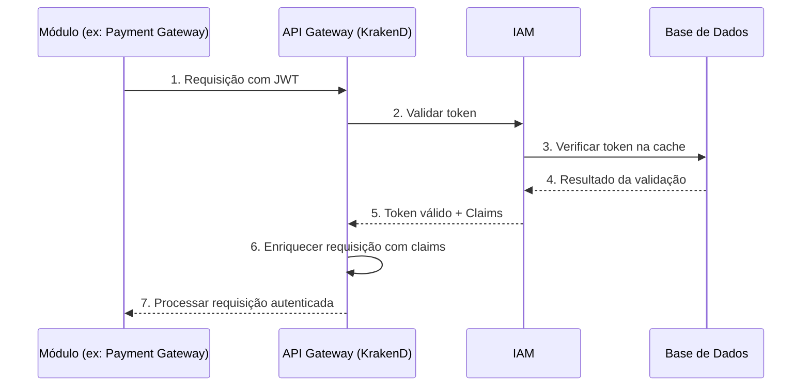
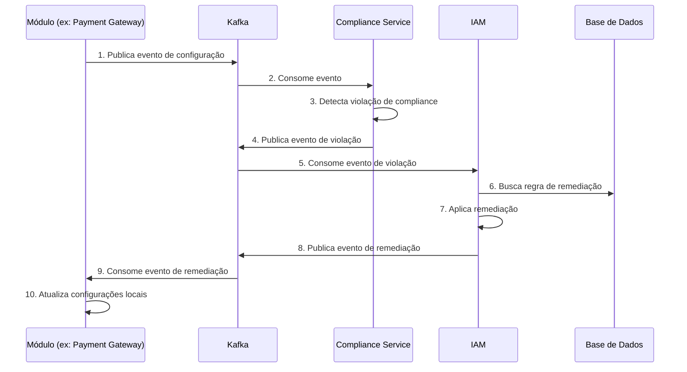
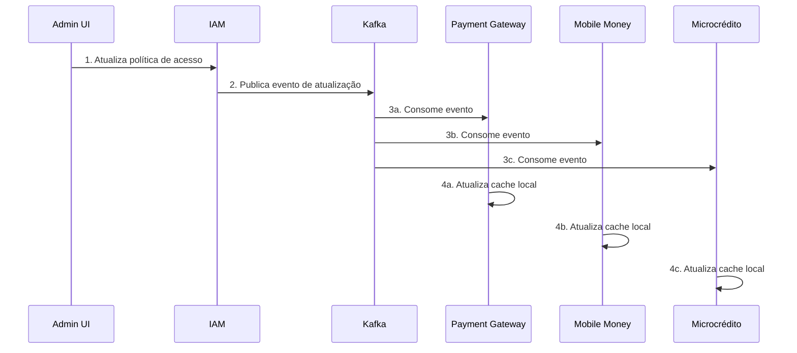

# Arquitetura de Integração do IAM para Remediação de Compliance

## 1. Introdução

### 1.1 Visão Geral

Este documento define a arquitetura de integração do módulo IAM (Identity and Access Management) com os demais módulos da plataforma INNOVABIZ para suportar a remediação automática de compliance. A arquitetura apresentada estabelece os mecanismos pelos quais o módulo IAM já implementado com recursos de remediação se integra aos outros módulos core (Payment Gateway, Mobile Money, Microcrédito, Marketplace, e-Commerce, Seguros) para garantir uma abordagem consistente e extensível de conformidade regulatória.

### 1.2 Objetivos

1. Estabelecer um framework técnico para integração do IAM com outros módulos da plataforma
2. Definir interfaces, protocolos e contratos de comunicação padronizados
3. Garantir consistência na aplicação de políticas de compliance entre módulos
4. Implementar mecanismos de segurança e auditoria transversais
5. Suportar uma arquitetura multi-regional e multi-regulatória

### 1.3 Princípios Arquiteturais

1. **Separação de Responsabilidades**: Clara definição de funções entre IAM e módulos integrados
2. **Desacoplamento**: Acoplamento fraco entre componentes para permitir evolução independente
3. **Segurança por Design**: Autenticação, autorização e auditoria integradas em todas as interfaces
4. **Escalabilidade Horizontal**: Capacidade de escalar em ambientes de alta demanda
5. **Resiliência**: Operação contínua mesmo em cenários de falha parcial
6. **Observabilidade**: Visibilidade completa sobre fluxos de integração e operações

## 2. Arquitetura de Integração

### 2.1 Visão Geral da Arquitetura

A arquitetura de integração do IAM para remediação de compliance é estruturada em camadas, com interfaces claras e padronizadas para cada nível de interação:

```
┌─────────────────────────────────────────────────────────────────┐
│                    Módulos Core da Plataforma                   │
├─────────────┬─────────────┬─────────────┬───────────┬───────────┤
│  Payment    │   Mobile    │ Microcrédito│Marketplace│   ...     │
│  Gateway    │   Money     │             │           │           │
└──────┬──────┴──────┬──────┴──────┬──────┴─────┬─────┴─────┬─────┘
       │             │             │            │           │
┌──────▼─────────────▼─────────────▼────────────▼───────────▼─────┐
│                          API Gateway                             │
│                          (KrakenD)                              │
└──────────────────────────────┬──────────────────────────────────┘
                               │
┌──────────────────────────────▼──────────────────────────────────┐
│                    Barramento de Eventos                        │
│                        (Apache Kafka)                           │
└─────────────┬─────────────────────────────────────┬─────────────┘
              │                                     │
┌─────────────▼─────────────────┐    ┌─────────────▼─────────────────┐
│     Compliance Service        │    │           IAM                  │
├─────────────────────────────────    ├─────────────────────────────────
│  ┌─────────────┐ ┌───────────┐│    │  ┌─────────────┐ ┌───────────┐│
│  │Detector de  │ │Remediador ││    │  │ Serviço de │ │Políticas  ││
│  │Violações    │ │Automático │◄────┼──►│ Identidade │ │de Acesso ││
│  └──────┬──────┘ └─────┬─────┘│    │  └─────┬─────┘  └─────┬─────┘│
│         │              │      │    │        │              │      │
│  ┌──────▼──────┐ ┌─────▼─────┐│    │  ┌─────▼─────┐  ┌─────▼─────┐│
│  │Repositório  │ │Auditoria  ││    │  │Gestão de  │  │Gestão de  ││
│  │de Regras    │ │           ││    │  │Usuários   │  │Permissões ││
│  └─────────────┘ └───────────┘│    │  └───────────┘  └───────────┘│
└───────────────────────────────┘    └───────────────────────────────┘
              │                                     │
              ▼                                     ▼
┌────────────────────────────────────────────────────────────────────┐
│                      Persistência Distribuída                      │
├────────────────────────┬─────────────────┬───────────────────────────
│  ┌─────────────┐       │ ┌─────────────┐ │      ┌─────────────┐    │
│  │PostgreSQL   │       │ │   Redis     │ │      │ Neo4j       │    │
│  │(Transacional│       │ │  (Cache)    │ │      │(Grafos de   │    │
│  │  + Timescale│       │ │             │ │      │ Identidade) │    │
│  └─────────────┘       │ └─────────────┘ │      └─────────────┘    │
└────────────────────────┴─────────────────┴───────────────────────────
```

### 2.2 Componentes da Arquitetura

#### 2.2.1 IAM Core
- **Serviço de Identidade**: Autenticação e gestão de identidades
- **Políticas de Acesso**: Definição e aplicação de políticas RBAC/ABAC
- **Gestão de Usuários**: Administração de contas e perfis
- **Gestão de Permissões**: Controle granular de acesso a recursos

#### 2.2.2 Compliance Service
- **Detector de Violações**: Identifica violações de compliance
- **Remediador Automático**: Aplica correções automáticas
- **Repositório de Regras**: Armazena regras de compliance por região
- **Auditoria**: Registro imutável de atividades de remediação

#### 2.2.3 Camada de Integração
- **API Gateway (KrakenD)**: Roteamento e gestão de APIs
- **Barramento de Eventos (Kafka)**: Comunicação assíncrona entre componentes
- **Adaptadores de Módulo**: Conversores específicos para cada módulo

#### 2.2.4 Persistência Distribuída
- **PostgreSQL/TimescaleDB**: Dados transacionais e séries temporais
- **Redis**: Caching e gestão de sessão
- **Neo4j**: Grafo de identidade e relacionamentos
- **Elasticsearch**: Logging centralizado e busca avançada

## 3. Interfaces de Integração

### 3.1 APIs REST

#### 3.1.1 API de Autenticação e Autorização

**Base URL**: `/api/v1/iam/auth`

| Endpoint | Método | Descrição | 
|----------|--------|-----------|
| `/token` | POST | Obter token de autenticação |
| `/validate` | POST | Validar token existente |
| `/refresh` | POST | Renovar token expirado |
| `/revoke` | POST | Revogar token ativo |
| `/permissions` | GET | Obter permissões do usuário atual |

**Exemplo de Payload**:
```json
{
  "grant_type": "password",
  "username": "usuario@exemplo.com",
  "password": "senha_segura",
  "client_id": "payment_gateway_client",
  "scope": "read write"
}
```

#### 3.1.2 API de Verificação de Políticas

**Base URL**: `/api/v1/iam/policies`

| Endpoint | Método | Descrição | 
|----------|--------|-----------|
| `/evaluate` | POST | Avaliar política para ação específica |
| `/batch-evaluate` | POST | Avaliar múltiplas políticas |
| `/query` | GET | Consultar políticas aplicáveis |
| `/compliance/check` | POST | Verificar conformidade de política |

**Exemplo de Payload**:
```json
{
  "subject": {
    "id": "user123",
    "roles": ["operator", "agent"],
    "attributes": {
      "region": "AO",
      "department": "finance"
    }
  },
  "action": "transfer",
  "resource": "account:12345",
  "context": {
    "timestamp": "2025-08-05T12:34:56Z",
    "clientIP": "192.168.1.1",
    "amount": 50000
  }
}
```

#### 3.1.3 API de Remediação de Compliance

**Base URL**: `/api/v1/iam/compliance`

| Endpoint | Método | Descrição | 
|----------|--------|-----------|
| `/violations` | GET | Listar violações detectadas |
| `/remediate` | POST | Aplicar remediação específica |
| `/rules` | GET | Listar regras de remediação |
| `/audit` | GET | Consultar logs de remediação |

**Exemplo de Payload**:
```json
{
  "violationId": "v-12345",
  "remediationRuleId": "IAM-BNA-001",
  "parameters": {
    "policyId": "p-789",
    "applyImmediately": true,
    "dryRun": false
  },
  "approvedBy": "admin_user",
  "justification": "Conformidade com Aviso nº 08/2020 do BNA"
}
```

### 3.2 Eventos e Mensagens

#### 3.2.1 Tópicos Kafka

| Tópico | Descrição | Produtores | Consumidores |
|--------|-----------|------------|--------------|
| `iam.identity.events` | Eventos de identidade | IAM | Todos os módulos |
| `iam.policy.events` | Mudanças em políticas | IAM | Todos os módulos |
| `iam.compliance.violations` | Violações detectadas | Compliance Service | IAM, Módulos |
| `iam.compliance.remediation` | Ações de remediação | IAM | Compliance Service, Módulos |

#### 3.2.2 Formato de Eventos

Os eventos seguem o padrão CloudEvents:

```json
{
  "specversion": "1.0",
  "id": "evt-12345",
  "source": "/innovabiz/iam",
  "type": "iam.policy.updated",
  "time": "2025-08-05T12:34:56.789Z",
  "subject": "policy-123",
  "datacontenttype": "application/json",
  "data": {
    "policyId": "policy-123",
    "version": 2,
    "changes": [
      {
        "attribute": "maxTransactionLimit",
        "oldValue": 1000000,
        "newValue": 500000,
        "reason": "compliance_remediation"
      }
    ],
    "remediationId": "rem-456",
    "appliedBy": "system",
    "framework": "BNA",
    "regulation": "Aviso nº 08/2020"
  }
}
```

### 3.3 API GraphQL

**Endpoint**: `/api/v1/iam/graphql`

#### 3.3.1 Exemplo de Queries

**Consulta de Políticas**:
```graphql
query {
  policies(
    filter: {
      module: "PAYMENT_GATEWAY",
      region: "AO",
      active: true
    }
  ) {
    id
    name
    version
    attributes {
      name
      value
      lastModified
      modifiedBy
      modifiedReason
    }
    remediationHistory {
      id
      timestamp
      violationType
      ruleName
      changes {
        attributeName
        oldValue
        newValue
      }
    }
  }
}
```

**Consulta de Remediações**:
```graphql
query {
  remediationStats(
    timeRange: { start: "2025-07-01", end: "2025-08-01" },
    module: "PAYMENT_GATEWAY",
    region: "AO"
  ) {
    totalViolations
    remediatedCount
    byFramework {
      framework
      violations
      remediations
      successRate
    }
    byViolationType {
      type
      count
      averageRemediationTime
    }
    trendByDay {
      date
      violations
      remediations
    }
  }
}
```

## 4. Fluxos de Integração

### 4.1 Autenticação e Autorização



### 4.2 Detecção e Remediação de Violação



### 4.3 Sincronização de Políticas



## 5. Requisitos de Integração por Módulo

### 5.1 Payment Gateway → IAM

#### 5.1.1 Requisitos de Autenticação
- Validação de identidade para todas as transações
- Autenticação multi-fator para transações de alto valor
- Verificação de permissões específicas por tipo de operação

#### 5.1.2 Requisitos de Compliance
- Validação de políticas de limites transacionais
- Verificação de conformidade com regras do BNA
- Remediação de configurações não-conformes

#### 5.1.3 Eventos a Monitorar
- `payment.transaction.initiated`
- `payment.configuration.updated`
- `payment.limit.changed`
- `payment.account.status.changed`

### 5.2 Mobile Money → IAM

#### 5.2.1 Requisitos de Autenticação
- Verificação de identidade para operações de wallet
- Autorização granular baseada em nível KYC
- Autenticação contextual baseada em risco

#### 5.2.2 Requisitos de Compliance
- Validação de limites por nível de KYC
- Monitoramento de operações de agentes
- Verificação de requisitos de reporting ao BNA

#### 5.2.3 Eventos a Monitorar
- `mobilemoney.wallet.created`
- `mobilemoney.transaction.executed`
- `mobilemoney.agent.registered`
- `mobilemoney.kyc.levelchanged`

### 5.3 Microcrédito → IAM

#### 5.3.1 Requisitos de Autenticação
- Validação de identidade para solicitações de empréstimo
- Autorização para aprovação de crédito
- Verificação de permissões para alteração de termos

#### 5.3.2 Requisitos de Compliance
- Validação de regras de avaliação de crédito
- Verificação de taxas e termos contratuais
- Monitoramento de inadimplência e provisões

#### 5.3.3 Eventos a Monitorar
- `microcredit.loan.requested`
- `microcredit.loan.approved`
- `microcredit.terms.updated`
- `microcredit.payment.received`

### 5.4 Marketplace → IAM

#### 5.4.1 Requisitos de Autenticação
- Validação de identidade para vendedores e compradores
- Autorização para listagem de produtos
- Verificação de permissões para transações

#### 5.4.2 Requisitos de Compliance
- Validação de regras para produtos permitidos
- Verificação de requisitos fiscais
- Monitoramento de práticas comerciais

#### 5.4.3 Eventos a Monitorar
- `marketplace.seller.registered`
- `marketplace.product.listed`
- `marketplace.order.placed`
- `marketplace.payment.processed`

## 6. Implementação e Deployment

### 6.1 Requisitos Tecnológicos

#### 6.1.1 Frameworks e Bibliotecas
- **Go**: Linguagem principal para serviços core
- **OPA (Open Policy Agent)**: Motor de políticas
- **gRPC**: Comunicação entre serviços
- **Protocol Buffers**: Serialização de dados
- **JWT**: Tokens de autenticação
- **OAuth 2.0/OIDC**: Protocolos de autenticação

#### 6.1.2 Infraestrutura
- **Kubernetes**: Orquestração de contêineres
- **Istio**: Service mesh para comunicação segura
- **Prometheus/Grafana**: Monitoramento e alertas
- **Jaeger**: Tracing distribuído
- **Vault**: Gestão de segredos
- **KrakenD**: API Gateway

### 6.2 Estratégia de Implantação

#### 6.2.1 Abordagem Fásica
1. **Fase 1**: Implementação das interfaces core de IAM
2. **Fase 2**: Integração com Payment Gateway e Mobile Money
3. **Fase 3**: Integração com demais módulos
4. **Fase 4**: Otimização e expansão global

#### 6.2.2 Estratégia de Rollout
- Implantação inicial em ambiente de desenvolvimento
- Testes completos em ambiente de homologação
- Implantação canary em produção
- Rollout gradual por região e módulo

## 7. Considerações de Segurança

### 7.1 Proteção de Dados

- Criptografia em trânsito (TLS 1.3)
- Criptografia em repouso (AES-256)
- Tokenização de dados sensíveis
- Mascaramento em logs e interfaces

### 7.2 Controle de Acesso

- Autenticação forte e multi-fator
- Autorização baseada em RBAC/ABAC
- Princípio de menor privilégio
- Separação de funções para operações críticas

### 7.3 Auditoria e Logging

- Logging imutável de todas as operações
- Trilhas de auditoria completas
- Alertas para atividades suspeitas
- Retenção de logs conforme requisitos regulatórios

### 7.4 Proteção contra Ameaças

- Proteção contra injeção (SQL, NoSQL, LDAP)
- Mitigação de CSRF e XSS
- Rate limiting e proteção contra DDoS
- Validação de entrada em todas as interfaces

## 8. Observabilidade e Monitoramento

### 8.1 Métricas Chave

- **Métricas de Autenticação**:
  - Taxa de sucesso/falha de autenticação
  - Latência de autenticação
  - Uso de MFA
  - Revogações de token

- **Métricas de Autorização**:
  - Taxa de sucesso/falha de verificações de política
  - Latência de verificação de política
  - Distribuição de decisões por tipo de política
  - Cache hit/miss ratio

- **Métricas de Compliance**:
  - Taxa de detecção de violações
  - Tempo médio de remediação
  - Taxa de sucesso de remediações
  - Distribuição por tipo de violação

### 8.2 Dashboards

- **Dashboard Operacional**:
  - Status de integrações em tempo real
  - Alertas ativos
  - Métricas de performance
  - Erros e exceções

- **Dashboard de Compliance**:
  - Violações por módulo e região
  - Status de remediações
  - Tendências de compliance
  - Eficácia de remediação

### 8.3 Alertas

- Alertas para falhas de integração
- Notificações para violações críticas
- Alertas para anomalias em padrões de acesso
- Notificações para remediações falhas

## 9. Governança e Suporte

### 9.1 Modelo de Governança

- Comitê de Integração IAM com representantes de cada módulo
- Processo formal de aprovação para mudanças de interface
- Revisão periódica de eficácia de integrações
- Gestão centralizada de políticas de compliance

### 9.2 SLAs de Integração

| Serviço | Disponibilidade | Latência (p95) | Recuperação |
|---------|----------------|----------------|-------------|
| Autenticação | 99.99% | < 200ms | < 1 min |
| Autorização | 99.99% | < 100ms | < 1 min |
| Verificação de Políticas | 99.95% | < 300ms | < 5 min |
| Remediação | 99.9% | < 2s | < 15 min |

### 9.3 Suporte e Manutenção

- Equipe dedicada de suporte à integração
- Documentação detalhada e atualizada
- Ambiente de sandbox para testes de integração
- Programa de capacitação contínua

## 10. Roteiro de Implementação

### 10.1 Fase 1: Fundação (Concluído)
- ✅ Implementação do core de remediação IAM
- ✅ Definição das interfaces de integração
- ✅ Desenvolvimento do barramento de eventos
- ✅ Implementação inicial para Angola (BNA)

### 10.2 Fase 2: Integração Primária (Em Andamento)
- ⚙️ Integração com Payment Gateway
- ⚙️ Adaptação de interfaces para Mobile Money
- ⌛ Desenvolvimento de dashboards integrados
- ⌛ Implementação de alertas cross-módulo

### 10.3 Fase 3: Expansão Modular (Planejado)
- ⌛ Integração com Microcrédito
- ⌛ Integração com Marketplace
- ⌛ Integração com E-Commerce
- ⌛ Integração com Seguros

### 10.4 Fase 4: Globalização (Planejado)
- ⌛ Adaptação para múltiplas jurisdições
- ⌛ Implementação de regras regionais específicas
- ⌛ Otimização de performance global
- ⌛ Suporte a escala internacional

---

## Anexos

### Anexo A: Matriz de Compliance por Módulo e Framework

| Módulo | BNA (Angola) | BACEN (Brasil) | PSD2 (Europa) | PCI DSS (Global) |
|--------|--------------|----------------|---------------|------------------|
| IAM | ✅ | ⚙️ | ⚙️ | ⚙️ |
| Payment Gateway | ⚙️ | ⌛ | ⌛ | ⚙️ |
| Mobile Money | ⌛ | ⌛ | ⌛ | ⌛ |
| Microcrédito | ⌛ | ⌛ | ⌛ | ⌛ |
| Marketplace | ⌛ | ⌛ | ⌛ | ⌛ |

**Legenda:**
- ✅ Implementado
- ⚙️ Em Progresso
- ⌛ Pendente

### Anexo B: Glossário de Termos Técnicos

| Termo | Definição |
|-------|-----------|
| ABAC | Attribute-Based Access Control - controle de acesso baseado em atributos |
| API Gateway | Componente que gerencia, protege e roteia APIs |
| IAM | Identity and Access Management - gestão de identidades e acessos |
| JWT | JSON Web Token - token para transferência segura de informações |
| MFA | Multi-Factor Authentication - autenticação multi-fator |
| OIDC | OpenID Connect - camada de identidade sobre OAuth 2.0 |
| OPA | Open Policy Agent - engine de políticas de código aberto |
| RBAC | Role-Based Access Control - controle de acesso baseado em funções |

---

**Status**: ⚙️ Em Progresso | **Versão**: 1.0 | **Data**: 05/08/2025 | **Autor**: Equipe INNOVABIZ