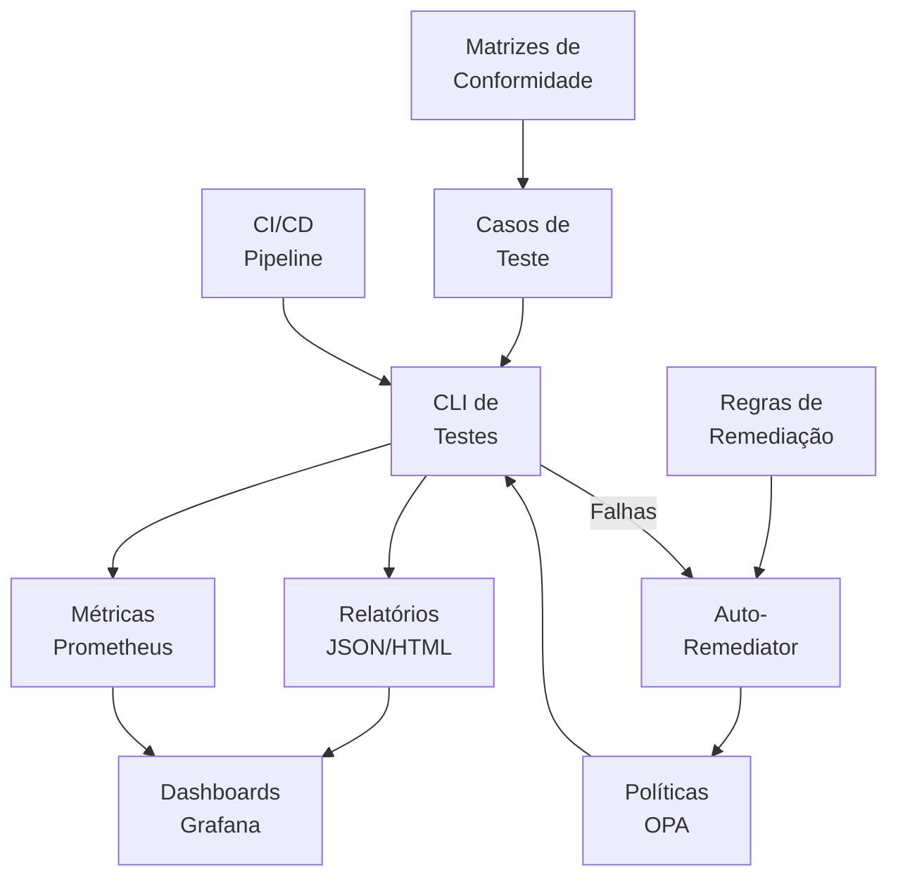
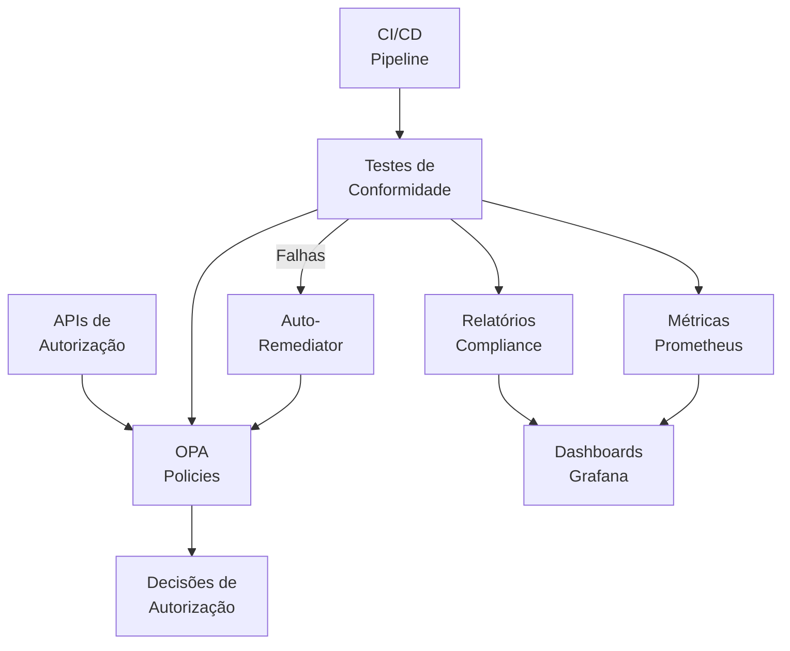

# Sistema de Testes de Conformidade Regulatória para Angola


## Visão Geral

O Sistema de Testes de Conformidade Regulatória para Angola é um componente crítico da infraestrutura de governança da plataforma INNOVABIZ. Este sistema automatiza a verificação de conformidade das políticas de autorização baseadas em OPA (Open Policy Agent) com os requisitos regulatórios específicos de Angola, incluindo proteção de dados, regulamentos financeiros do BNA e normas AML/KYC.



## Funcionalidades Principais

- **Teste Automatizado**: Validação contínua de políticas OPA contra requisitos regulatórios angolanos
- **Matrizes de Conformidade**: Mapeamento detalhado entre legislações e políticas de autorização
- **Auto-Remediação**: Correção automática de problemas comuns de conformidade
- **Relatórios Detalhados**: Geração de relatórios em formatos JSON e HTML com análise detalhada
- **Observabilidade**: Integração com Prometheus e dashboards Grafana para monitoramento contínuo
- **Integração CI/CD**: Pipeline automatizado para validação contínua durante o ciclo de desenvolvimento

## Frameworks Regulatórios Suportados

| Framework | Legislação | Escopo | Criticidade |
|-----------|------------|--------|------------|
| Lei nº 22/11 | Lei de Proteção de Dados | Processamento e proteção de dados pessoais | Alta |
| Aviso BNA nº 02/20 | Sistemas de Pagamentos | Autenticação forte e segurança de transações | Alta |
| Lei nº 14/21 | Combate ao Branqueamento de Capitais | AML, KYC e monitoramento de transações | Alta |
| Instrução BNA nº 06/20 | Open Banking | APIs abertas e compartilhamento de dados | Média |
| Normas ARSEG 2022 | Regulamentos de Seguros | Operações de seguros e microfinanças | Média |
| Padrões MultiCaixa | Interoperabilidade | Integração com sistema de pagamentos nacional | Alta |
| Aviso BNA nº 07/21 | Mobile Money | Operações financeiras via dispositivos móveis | Alta |

## Componentes do Sistema

### 1. CLI de Testes de Conformidade

Ferramenta de linha de comando para execução dos testes:

```
identity-service/cmd/compliance-test/
├── main.go             # Ponto de entrada da CLI
├── helpers.go          # Funções auxiliares para carregamento e processamento
└── test_execution.go   # Lógica principal de execução dos testes
```

### 2. Matrizes de Conformidade e Casos de Teste

Definições estruturadas de requisitos regulatórios e testes:

```
identity-service/tests/opa-compliance/
└── regions/
    └── AO/             # Angola
        ├── compliance_matrix.json
        └── test_cases/
            ├── protecao_dados/
            ├── financeiro_bna/
            └── aml_kyc/
```

### 3. Integração com Observabilidade

Dashboard Grafana específico para conformidade regulatória de Angola:

```
identity-service/observability/dashboards/regions/
└── ao_compliance_dashboard.json
```

### 4. Integração CI/CD

Workflow GitHub Actions para validação contínua:

```
identity-service/ci/
└── compliance-test-workflow.yml
```

### 5. Ferramentas de Análise

Utilitário para análise avançada de resultados de conformidade:

```
identity-service/tools/
└── compliance-analyzer.py
```

### 6. Documentação

Guias operacionais e de integração:

```
identity-service/docs/compliance/
└── AO_compliance_testing_guide.md
```

## Uso da CLI de Testes

### Instalação

```bash
# Compilar a CLI
go build -o compliance-test ./cmd/compliance-test

# Tornar executável (Linux/macOS)
chmod +x compliance-test
```

### Execução Básica

```bash
# Testar todas as políticas para Angola
./compliance-test --opa=./policies --tests=./tests/opa-compliance --regions=AO

# Filtrar por framework específico
./compliance-test --opa=./policies --tests=./tests/opa-compliance --regions=AO --frameworks=lei-22-11

# Gerar relatórios em múltiplos formatos
./compliance-test --opa=./policies --tests=./tests/opa-compliance --regions=AO --json --html

# Ativar remediação automática
./compliance-test --opa=./policies --tests=./tests/opa-compliance --regions=AO --remediate
```

### Opções Avançadas

```bash
# Modo detalhado com log verbose
./compliance-test --opa=./policies --tests=./tests/opa-compliance --regions=AO --verbose

# Simular remediação sem aplicar alterações
./compliance-test --opa=./policies --tests=./tests/opa-compliance --regions=AO --remediate --dry-run

# Filtrar por tags específicas
./compliance-test --opa=./policies --tests=./tests/opa-compliance --regions=AO --tags=alta,financeiro
```

## Integração com CI/CD

O sistema inclui um workflow GitHub Actions para integração contínua que:

1. É acionado por alterações em políticas OPA ou casos de teste
2. Executa testes de conformidade para Angola
3. Gera relatórios detalhados
4. Avalia a pontuação de conformidade contra limiares configuráveis
5. Notifica falhas e resultados

Para configurar:

```yaml
name: Compliance Tests
on:
  push:
    branches: [ main, develop ]
    paths:
      - 'policies/**'
      - 'tests/opa-compliance/**'
```

## Ferramentas de Análise

O utilitário `compliance-analyzer.py` permite análise detalhada dos resultados:

```bash
# Analisar todos os resultados para Angola
python3 tools/compliance-analyzer.py --reports-dir=./reports --region=AO --output=./analysis

# Ver tendências ao longo do tempo
# Relatório gerado em ./analysis/compliance_summary_AO.md
```

## Observabilidade e Dashboards

O dashboard Grafana para monitoramento de conformidade inclui:

- Pontuação geral de conformidade para Angola
- Detalhamento por framework regulatório
- Histórico e tendências
- Métricas de violações por criticidade
- Histórico de remediações e suas taxas de sucesso

## Arquitetura de Integração



## Princípios de Design

Este sistema foi projetado seguindo os seguintes princípios:

1. **Transparência**: Testes e resultados são completamente transparentes e auditáveis
2. **Automação**: Verificação e remediação automatizadas para reduzir carga manual
3. **Adaptabilidade**: Estrutura modular que permite fácil expansão para novos requisitos
4. **Observabilidade**: Monitoramento contínuo e alerta proativo
5. **Rastreabilidade**: Cada teste é vinculado a requisitos regulatórios específicos

## Gestão de Riscos

| Risco | Probabilidade | Impacto | Mitigação |
|-------|--------------|---------|-----------|
| Alteração regulatória | Alta | Alto | Monitoramento proativo das regulamentações angolanas |
| Falsos positivos | Média | Médio | Calibração contínua dos casos de teste |
| Falsos negativos | Baixa | Alto | Revisão manual periódica e auditorias |
| Falha na remediação | Média | Alto | Modo dry-run e backups automáticos |
| Degradação de performance | Baixa | Médio | Otimização contínua e monitoramento |

## Requisitos e Dependências

- Go 1.21 ou superior
- OPA v0.47 ou superior
- Python 3.8+ (para ferramentas de análise)
- Prometheus (para métricas)
- Grafana (para dashboards)
- GitHub Actions (para CI/CD)

## Roadmap e Melhorias Planejadas

- [ ] Expansão da cobertura de testes para 100% dos requisitos críticos
- [ ] Implementação de alertas baseados em limiares de conformidade
- [ ] Integração com sistema de ticketing para remediação manual
- [ ] Análise preditiva de impacto regulatório
- [ ] Suporte para versionamento de matrizes de conformidade
- [ ] Comparação histórica de pontuações de conformidade
- [ ] Extensão para outras regiões africanas e PALOP

## Contribuição

Para contribuir com este projeto:

1. Entenda o contexto regulatório de Angola relevante para o domínio
2. Familiarize-se com a estrutura do sistema de testes
3. Desenvolva novos casos de teste seguindo os padrões existentes
4. Verifique a integração com matrizes de conformidade
5. Execute testes locais para validar as alterações
6. Envie um pull request com descrição detalhada

## Documentação Adicional

- [Guia de Operação e Integração](./docs/compliance/AO_compliance_testing_guide.md)
- [Matriz de Conformidade Angola](./tests/opa-compliance/regions/AO/compliance_matrix.json)

## Contato e Suporte

- **Equipe**: INNOVABIZ DevSecOps
- **E-mail**: innovabizdevops@gmail.com
- **Responsável**: Eduardo Jeremias

---

© 2025 INNOVABIZ. Todos os direitos reservados.