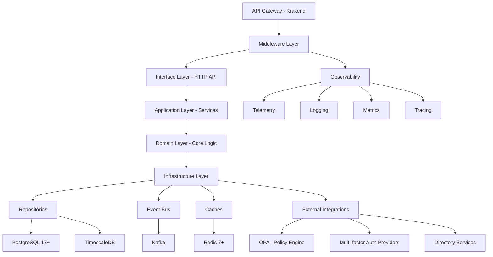
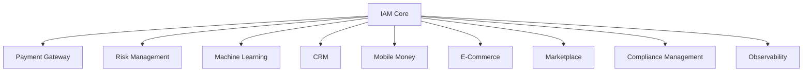
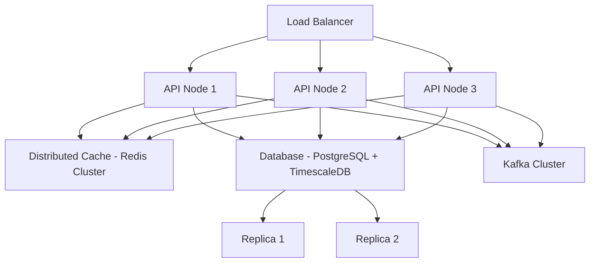

# Arquitetura de IAM (Identity and Access Management) - INNOVABIZ

## Visão Geral

Este documento descreve a arquitetura detalhada do módulo IAM (Identity and Access Management) da plataforma INNOVABIZ, focado em oferecer gerenciamento de identidades e acessos de classe empresarial, com conformidade a múltiplos padrões internacionais e suporte a diversos contextos operacionais.

| Metadata | Valor |
|----------|-------|
| Versão | 1.0.0 |
| Status | Implementação |
| Classificação | Confidencial |
| Data Criação | 2025-08-05 |
| Última Atualização | 2025-08-05 |
| Autor | INNOVABIZ Architecture Team |
| Aprovado por | Eduardo Jeremias |
| Responsável | Equipa de IAM |

## Arquitetura Modular Multinível

A solução IAM da INNOVABIZ segue uma arquitetura hexagonal (ports and adapters) com múltiplos níveis de segurança e isolamento:



## Componentes Principais

### 1. API Layer - Interface Externa

A camada de API expõe os serviços IAM via REST, GraphQL e gRPC para integração com outros sistemas:

- **REST API**: Interface primária para integrações B2B/B2C
- **GraphQL**: Para consultas complexas e redução de tráfego
- **gRPC**: Para comunicações de alta performance entre microsserviços

**Middleware Stack**:
- Autenticação JWT (HS256/RS256)
- Autorização ABAC via Open Policy Agent (OPA)
- CORS e Segurança de Cabeçalhos
- Logging Contextual (zerolog)
- Telemetria (OpenTelemetry)
- Rate Limiting
- Circuit Breaking
- Multitenancy Enforcement

### 2. Application Layer - Serviços de Domínio

Serviços de aplicação que implementam a lógica de negócios IAM:

#### Serviços Core:
- **UserService**: Gestão de utilizadores, perfis e credenciais
- **AuthenticationService**: Autenticação, tokens e sessões
- **RoleService**: Gestão de funções, permissões e hierarquias
- **TenantService**: Gestão de multitenancy e isolamento
- **PermissionService**: Gestão de permissões granulares
- **AuditService**: Registo de auditoria e compliance
- **PolicyService**: Gestão de políticas e regras de acesso
- **ProvisioningService**: Provisionamento automático de recursos

### 3. Domain Layer - Modelos de Domínio

Define as entidades principais do domínio IAM com regras de negócio encapsuladas:

#### Entidades Core:
- **User**: Utilizadores do sistema
- **Role**: Funções de acesso e agrupamentos lógicos
- **Permission**: Permissões granulares
- **Tenant**: Unidade organizacional de isolamento
- **AuthenticationFactor**: Fatores de autenticação
- **AuthenticationMethod**: Métodos de autenticação
- **Session**: Sessões ativas de utilizador
- **AuditTrail**: Registos de auditoria imutáveis
- **Policy**: Políticas de acesso

### 4. Infrastructure Layer - Implementações Técnicas

Provê implementações concretas para interfaces definidas nas camadas superiores:

- **Repositórios**: Persistência de dados em PostgreSQL 17+
- **EventBus**: Publicação/subscrição via Kafka
- **Cache**: Armazenamento em Redis 7+
- **Clients**: Integrações com serviços externos
- **Crypto**: Criptografia e assinatura digital

## Arquitetura de Multitenancy

O IAM INNOVABIZ implementa multitenancy híbrido, suportando três modelos:

### Modelo de Isolamento de Dados
1. **Isolamento por Schema**: Cada tenant possui seu próprio schema em banco de dados compartilhado
2. **Isolamento por Database**: Tenants críticos possuem bancos dedicados
3. **Isolamento por Row**: Tenants menores compartilham tabelas com filtragem por tenant_id

### Hierarquia de Tenants
```
Tenant Global
└── Tenant Organizacional
    └── Tenant Departamental
        └── Tenant Projeto
```

## Componentes de Segurança

### Autenticação Multi-fator
Suporte nativo a mais de 400 métodos de autenticação contemporâneos:

#### Categorias de Autenticação
1. **Conhecimento**: Senhas, PINs, perguntas de segurança
2. **Posse**: TOTP, FIDO2/WebAuthn, SmartCards, Tokens físicos
3. **Inerência**: Biometria (impressão digital, facial, íris, voz)
4. **Comportamental**: Padrões de digitação, análise de movimento
5. **Contextual**: Localização, dispositivo, hora, rede
6. **Social**: Verificação por terceiros, prova de vida
7. **Distribuída**: Threshold signatures, MPC (Multi-Party Computation)

### Criptografia Avançada

- **Chaves**: RSA-4096, ECDSA (P-384), Ed25519
- **Algoritmos Hash**: SHA-3, BLAKE3
- **Cifras Simétricas**: AES-256-GCM, ChaCha20-Poly1305
- **PBKDF**: Argon2id
- **Assinaturas**: PSS, EdDSA
- **Envelopes Digitais**: Hybrid encryption
- **HSM Integration**: Azure Key Vault, AWS KMS, Google Cloud KMS

### Autorização Baseada em Atributos (ABAC)

Utiliza OPA (Open Policy Agent) como motor de políticas, suportando:

- Políticas baseadas em contexto
- Autorização dinâmica
- Expressões lógicas complexas
- Integração com fontes externas
- Avaliação em tempo real

## Integrações com Plataforma INNOVABIZ

### Integrações com Módulos Core



### APIs Expostas para Integração

1. **Authentication API**: `/api/v1/auth/*`
2. **User Management API**: `/api/v1/users/*`
3. **Role Management API**: `/api/v1/roles/*`
4. **Permission Management API**: `/api/v1/permissions/*`
5. **Tenant Management API**: `/api/v1/tenants/*`
6. **MFA Management API**: `/api/v1/mfa/*`
7. **Session Management API**: `/api/v1/sessions/*`
8. **Audit API**: `/api/v1/audit/*`

### Event Stream Integration

Eventos publicados pelo IAM para consumo por outros módulos:

1. `user.created`
2. `user.updated`
3. `user.deleted`
4. `role.created`
5. `role.updated`
6. `role.deleted`
7. `permission.granted`
8. `permission.revoked`
9. `authentication.succeeded`
10. `authentication.failed`
11. `session.created`
12. `session.terminated`

## Conformidade e Governança

### Conformidade com Normas e Regulamentações

| Norma/Regulamento | Aspectos Implementados |
|-------------------|------------------------|
| ISO/IEC 27001 | Controles de Acesso, Gestão de Identidade, Auditoria |
| TOGAF 10.0 | Arquitetura em Camadas, Separação de Concerns |
| COBIT 2019 | Governança, Gestão de Riscos, Auditabilidade |
| PCI DSS | Acesso Mínimo Necessário, Autenticação MFA, Logs |
| Basel III | Gestão de Acesso, Segregação de Funções |
| GDPR | Privacy by Design, Auditoria, Direito ao Esquecimento |
| APD Angola | Proteção de Dados Pessoais, Consentimento |
| BNA | Requisitos de Segurança para Instituições Financeiras |
| PSD2 | SCA (Strong Customer Authentication) |
| AML/KYC | Due Diligence, Verificação de Identidade |

### Auditoria e Logs

Todos os eventos relacionados a identidade e acesso são registrados com:

- Timestamp preciso (UTC) com precisão de nanossegundos
- Identidade do ator (usuário/sistema)
- Tenant context
- Operação realizada
- Recursos afetados
- Resultado da operação
- Metadados de contexto (IP, dispositivo, localização)
- Hash de integridade

## Arquitetura de Alta Disponibilidade



### Resiliência

- **Circuit Breakers**: Protegem contra falhas em cascata
- **Rate Limiting**: Protege contra sobrecarga e DoS
- **Exponential Backoff**: Para retry automático
- **Bulkheads**: Isolamento de falhas entre componentes
- **Degradação Graciosa**: Modos de operação degradados mas funcionais
- **Caches Locais**: Reduz dependência de serviços externos

## Performance e Escalabilidade

### Métricas de Performance

- **Autenticação**: <100ms para métodos padrão
- **Autorização**: <10ms para decisões ABAC simples
- **Throughput**: >1000 operações/segundo por nó
- **Latência p99**: <200ms para operações complexas

### Estratégias de Escala

- **Horizontal**: Adição de nós API (stateless)
- **Vertical**: Aumento de recursos por nó
- **Caching**: Múltiplas camadas (L1/L2/L3)
- **Database Sharding**: Por tenant para grandes implementações
- **Read Replicas**: Para operações de leitura intensiva

## Monitoramento e Observabilidade

### Instrumentação

- **Metrics**: Prometheus-compatible
- **Logs**: JSON estruturado via zerolog
- **Traces**: OpenTelemetry
- **Healthchecks**: Readiness/Liveness/Startup

### Alertas

- **SLO/SLI**: Alertas baseados em objetivos de nível de serviço
- **Anomalias**: Detecção de comportamento anômalo
- **Segurança**: Alertas de segurança em tempo real
- **Capacity**: Alertas de capacidade e tendências

## Roadmap de Evolução

### Curto Prazo (3-6 meses)
- Implementação completa de todos os testes unitários e de integração
- Adição de suporte a algoritmos RSA para JWT
- Integração com OPA para autorização ABAC avançada
- Documentação OpenAPI/Swagger completa

### Médio Prazo (6-12 meses)
- Suporte a autenticação biométrica avançada
- Implementação de funcionalidades de Identity Governance
- Suporte a federação de identidade com SAML e OIDC
- Machine Learning para detecção de anomalias

### Longo Prazo (12-24 meses)
- Suporte a autenticação sem senha (passwordless)
- Gestão de credenciais verificáveis (Verifiable Credentials)
- Identidade descentralizada (DID)
- Zero-Knowledge Proofs para autenticação

## Considerações para Implantação

### Requisitos de Infraestrutura
- Kubernetes ou equivalente para orquestração
- Cluster PostgreSQL 17+ com alta disponibilidade
- Cluster Redis 7+ para cache e sessões
- Kafka para eventos e mensageria
- Vault ou HSM para gestão de segredos

### Estratégias de Migração
- Migração faseada por tenant
- Período de coexistência com sistemas legados
- Federação com provedores de identidade existentes

## Avaliação de Riscos e Mitigação

| Risco | Impacto | Probabilidade | Mitigação |
|-------|---------|--------------|-----------|
| Comprometimento de credenciais | Alto | Médio | MFA, alertas de comportamento anômalo |
| Indisponibilidade do serviço | Alto | Baixo | Redundância, failover automático |
| Falhas de integração | Médio | Médio | Testes abrangentes, circuit breakers |
| Escala insuficiente | Alto | Baixo | Testes de carga, monitoramento proativo |
| Violação de dados | Alto | Baixo | Criptografia, auditoria, controle de acesso |

## Conclusão

A arquitetura do IAM INNOVABIZ fornece uma solução robusta, segura e escalável para gestão de identidades e acessos, atendendo às necessidades de múltiplos mercados e indústrias, com conformidade a padrões internacionais e suporte a contextos diversos de operação.

---

© 2025 INNOVABIZ - Todos os direitos reservados