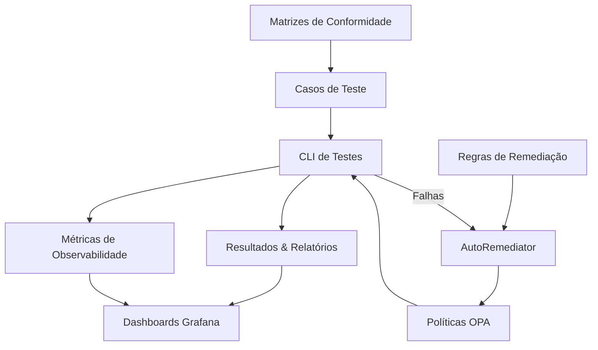

# Manual de Operação e Integração: Testes de Conformidade Regulatória para Angola

**Versão:** 1.0.0  
**Data:** 05/08/2025  
**Autor:** INNOVABIZ DevOps  
**Classificação:** Interno

## 1. Introdução

Este documento apresenta as diretrizes e procedimentos para a operação, manutenção e integração do sistema automatizado de testes de conformidade regulatória para Angola no âmbito do serviço de identidade da INNOVABIZ. O sistema foi desenvolvido para garantir a aderência contínua das políticas de autorização baseadas em OPA (Open Policy Agent) aos requisitos regulatórios angolanos, incluindo proteção de dados, regulamentações financeiras e normas AML/KYC.

## 2. Arquitetura do Sistema

### 2.1. Visão Geral

O sistema de testes de conformidade é composto pelos seguintes componentes:



### 2.2. Componentes Principais

1. **Matrizes de Conformidade**: Documentos JSON que mapeiam requisitos regulatórios a frameworks específicos.
2. **Casos de Teste**: Cenários detalhados para validação da conformidade das políticas.
3. **CLI de Testes**: Ferramenta para execução automatizada dos testes e geração de relatórios.
4. **AutoRemediator**: Componente para correção automática de problemas comuns.
5. **Sistema de Observabilidade**: Dashboards Grafana para monitoramento da conformidade.

## 3. Operação do Sistema de Testes

### 3.1. Pré-requisitos

- Go 1.21 ou superior
- OPA v0.47 ou superior
- Acesso às políticas e casos de teste
- Prometheus e Grafana (para observabilidade)

### 3.2. Estrutura de Diretórios

```
identity-service/
├── policies/                   # Políticas OPA
├── tests/
│   └── opa-compliance/
│       └── regions/
│           └── AO/             # Angola
│               ├── compliance_matrix.json
│               └── test_cases/
│                   ├── protecao_dados/
│                   ├── financeiro_bna/
│                   └── aml_kyc/
├── remediator/                 # Auto-remediação
├── cmd/
│   └── compliance-test/        # CLI para testes
└── observability/
    └── dashboards/
        └── regions/            # Dashboards específicos por região
```

### 3.3. Execução dos Testes de Conformidade

Para executar os testes de conformidade para Angola:

```bash
# Compilar a CLI
go build -o compliance-test ./cmd/compliance-test

# Executar todos os testes para Angola
./compliance-test --opa=./policies --tests=./tests/opa-compliance --regions=AO --json --html

# Executar testes específicos por framework
./compliance-test --opa=./policies --tests=./tests/opa-compliance --regions=AO --frameworks=lei-22-11,lei-14-21

# Executar com remediação automática
./compliance-test --opa=./policies --tests=./tests/opa-compliance --regions=AO --remediate

# Modo de execução segura (dry-run)
./compliance-test --opa=./policies --tests=./tests/opa-compliance --regions=AO --remediate --dry-run
```

### 3.4. Interpretação dos Resultados

Os resultados dos testes serão apresentados nos seguintes formatos:

1. **Saída de Console**: Resumo colorizado com pontuação geral e por framework.
2. **Relatório JSON**: Detalhamento técnico completo, adequado para processamento.
3. **Relatório HTML**: Visualização amigável para análise humana.

A pontuação de conformidade é calculada como a porcentagem de testes passados em relação ao total de testes executados. Os limiares de conformidade são:

- **≥ 90%**: Conformidade satisfatória (verde)
- **≥ 70%**: Conformidade aceitável, requer atenção (amarelo)
- **< 70%**: Conformidade insatisfatória, requer ação imediata (vermelho)

## 4. Integração com CI/CD

### 4.1. Pipeline GitHub Actions

O sistema inclui um workflow de GitHub Actions para integração contínua:

```yaml
# Gatilhos
on:
  push:
    branches: [ main, develop ]
    paths:
      - 'policies/**'
      - 'tests/opa-compliance/**'
  pull_request:
    branches: [ main, develop ]
  workflow_dispatch:
    # Parâmetros configuráveis
```

### 4.2. Verificações Automatizadas

O pipeline executa:

1. Testes de conformidade para todas as regiões afetadas
2. Geração de relatórios e métricas
3. Verificação de limiar mínimo de conformidade (80%)
4. Notificação via PR ou Slack

### 4.3. Integração com Métricas e Alertas

As métricas de conformidade são publicadas no Prometheus, permitindo:

1. Monitoramento contínuo via dashboard Grafana
2. Alertas para quedas na pontuação de conformidade
3. Visualização de tendências ao longo do tempo

## 5. Manutenção e Atualização

### 5.1. Atualização da Matriz de Conformidade

Para atualizar a matriz de conformidade angolana:

1. Edite o arquivo `tests/opa-compliance/regions/AO/compliance_matrix.json`
2. Adicione novos frameworks, requisitos ou referências
3. Vincule requisitos a casos de teste existentes ou novos

### 5.2. Criação de Novos Casos de Teste

Para criar um novo caso de teste:

1. Identifique a categoria apropriada (protecao_dados, financeiro_bna, aml_kyc)
2. Crie um arquivo JSON seguindo o formato:

```json
{
  "id": "ao-[categoria]-test-[funcionalidade]-[número]",
  "name": "Nome descritivo do teste",
  "description": "Descrição detalhada do requisito regulatório",
  "requirementIds": ["req-id-1", "req-id-2"],
  "policyPath": "caminho/para/politica.rego",
  "input": {
    // Dados de entrada para o teste
  },
  "expectedDecision": {
    // Resultado esperado da decisão OPA
  },
  "tags": ["angola", "tag-relevante"],
  "context": {
    "compliance_region": "AO"
  }
}
```

### 5.3. Atualização de Regras de Remediação

As regras de remediação são definidas por região e framework. Para atualizá-las:

1. Edite o arquivo de regras correspondente
2. Defina padrões de detecção (regex ou AST)
3. Configure ações de correção (replace, insert, delete, template)

## 6. Marcos de Conformidade para Angola

### 6.1. Principais Legislações

| Framework | Legislação | Escopo |
|-----------|------------|--------|
| Lei nº 22/11 | Lei de Proteção de Dados | Processamento e proteção de dados pessoais |
| Aviso BNA nº 02/20 | Sistemas de Pagamentos | Autenticação forte e segurança de transações |
| Lei nº 14/21 | Prevenção ao Branqueamento de Capitais | AML, KYC e monitoramento de transações |
| Normas ARSEG | Regulamentos de Seguros | Operações de seguros e microfinanças |
| Padrões MultiCaixa | Interoperabilidade de Pagamentos | Integração com sistema de pagamentos nacional |

### 6.2. Criticidade dos Requisitos

Os requisitos são classificados por criticidade:

- **Alta**: Conformidade obrigatória, risco regulatório elevado
- **Média**: Conformidade necessária, prazo de adequação possível
- **Baixa**: Recomendações de boas práticas

## 7. Dashboards e Observabilidade

O sistema inclui dashboards Grafana para monitoramento contínuo da conformidade:

### 7.1. Dashboard Angola

- **URL**: `http://grafana.innovabiz.local/d/AO-compliance-dashboard`
- **Atualização**: A cada 1 minuto
- **Alertas**: Configurados para quedas superiores a 10% na pontuação

### 7.2. Métricas Disponíveis

- `innovabiz_opa_compliance_score{region="AO"}`
- `innovabiz_opa_compliance_score_by_framework{region="AO", framework="..."}`
- `innovabiz_opa_compliance_tests_total{region="AO", status="passed|failed"}`
- `innovabiz_opa_compliance_violations_total{region="AO", criticality="..."}`
- `innovabiz_opa_remediation_total{region="AO", status="success|failed", action_type="..."}`

## 8. Resolução de Problemas

### 8.1. Problemas Comuns

| Problema | Possível Causa | Solução |
|----------|----------------|---------|
| Falha em teste específico | Política incompatível com requisito | Use `--verbose` para identificar e corrigir a política |
| Múltiplas falhas relacionadas | Mudança estrutural na política | Verifique o histórico de alterações e use `--remediate` |
| Erro de execução da CLI | Problema de permissão ou pacotes | Verifique dependências e diretórios de trabalho |
| Discrepância entre testes manuais e CI | Diferença de ambiente ou configuração | Harmonize as configurações entre ambientes |

### 8.2. Logs e Diagnóstico

Os logs detalhados são gerados em:

- **CLI**: Console e arquivo (`--log-file=path/to/file.log`)
- **CI/CD**: Artifacts do GitHub Actions
- **Remediação**: Registros de alterações e backups em `./remediator/backups/`

## 9. Responsabilidades e Governança

### 9.1. Papéis e Responsabilidades

| Papel | Responsabilidades |
|-------|------------------|
| Equipe de Desenvolvimento | Manutenção das políticas OPA, correção de problemas identificados |
| Equipe de Conformidade | Atualização das matrizes e requisitos regulatórios |
| DevSecOps | Integração CI/CD, monitoramento de métricas e alertas |
| Analista de Governança | Revisão de relatórios, aprovação de exceções |

### 9.2. Frequência de Avaliação

| Tipo | Frequência | Responsável |
|------|------------|-------------|
| Testes Automatizados | A cada PR e commit | CI/CD Pipeline |
| Revisão de Relatórios | Semanal | Equipe de Conformidade |
| Auditoria Completa | Trimestral | Analista de Governança |
| Atualização de Requisitos | Por demanda (novas regulamentações) | Equipe de Conformidade |

## 10. Próximos Passos e Evolução

### 10.1. Roadmap de Melhorias

1. **Curto prazo**:
   - Expandir casos de teste para cobrir 100% dos requisitos críticos
   - Implementar relatórios comparativos entre execuções

2. **Médio prazo**:
   - Integrar testes de conformidade com simulação de produção
   - Desenvolver ML para sugestão proativa de políticas

3. **Longo prazo**:
   - Automatizar atualização de matrizes baseada em novas regulamentações
   - Implementar análise de impacto preditiva

### 10.2. Expansão para Outras Regiões

A estrutura modular permite extensão para outras regiões seguindo o mesmo modelo:

1. Criar diretório para nova região (`tests/opa-compliance/regions/[CÓDIGO_REGIÃO]/`)
2. Desenvolver matriz de conformidade regional
3. Implementar casos de teste específicos
4. Configurar dashboards de observabilidade

## Apêndices

### A. Referências Regulatórias Angola

- [Lei nº 22/11 (Proteção de Dados Pessoais)](https://www.inacom.gov.ao/pt/noticias/lei-n-22-11-de-17-de-junho)
- [Aviso BNA nº 02/20 (Sistemas de Pagamentos)](https://www.bna.ao/uploads/%7B6fda3f39-498e-4e66-a760-9d92fe3c14fe%7D.pdf)
- [Lei nº 14/21 (Prevenção ao Branqueamento de Capitais)](https://www.ucm.minfin.gov.ao/cs/groups/public/documents/document/mdaw/mdm5/~edisp/lei14_21.pdf)

### B. Glossário de Termos

- **OPA**: Open Policy Agent, ferramenta para autorização baseada em políticas
- **Compliance**: Conformidade com leis, regulamentos e normas aplicáveis
- **AML**: Anti-Money Laundering (Combate à Lavagem de Dinheiro)
- **KYC**: Know Your Customer (Conheça Seu Cliente)
- **CI/CD**: Continuous Integration/Continuous Deployment
- **BNA**: Banco Nacional de Angola
- **ARSEG**: Agência Angolana de Regulação e Supervisão de Seguros

---

*Este documento é propriedade da INNOVABIZ e foi gerado como parte do sistema de governança corporativa. Todos os direitos reservados.*

*© 2025 INNOVABIZ*