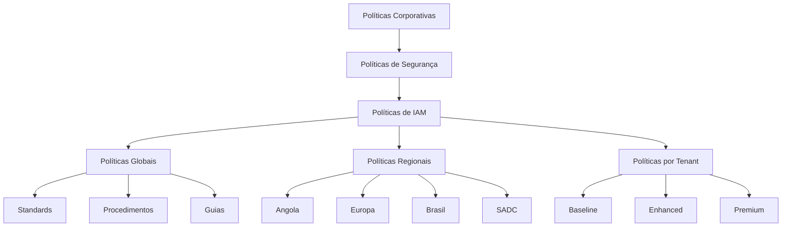
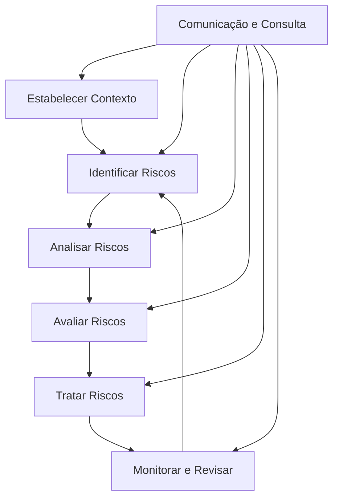
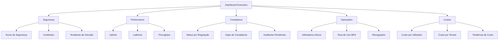
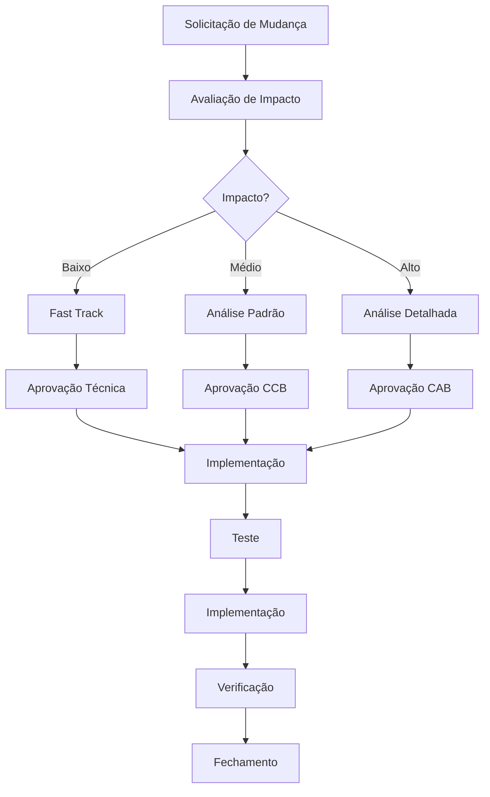
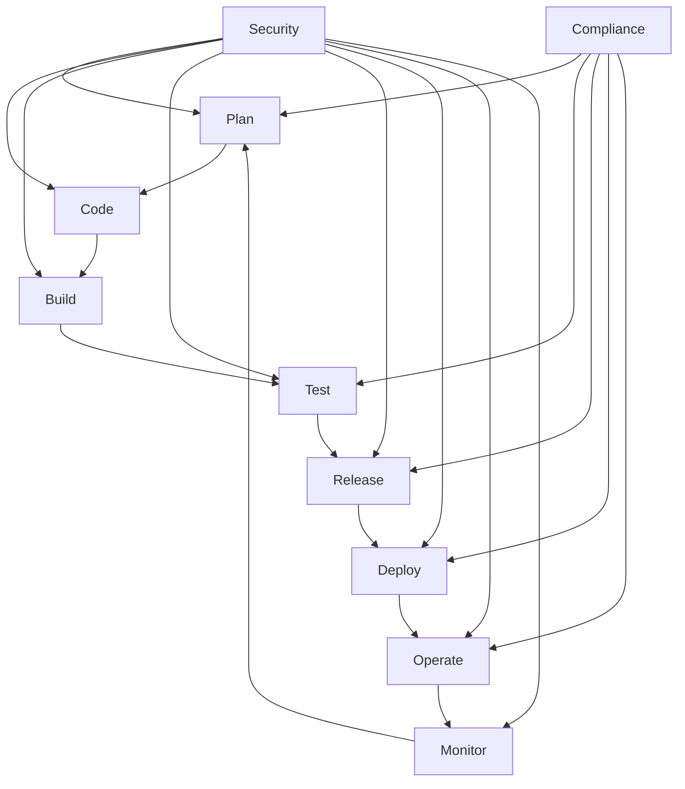

# Governança Avançada do IAM - INNOVABIZ

| Metadata | Valor |
|----------|-------|
| Versão | 1.0.0 |
| Status | Em Desenvolvimento |
| Classificação | Confidencial |
| Data Criação | 2025-08-05 |
| Última Atualização | 2025-08-05 |
| Autor | INNOVABIZ Architecture Team |
| Aprovado por | Eduardo Jeremias |
| Responsável | Centro de Excelência em Governança |

## Índice
1. [Visão Geral da Governança](#visão-geral-da-governança)
2. [Framework de Governança Multi-Dimensional](#framework-de-governança-multi-dimensional)
3. [Estrutura de Governança](#estrutura-de-governança)
4. [Políticas e Procedimentos](#políticas-e-procedimentos)
5. [Conformidade Regional e Internacional](#conformidade-regional-e-internacional)
6. [Gestão de Riscos](#gestão-de-riscos)
7. [Matriz de Responsabilidade](#matriz-de-responsabilidade)
8. [Monitoramento e Métricas](#monitoramento-e-métricas)
9. [Auditorias e Controlos](#auditorias-e-controlos)
10. [Gestão de Mudanças](#gestão-de-mudanças)

## Visão Geral da Governança

A Governança do módulo IAM da plataforma INNOVABIZ estabelece um framework abrangente para garantir que os serviços de identidade e acesso funcionem com integridade, segurança e conformidade em todos os mercados e contextos operacionais. Este documento define os princípios, estruturas e processos que governam o IAM, alinhados com os mais recentes standards internacionais e adaptados às regulamentações regionais específicas de Angola, Europa, CPLP, SADC, PALOP, BRICS e outros mercados relevantes.

### Princípios de Governança

1. **Accountability**: Responsabilidades claramente definidas e rastreáveis
2. **Transparência**: Processos documentados e auditáveis
3. **Integridade**: Preservação da precisão e consistência dos dados
4. **Conformidade**: Alinhamento com normas e regulamentações
5. **Eficiência**: Optimização de recursos e processos
6. **Resiliência**: Capacidade de adaptação a mudanças
7. **Orientação a Valor**: Foco nos resultados de negócio
8. **Gestão de Risco**: Identificação proativa e mitigação
9. **Melhoria Contínua**: Evolução baseada em métricas e feedback

### Alinhamento Estratégico

O modelo de governança do IAM está alinhado com a visão estratégica da INNOVABIZ de criar uma plataforma financeira digital inclusiva e segura para mercados emergentes e desenvolvidos, permitindo:

- **Expansão Regional**: Adaptabilidade a múltiplos contextos regulatórios
- **Escalabilidade**: Suporte ao crescimento sustentável do ecossistema
- **Confiança**: Base sólida para relações com clientes, parceiros e reguladores
- **Inovação Responsável**: Equilíbrio entre agilidade e controle
- **Inclusão Digital**: Acesso seguro a serviços financeiros para populações diversas

## Framework de Governança Multi-Dimensional

O Framework de Governança do IAM INNOVABIZ opera em múltiplas dimensões para garantir cobertura abrangente:

```mermaid
graph TD
    A[Governança IAM] --- B[Dimensão Estrutural]
    A --- C[Dimensão Funcional]
    A --- D[Dimensão de Dados]
    A --- E[Dimensão Tecnológica]
    A --- F[Dimensão Regional]
    A --- G[Dimensão de Compliance]
    A --- H[Dimensão de Tenant]
    
    B --> B1[Comités]
    B --> B2[Papéis]
    B --> B3[Responsabilidades]
    
    C --> C1[Autenticação]
    C --> C2[Autorização]
    C --> C3[Gestão de Identidades]
    C --> C4[Federação]
    
    D --> D1[Classificação]
    D --> D2[Privacidade]
    D --> D3[Retenção]
    D --> D4[Qualidade]
    
    E --> E1[Arquitetura]
    E --> E2[Standards]
    E --> E3[Segurança]
    E --> E4[DevSecOps]
    
    F --> F1[Angola]
    F --> F2[Europa]
    F --> F3[Brasil]
    F --> F4[SADC/PALOP]
    F --> F5[China]
    
    G --> G1[ISO 27001]
    G --> G2[TOGAF]
    G --> G3[COBIT]
    G --> G4[Basel III]
    G --> G5[Regulamentações Locais]
    
    H --> H1[Multi-tenancy]
    H --> H2[Segregação]
    H --> H3[Hierarquia]
```

## Estrutura de Governança

### Modelo Organizacional

A estrutura de governança do IAM INNOVABIZ é composta por comités hierárquicos com responsabilidades específicas:

#### 1. Comité Executivo de Governança Digital

**Membros**: CEO, CIO, CISO, CPO, CCO, CRO, DPO
**Frequência**: Trimestral
**Responsabilidades**:
- Aprovação de políticas de alto nível
- Supervisão da estratégia de IAM
- Alocação de recursos
- Aprovação de exceções críticas
- Revisão de KPIs de governança

#### 2. Comité de Segurança e Compliance

**Membros**: CISO, Diretor de Compliance, Diretor de Risco, Diretor de Auditoria, DPO
**Frequência**: Mensal
**Responsabilidades**:
- Avaliação de postura de segurança
- Supervisão de compliance regulatório
- Revisão de incidentes
- Aprovação de controles
- Gestão de riscos de segurança

#### 3. Comité Técnico de IAM

**Membros**: Arquiteto Chefe, Product Owner IAM, Líderes Técnicos, Especialistas em Segurança
**Frequência**: Quinzenal
**Responsabilidades**:
- Definição de standards técnicos
- Revisão de arquitetura
- Aprovação de design de integração
- Resolução de questões técnicas
- Priorização de melhorias

#### 4. Grupo de Trabalho Regional

**Membros**: Especialistas Regionais (Angola, Europa, Brasil, SADC, China), Compliance Officer
**Frequência**: Mensal
**Responsabilidades**:
- Adaptação a regulamentações locais
- Monitoramento de mudanças regulatórias
- Implementação de requisitos específicos por região
- Avaliação de impacto regional

### Papéis e Responsabilidades

#### Papéis Estratégicos

| Papel | Responsabilidade | Reporte |
|-------|-----------------|---------|
| Sponsor Executivo | Visão estratégica e alinhamento | Conselho |
| IAM Program Manager | Supervisão geral do programa | Sponsor |
| Comité de Arquitetura | Governance da arquitetura técnica | CIO |
| Comité de Risco | Governance de riscos | CRO |
| Comité de Compliance | Governance de conformidade | CCO |

#### Papéis Operacionais

| Papel | Responsabilidade | Reporte |
|-------|-----------------|---------|
| Identity Architect | Desenho da solução IAM | Arquiteto Chefe |
| IAM Operations Manager | Operação diária do IAM | IT Operations Director |
| IAM Security Specialist | Segurança da infraestrutura IAM | CISO |
| Regional Compliance Officer | Compliance regional | Diretor de Compliance |
| Identity Data Steward | Governance de dados de identidade | DPO |
| IAM DevOps Engineer | Operações e CI/CD | CTO |
| IAM Support Specialist | Suporte L2/L3 | Support Director |## Políticas e Procedimentos

### Categorias de Políticas

O IAM INNOVABIZ é governado por um conjunto abrangente de políticas estruturadas:

#### 1. Políticas de Identidade

| Política | Descrição | Standards/Frameworks |
|----------|-----------|---------------------|
| Gestão do Ciclo de Vida de Identidade | Define processos de criação, atualização, desativação e exclusão de identidades | ISO 27001, TOGAF, NIST SP 800-53 |
| Credenciais de Autenticação | Requisitos de força, rotação e gestão de credenciais | NIST SP 800-63B, PCI DSS 4.0, ISO 27001 |
| Autenticação Multi-Fator | Critérios para aplicação de MFA e requisitos por nível de risco | PSD2 SCA, NIST SP 800-63B, ISO 27001 |
| Gestão de Identidade Privilegiada | Controles para contas com privilégios elevados | CIS Controls, ISO 27001, PCI DSS 4.0 |
| Federação de Identidades | Regras para integração com provedores externos | ISO 27001, eIDAS, NIST SP 800-63C |

#### 2. Políticas de Acesso

| Política | Descrição | Standards/Frameworks |
|----------|-----------|---------------------|
| Controle de Acesso | Princípios gerais de controle de acesso (least privilege, need-to-know) | ISO 27001, NIST SP 800-53, CIS Controls |
| Segregação de Funções | Prevenção de conflitos de interesse em funções críticas | COBIT 2019, ISO 27001, Basel III |
| Revisão de Acesso | Periodicidade e processo de revisão de direitos de acesso | ISO 27001, SOX, PCI DSS 4.0 |
| Autorização Baseada em Atributos | Framework para decisões de autorização contextual | NIST SP 800-162, XACML 3.0 |
| Gestão de Exceções | Processo para aprovação e monitoramento de exceções | ISO 27001, COBIT 2019 |

#### 3. Políticas de Auditoria e Compliance

| Política | Descrição | Standards/Frameworks |
|----------|-----------|---------------------|
| Auditoria de Acesso | Requisitos de logging, monitoramento e revisão de eventos | ISO 27001, PCI DSS 4.0, GDPR, APD Angola |
| Retenção de Logs | Períodos de retenção por tipo de log e região | ISO 27001, PCI DSS 4.0, GDPR, Lei 22/11 |
| Gestão de Incidentes | Detecção, resposta e reporting de incidentes | ISO 27001, NIST SP 800-61, NIS2 |
| Compliance Regulatório | Mapeamento de requisitos e controles por região | ISO 27001, BNA, GDPR, PCI DSS, BACEN |
| Privacidade de Dados | Proteção de dados pessoais em operações de IAM | GDPR, Lei 22/11, LGPD, POPIA, PIPL |

#### 4. Políticas Operacionais

| Política | Descrição | Standards/Frameworks |
|----------|-----------|---------------------|
| Gestão de Mudanças | Processo para implementação de mudanças no IAM | ITIL 4, DevSecOps, ISO 27001 |
| Monitoramento e Performance | Requisitos de monitoramento e alertas | ISO 27001, ISO 20000, SRE Principles |
| Backup e Recuperação | Estratégias de backup e objetivos de recuperação | ISO 27001, ISO 22301, NIST SP 800-34 |
| Gestão de Capacidade | Planeamento e gestão de capacidade da plataforma IAM | ITIL 4, ISO 20000 |
| Gestão de Configuração | Controle de configurações e versionamento | ITIL 4, DevSecOps, ISO 20000 |

### Hierarquia de Políticas

A estrutura hierárquica garante consistência enquanto permite adaptações contextuais:

## Conformidade Regional e Internacional

### Matriz de Conformidade Internacional

| Framework | Escopo | Implementado | Certificado | Última Avaliação | Próxima Avaliação |
|-----------|--------|-------------|------------|-----------------|------------------|
| ISO/IEC 27001:2022 | Gestão da Segurança da Informação | Sim | Sim | 2025-01 | 2026-01 |
| ISO/IEC 27701:2019 | Gestão de Informações de Privacidade | Sim | Em Processo | 2025-03 | 2025-09 |
| COBIT 2019 | Governança de TI | Parcial | Não | 2025-02 | 2025-08 |
| NIST Cybersecurity Framework | Segurança Cibernética | Sim | Não | 2025-02 | 2025-08 |
| SOC 2 Type II | Segurança, Disponibilidade, Integridade | Sim | Sim | 2025-05 | 2026-05 |
| PCI DSS 4.0 | Segurança de Dados de Pagamento | Sim | Sim | 2025-04 | 2026-04 |
| CSA STAR Level 2 | Segurança em Cloud | Parcial | Em Processo | 2025-05 | 2025-11 |

### Matriz de Conformidade Regional

#### Angola e África

| Regulamentação | Autoridade | Status | Escopo | Verificação |
|----------------|-----------|--------|--------|------------|
| Lei nº 22/11 | APD Angola | Conformidade Total | Proteção de Dados Pessoais | 2025-03 |
| Aviso nº 2/2020 | BNA | Conformidade Total | Segurança Cibernética | 2025-02 |
| Instrutivo nº 7/2021 | BNA | Conformidade Total | KYC/AML | 2025-02 |
| POPIA | Info Regulator SA | Conformidade Parcial | Proteção de Dados (SADC) | 2025-04 |
| Diretiva SADC | SADC | Em Implementação | Pagamentos Transfronteiriços | 2025-06 |

#### Europa

| Regulamentação | Autoridade | Status | Escopo | Verificação |
|----------------|-----------|--------|--------|------------|
| GDPR | EU DPAs | Conformidade Total | Proteção de Dados | 2025-01 |
| PSD2 | EBA | Conformidade Total | Pagamentos e Autenticação Forte | 2025-03 |
| eIDAS | EU | Conformidade Parcial | Identificação Eletrônica | 2025-04 |
| NIS2 | ENISA | Em Implementação | Segurança de Rede e Sistemas | 2025-06 |
| DORA | EBA, ESMA, EIOPA | Em Implementação | Resiliência Digital | 2025-07 |

#### Brasil e CPLP

| Regulamentação | Autoridade | Status | Escopo | Verificação |
|----------------|-----------|--------|--------|------------|
| LGPD | ANPD | Conformidade Total | Proteção de Dados | 2025-02 |
| Resolução 4.658 | BACEN | Conformidade Total | Segurança Cibernética | 2025-03 |
| Open Banking BR | BACEN | Conformidade Parcial | APIs Abertas | 2025-05 |
| CNPJ API | Receita Federal | Conformidade Total | Validação de Empresas | 2025-01 |
| Lei 14.129/21 | Governo Brasil | Em Avaliação | Governo Digital | 2025-06 |

#### BRICS e Outros Mercados

| Regulamentação | Autoridade | Status | Escopo | Verificação |
|----------------|-----------|--------|--------|------------|
| PIPL | CAC China | Conformidade Parcial | Proteção de Dados | 2025-04 |
| CSL | CAC China | Em Avaliação | Segurança Cibernética | 2025-06 |
| IT Act | MEITY India | Conformidade Parcial | Tecnologia da Informação | 2025-05 |
| IRDAI | Regulador Seguros Índia | Em Avaliação | Segurança em Seguros | 2025-07 |
| Federal Law 152-FZ | Roskomnadzor | Em Avaliação | Proteção de Dados Pessoais | 2025-08 |

### Matriz de Gaps de Conformidade

| Requisito | Standard | Status Atual | Gap | Plano de Ação | Prazo |
|-----------|----------|--------------|-----|--------------|-------|
| Pseudonimização | GDPR Art. 32 | Parcial | Implementação em dados históricos | Projeto de tokenização | 2025-09 |
| Direitos do Titular | Lei 22/11 | Implementado | Automação limitada | Portal de privacidade | 2025-10 |
| Rastreamento de Consentimento | LGPD Art. 8 | Implementado | Granularidade | Refinamento de registros | 2025-08 |
| Gestão de Incidentes | BNA Aviso 2/2020 | Parcial | Tempo de resposta | Automação de alertas | 2025-07 |
| Autenticação Biométrica | PSD2 RTS | Implementado | Fraude sintética | Detecção de vivacidade | 2025-08 |## Gestão de Riscos

A abordagem de gestão de riscos do IAM INNOVABIZ segue metodologias estruturadas alinhadas com ISO 31000, COBIT 2019, NIST RMF e frameworks regionais relevantes.

### Framework de Gestão de Riscos

### Categorias de Risco

| Categoria | Descrição | Exemplos |
|-----------|-----------|----------|
| Estratégico | Riscos relacionados aos objetivos estratégicos | Alinhamento com regulações emergentes, evolução de mercado |
| Operacional | Riscos nos processos operacionais | Indisponibilidade, degradação de performance |
| Técnico | Riscos tecnológicos | Vulnerabilidades, debt técnico, escalabilidade |
| Compliance | Riscos de conformidade | Violação regulatória, falha em auditorias |
| Reputacional | Riscos à reputação | Violações de dados, incidentes de segurança |
| Financeiro | Riscos financeiros | Custos operacionais, penalidades |
| Vendor | Riscos associados a fornecedores | Dependências, interrupção de serviço |
| Mercado | Riscos específicos de mercado | Volatilidade, câmbio, inflação |

### Matriz de Riscos IAM

| ID | Risco | Categoria | Probabilidade | Impacto | Nível | Mitigação | Proprietário | Status |
|----|-------|-----------|--------------|---------|-------|-----------|-------------|--------|
| R01 | Violação de dados de identidade | Operacional | Média | Alto | Alto | Criptografia, MFA, Monitoramento | CISO | Mitigado |
| R02 | Indisponibilidade do serviço IAM | Operacional | Baixa | Crítico | Alto | Arquitetura HA, DR | CTO | Mitigado |
| R03 | Não conformidade com regulação regional | Compliance | Média | Alto | Alto | Monitoramento regulatório, auditorias | CCO | Em Tratamento |
| R04 | Escala insuficiente para picos de tráfego | Técnico | Média | Médio | Médio | Autoscaling, testes de carga | CTO | Mitigado |
| R05 | Gestão inadequada de credenciais privilegiadas | Técnico | Baixa | Crítico | Alto | PAM, rotation, MFA | CISO | Mitigado |
| R06 | Falha em federação de identidades | Operacional | Baixa | Médio | Médio | Monitoramento, circuit breakers | CTO | Em Tratamento |
| R07 | Mudança regulatória significativa | Compliance | Alta | Alto | Alto | Monitoramento regulatório, flexibilidade | CCO | Em Tratamento |
| R08 | Comprometimento de algoritmos criptográficos | Técnico | Muito Baixa | Crítico | Médio | Crypto-agilidade | CISO | Em Tratamento |
| R09 | Falha no processo de onboarding | Operacional | Média | Médio | Médio | Automação, validação | CPO | Mitigado |
| R10 | Perda de talentos-chave em IAM | Estratégico | Média | Alto | Alto | Documentação, conhecimento partilhado | CIO | Em Tratamento |

### Tratamento de Riscos

| Estratégia | Descrição | Aplicação |
|------------|-----------|-----------|
| Mitigar | Implementar controlos para reduzir probabilidade ou impacto | Maioria dos riscos técnicos e operacionais |
| Transferir | Compartilhar o risco com terceiros | Seguros, contratos com fornecedores |
| Evitar | Eliminar a atividade que gera o risco | Restrição de funcionalidades de alto risco |
| Aceitar | Aceitar o risco sem ação adicional | Riscos de baixo impacto com alto custo de mitigação |

### Processo de Avaliação de Risco

1. **Avaliação Regular**: Trimestral para riscos altos, semestral para médios, anual para baixos
2. **Avaliação Específica**: Para mudanças significativas, novos mercados, novas regulamentações
3. **Reavaliação Pós-Incidente**: Após qualquer incidente significativo
4. **Avaliação Contínua**: Monitoramento automatizado de indicadores-chave de risco

## Matriz de Responsabilidade

### RACI de Governança IAM

| Atividade | CEO | CIO | CISO | Comité IAM | Comité Segurança | Comité Regional | Equipa Técnica | Auditoria | DPO |
|-----------|-----|-----|------|-----------|-----------------|----------------|---------------|-----------|-----|
| Aprovação de Políticas de Alto Nível | A | R | C | C | C | I | I | C | C |
| Definição de Standards Técnicos | I | A | C | R | C | I | C | I | I |
| Aprovação de Exceções | I | A | R | C | C | C | C | I | C |
| Revisão de Compliance | I | C | C | I | A | R | I | C | C |
| Gestão de Incidentes | I | I | A | C | R | I | C | I | C |
| Monitoramento de KPIs | I | A | C | R | C | C | C | I | I |
| Auditoria de Acesso | I | I | C | I | C | I | C | R | C |
| Aprovação de Arquitetura | I | A | C | R | C | C | C | I | C |
| Revisão de Riscos | I | C | A | C | R | C | I | C | C |
| Aprovação de Mudanças | I | A | C | R | C | I | C | I | I |

### Matriz de Comunicação

| Comunicação | Audiência | Frequência | Formato | Responsável |
|------------|-----------|------------|---------|------------|
| Dashboard Executivo | Executivos | Mensal | Dashboard | Program Manager |
| Relatório de Segurança | Comité de Segurança | Mensal | Relatório | CISO |
| Status de Projeto | Stakeholders | Quinzenal | Apresentação | Program Manager |
| Compliance Report | Comité de Compliance | Trimestral | Relatório | Compliance Officer |
| Alerta de Incidente | Equipa de Resposta | Imediato | Alerta | Ops Team |
| Boletim Regulatório | Comité Regional | Mensal | Newsletter | Compliance Officer |
| Revisão Técnica | Equipa Técnica | Semanal | Reunião | Arquiteto IAM |
| Atualização de KPIs | Todos Stakeholders | Mensal | Dashboard | Program Manager |

## Monitoramento e Métricas

### Indicadores-Chave de Performance (KPIs)

#### KPIs Estratégicos

| KPI | Descrição | Meta | Frequência | Tendência |
|-----|-----------|------|------------|-----------|
| Índice de Maturidade IAM | Avaliação da maturidade geral de IAM | 4.5/5 | Semestral | ↗ |
| Cobertura de Compliance | % requisitos regulatórios atendidos | 100% | Trimestral | → |
| Disponibilidade do Serviço | % de tempo operacional | 99.99% | Mensal | → |
| Índice de Segurança IAM | Score composto de postura de segurança | 95/100 | Mensal | ↗ |
| Eficiência de Custos | Custo por utilizador ativo | < $1.50/mês | Trimestral | ↘ |

#### KPIs Operacionais

| KPI | Descrição | Meta | Frequência | Tendência |
|-----|-----------|------|------------|-----------|
| Tempo Médio de Onboarding | Tempo para provisionar novo utilizador | < 5 min | Mensal | ↘ |
| Taxa de Sucesso de Autenticação | % de autenticações bem-sucedidas | > 99.5% | Semanal | → |
| Taxa de Falha de MFA | % de falhas em verificação MFA | < 0.5% | Semanal | ↘ |
| Precisão de Autorização | % de decisões de autorização corretas | > 99.99% | Mensal | → |
| Tempo de Resolução de Incidentes | MTTR para incidentes IAM | < 30 min | Mensal | ↘ |
| Tempo de Resposta API | Latência média de endpoints críticos | < 50 ms | Diária | → |
| Taxa de Rotação de Credenciais | % de credenciais rotacionadas no prazo | 100% | Mensal | → |
| Cobertura de Revisão de Acesso | % de acessos revisados no período | 100% | Trimestral | → |

### Dashboards de Monitoramento

#### Dashboard Executivo

#### Dashboard Técnico

```mermaid
graph TD
    A[Dashboard Técnico] --> B[Autenticação]
    A --> C[Autorização]
    A --> D[Directory]
    A --> E[Federação]
    A --> F[APIs]
    
    B --> B1[Auth/s]
    B --> B2[Taxa de Erro]
    B --> B3[Latência]
    B --> B4[Métodos de Auth]
    
    C --> C1[Decisões/s]
    C --> C2[Cache Hit Rate]
    C --> C3[Tempo Médio Decisão]
    C --> C4[Requisições OPA]
    
    D --> D1[Queries/s]
    D --> D2[Tempo de Resposta]
    D --> D3[Tamanho DB]
    D --> D4[Locks]
    
    E --> E1[SSO Sessions]
    E --> E2[Token Exchange Rate]
    E --> E3[Saúde Provedores]
    
    F --> F1[Requisições/s]
    F --> F2[Erros 4xx/5xx]
    F --> F3[Latência por Endpoint]
    F --> F4[Rate Limiting]
```

## Auditorias e Controlos

### Programa de Auditoria

| Tipo de Auditoria | Escopo | Frequência | Método | Responsável |
|-------------------|--------|------------|--------|------------|
| Auditoria Interna | Todas políticas e controlos | Trimestral | Avaliação interna | Equipa de Auditoria |
| Revisão de Segurança | Controlos técnicos | Semestral | Teste de penetração | Segurança |
| Auditoria de Compliance | Requisitos regulatórios | Anual | Avaliação formal | Compliance |
| Auditoria Externa | Certificações (ISO 27001, PCI) | Anual | Avaliador externo | CISO |
| Revisão de Código | Implementações críticas | Contínuo | SAST/DAST, peer review | DevSecOps |
| Auditoria de Acesso | Revisão de direitos | Trimestral | Análise automatizada | IAM Ops |
| Revisão Arquitetural | Design e implementação | Semestral | Revisão por pares | Arquitetos |

### Controlos por Categoria

#### Controlos Preventivos

| Controlo | Descrição | Standard | Verificação |
|----------|-----------|----------|------------|
| MFA Obrigatório | Autenticação multi-fator para todos os acessos privilegiados | ISO 27001, PCI DSS 4.0 | Configuração |
| Gestão de Segredos | Proteção de credenciais e chaves | NIST SP 800-57, ISO 27001 | Auditoria |
| Least Privilege | Acesso mínimo necessário | ISO 27001, PCI DSS 4.0 | Revisão de acesso |
| Segregação de Funções | Separação de responsabilidades críticas | ISO 27001, COBIT 2019 | Análise de matriz |
| Validação de Input | Sanitização de entradas de usuário | OWASP Top 10, ISO 27001 | Teste de aplicação |
| Criptografia | Proteção de dados sensíveis | ISO 27001, PCI DSS 4.0 | Auditoria técnica |

#### Controlos Detectivos

| Controlo | Descrição | Standard | Verificação |
|----------|-----------|----------|------------|
| Monitoramento de Atividade | Detecção de comportamentos anómalos | ISO 27001, NIST SP 800-53 | Análise de logs |
| Alertas de Segurança | Notificação de eventos suspeitos | ISO 27001, PCI DSS 4.0 | Teste de alerta |
| Revisão de Logs | Análise regular de logs de segurança | ISO 27001, COBIT 2019 | Auditoria |
| Detecção de Vulnerabilidades | Scans regulares de vulnerabilidade | ISO 27001, PCI DSS 4.0 | Relatórios de scan |
| Monitoramento de Integridade | Verificação de mudanças não autorizadas | ISO 27001, PCI DSS 4.0 | Testes de integridade |
| Análise de Tráfego | Identificação de padrões suspeitos | ISO 27001, NIST SP 800-53 | Análise de rede |

#### Controlos Corretivos

| Controlo | Descrição | Standard | Verificação |
|----------|-----------|----------|------------|
| Resposta a Incidentes | Processo estruturado de resposta | ISO 27001, NIST SP 800-61 | Exercício de simulação |
| Backup e Recuperação | Restauração de dados e sistemas | ISO 27001, ISO 22301 | Teste de recuperação |
| Revogação de Acesso | Remoção imediata de acessos | ISO 27001, PCI DSS 4.0 | Teste de revogação |
| Rotação de Credenciais | Mudança de credenciais após exposição | ISO 27001, NIST SP 800-63B | Auditoria de processo |
| Remediação de Vulnerabilidades | Correção de falhas identificadas | ISO 27001, NIST SP 800-40 | Verificação pós-correção |
| Comunicação de Violações | Notificação conforme requisitos | GDPR, Lei 22/11, LGPD | Exercício de simulação |

## Gestão de Mudanças

### Processo de Gestão de Mudanças

O processo de gestão de mudanças do IAM INNOVABIZ segue um modelo integrado com metodologias ágeis e DevSecOps, garantindo segurança, conformidade e agilidade.

### Categorização de Mudanças

| Categoria | Descrição | Aprovação | Janela de Mudança | Notificação |
|-----------|-----------|-----------|------------------|------------|
| Emergencial | Correção de segurança crítica | CISO | Imediata | Após implementação |
| Maior | Mudança arquitetural significativa | CAB | Programada | 14 dias antes |
| Normal | Mudança de impacto médio | CCB | Programada | 7 dias antes |
| Menor | Mudança de baixo impacto | Líder Técnico | Regular | 3 dias antes |
| Padrão | Mudança pré-aprovada | Automática | Regular | Opcional |

### Ciclo de Vida DevSecOps

O ciclo de desenvolvimento e operação do IAM segue práticas DevSecOps com segurança integrada em cada fase:

### Pipeline CI/CD Seguro

| Fase | Atividades | Ferramentas | Gates |
|------|-----------|------------|-------|
| Build | Compilação, análise estática | SonarQube, Go Sec | Sem vulnerabilidades críticas |
| Test | Testes unitários, integração, segurança | Go Test, OWASP ZAP | 100% pass, sem falhas de segurança |
| Scan | Análise de dependências | Snyk, Dependabot | Sem CVEs críticas |
| Review | Revisão de código, compliance | GitHub Actions | Aprovação por pares |
| Deploy | Implantação automatizada | Kubernetes, Helm | Checks de sanidade |
| Verify | Verificação pós-implantação | Synthetic monitoring | Métricas de saúde |
| Monitor | Observabilidade contínua | Prometheus, Grafana | Alertas configurados |

## Plano de Evolução da Governança

### Roadmap de Maturidade

| Dimensão | Atual | Objetivo 2025 | Objetivo 2026 | Iniciativas |
|----------|-------|--------------|--------------|------------|
| Gestão de Identidade | 4.0/5.0 | 4.5/5.0 | 5.0/5.0 | Automação de ciclo de vida, verificação contínua |
| Autenticação | 4.2/5.0 | 4.7/5.0 | 5.0/5.0 | MFA adaptativo, biometria avançada |
| Autorização | 3.8/5.0 | 4.5/5.0 | 5.0/5.0 | ABAC avançado, análise contextual |
| Federação | 3.5/5.0 | 4.2/5.0 | 4.8/5.0 | Expansão de padrões, federation gateway |
| Auditoria | 4.0/5.0 | 4.5/5.0 | 5.0/5.0 | SIEM integrado, AI para anomalias |
| Gestão de Riscos | 3.7/5.0 | 4.3/5.0 | 4.8/5.0 | Modelagem quantitativa, automação |
| Compliance | 4.1/5.0 | 4.6/5.0 | 5.0/5.0 | Automação de controles, dashboards |
| DevSecOps | 3.6/5.0 | 4.4/5.0 | 4.9/5.0 | Pipeline avançado, testes automatizados |

### Iniciativas Estratégicas

1. **Programa de Automação de Governança**
   - Automação de revisões de acesso
   - Dashboards de compliance em tempo real
   - Integração de gestão de riscos com CI/CD

2. **Expansão Regional**
   - Especialistas de compliance por região
   - Adaptação de políticas a novos mercados
   - Localização de controlos e reportes

3. **Evolução Tecnológica**
   - IAM sem senha (passwordless)
   - Identidade descentralizada (DID)
   - Autenticação baseada em risco adaptativa

4. **Programa de Excelência em Segurança**
   - Verificação contínua de postura
   - Gamificação de awareness
   - Red team dedicado

## Conclusão

A governança avançada do IAM INNOVABIZ fornece um framework abrangente e adaptável que permite a operação segura, eficiente e compliant do sistema de identidade e acesso em múltiplos contextos e regiões. Este modelo alinha-se aos mais rigorosos padrões internacionais enquanto atende às especificidades dos mercados-alvo, especialmente Angola, Brasil, Europa, CPLP, SADC, PALOP e BRICS.

A implementação desta estrutura de governança é essencial para garantir que o IAM cumpra não apenas sua função técnica de controle de acesso, mas também seu papel estratégico de habilitador de negócios digitais seguros e confiáveis em todos os módulos da plataforma INNOVABIZ.

---

© 2025 INNOVABIZ - Todos os direitos reservados