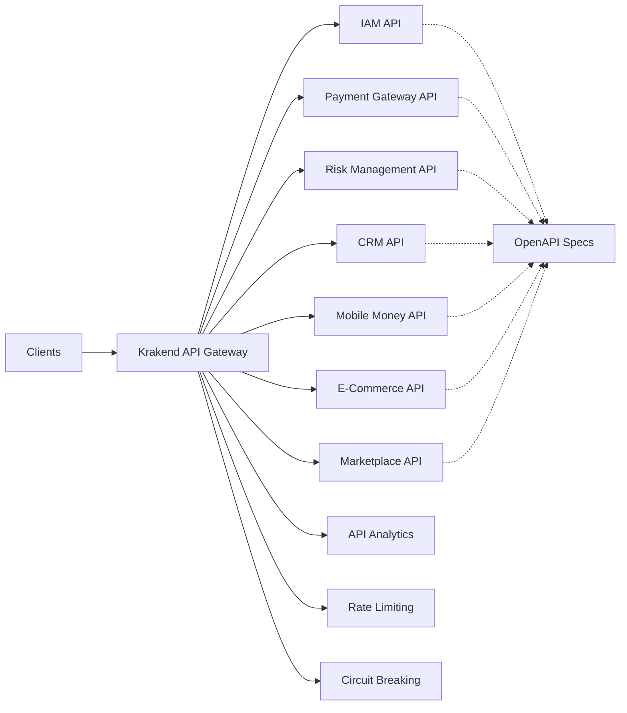
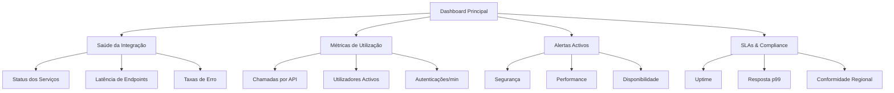

# Documento de Integração Total Avançada - IAM INNOVABIZ

| Metadata | Valor |
|----------|-------|
| Versão | 1.0.0 |
| Status | Em Desenvolvimento |
| Classificação | Confidencial |
| Data Criação | 2025-08-05 |
| Última Atualização | 2025-08-05 |
| Autor | INNOVABIZ Architecture Team |
| Aprovado por | Eduardo Jeremias |
| Responsável | Equipa de Integração |

## Índice
1. [Visão Geral da Integração](#visão-geral-da-integração)
2. [Modelo de Integração Multi-Dimensional](#modelo-de-integração-multi-dimensional)
3. [Integração com Módulos Core](#integração-com-módulos-core)
4. [Conformidade Regional e Internacional](#conformidade-regional-e-internacional)
5. [Arquitetura de Eventos](#arquitetura-de-eventos)
6. [APIs de Integração](#apis-de-integração)
7. [Observabilidade e Monitorização](#observabilidade-e-monitorização)
8. [Matriz de Integração](#matriz-de-integração)
9. [Governança de Dados](#governança-de-dados)
10. [Segurança e Compliance](#segurança-e-compliance)

## Visão Geral da Integração

A integração do módulo IAM com os demais componentes da plataforma INNOVABIZ segue uma abordagem multi-dimensional, considerando multitenancy, multi-contexto, e requisitos regionais específicos. Este documento detalha o modelo de integração avançada que permite a composição harmónica e segura dos diversos módulos e serviços da plataforma.

### Princípios de Integração

- **Zero Trust Security**: Todas as comunicações entre módulos são autenticadas e autorizadas
- **Event-Driven**: Arquitetura orientada a eventos para desacoplamento e escalabilidade
- **API-First**: Interfaces bem definidas e versionadas para todas as interações
- **Observabilidade Total**: Telemetria, logging e tracing em todas as integrações
- **Resilient by Design**: Falhas de integração são geridas através de circuit breakers e graceful degradation
- **Compliance-Driven**: Conformidade com normas internacionais e regionais incorporada na camada de integração

## Modelo de Integração Multi-Dimensional

A integração do IAM com outros módulos ocorre em múltiplas dimensões:

```mermaid
graph TD
    A[IAM Core] --- B[Dimensão Funcional]
    A --- C[Dimensão de Dados]
    A --- D[Dimensão de Processos]
    A --- E[Dimensão de Segurança]
    A --- F[Dimensão de Conformidade]
    A --- G[Dimensão Geográfica]
    A --- H[Dimensão de Tenant]
    
    B --> B1[Autenticação]
    B --> B2[Autorização]
    B --> B3[Identidade]
    
    C --> C1[Partilha de Dados]
    C --> C2[Consistência]
    C --> C3[Privacidade]
    
    D --> D1[Fluxos de Trabalho]
    D --> D2[Orquestração]
    D --> D3[Automação]
    
    E --> E1[Controlo de Acesso]
    E --> E2[Criptografia]
    E --> E3[Auditoria]
    
    F --> F1[Normas Globais]
    F --> F2[Regulamentos Regionais]
    F --> F3[Políticas Internas]
    
    G --> G1[Angola]
    G --> G2[Europa]
    G --> G3[América]
    G --> G4[CPLP/PALOP]
    G --> G5[BRICS]
    
    H --> H1[Isolamento]
    H --> H2[Herança]
    H --> H3[Federação]
```



## Integração com Módulos Core

### Integração com Payment Gateway

O IAM fornece serviços críticos de segurança e controlo de acesso para o Gateway de Pagamentos:

#### Fluxos de Integração

1. **Autenticação Forte (SCA)**:
   - Fornecimento de MFA contextual baseado em risco da transação
   - Verificação biométrica para transações acima de limites definidos
   - Autenticação adaptativa baseada em padrões de comportamento

2. **Autorização de Transações**:
   - Verificação de permissões específicas para operações financeiras
   - Aplicação de limites hierárquicos de aprovação
   - Segregação de funções para transações de alto valor

3. **Gestão de Identidade do Comerciante**:
   - Onboarding seguro e validação KYC/KYB para comerciantes
   - Gestão de credenciais de API para integração de terminais
   - Rotação automática de segredos e certificados

4. **Contratos e Acordos de Integração**:
   - Em conformidade com PSD2, PCI DSS, SEPA, BNA
   - SLAs específicos para operações de pagamento: disponibilidade 99.999%
   - Resposta máxima para autenticação: 200ms (p99)

### Integração com RiskManagement

A integração entre IAM e o módulo de Gestão de Risco permite decisões informadas baseadas em identidade:

#### Fluxos de Integração

1. **Avaliação de Risco de Identidade**:
   - Fornecimento de scores de confiança para cada autenticação
   - Detecção de anomalias em padrões de acesso
   - Histórico de geolocalização e dispositivos

2. **Autorização Baseada em Risco**:
   - Políticas dinâmicas baseadas em nível de risco actual
   - Step-up authentication quando o risco excede limites
   - Quarentena de identidades comprometidas

3. **Alimentação do Motor de Análise de Risco**:
   - Streaming de eventos de autenticação e autorização em tempo real
   - Enriquecimento de dados com contexto de sessão e dispositivo
   - Alertas de comportamento suspeito

4. **Conformidade e Reportes**:
   - Geração automática de relatórios para BNA, APD Angola
   - Evidência para auditoria de controles Basel III
   - Dashboards de risco operacional integrados

### Integração com CRM

A integração com o CRM permite uma visão 360° do cliente com autenticação e autorização apropriadas:

#### Fluxos de Integração

1. **Identidade Unificada do Cliente**:
   - Sincronização bidirecional de perfis de clientes
   - Single Sign-On para portais de cliente
   - Preferências de comunicação e consentimentos GDPR/APD

2. **Autorização Contextual**:
   - Acesso a dados de cliente baseado em relacionamento comercial
   - Visibilidade de dados sensíveis baseada em necessidade de negócio
   - Mascaramento dinâmico de informações PII/PCI

3. **Jornada do Cliente**:
   - Autenticação adaptativa em pontos críticos da jornada
   - Onboarding digital com verificação de identidade
   - Autenticação omnicanal (aplicações, call center, presencial)

4. **Integrações Regionais**:
   - Validação de documentos por região (BI Angola, CPF Brasil, etc.)
   - Adaptação a requisitos KYC específicos por país
   - Suporte a identidades digitais nacionais (IDs Mobile)

### Integração com Mobile Money

A segurança de operações Mobile Money depende criticamente dos serviços IAM:

#### Fluxos de Integração

1. **Autenticação Móvel Segura**:
   - Biometria adaptada a dispositivos (impressão digital, facial, voz)
   - Autenticação offline com tokens criptográficos
   - Proteção contra SIM swapping e roubo de dispositivo

2. **Autorização de Transações**:
   - Verificação em tempo real de limites transacionais
   - Aprovações multi-nível para transações corporativas
   - Restrições geográficas e temporais para transações

3. **Identidade do Agente**:
   - Gestão de credenciais para agentes Mobile Money
   - Hierarquia de aprovações e limites operacionais
   - Auditoria detalhada de operações de agentes

4. **Compliance Regional**:
   - Conformidade com regulamentos BNA para Mobile Money
   - Implementação de controlos AML/CFT para SADC
   - Integração com sistemas de reportes regulatórios

### Integração com E-Commerce e Marketplace

A integração com plataformas de comércio electrónico garante experiências seguras de compra:

#### Fluxos de Integração

1. **Identidade do Comprador**:
   - Login social com verificação adicional
   - Guest checkout com tokenização de identidade
   - Perfis de comprador verificados para compras B2B

2. **Verificação de Vendedores**:
   - Onboarding KYC/KYB para vendedores marketplace
   - Gestão de credenciais de API para integrações de loja
   - Classificação de risco de vendedor com base em comportamento

3. **Autorização Transacional**:
   - Políticas de aprovação baseadas em valor e categoria
   - Verificação de limites de crédito em tempo real
   - Controlos anti-fraude integrados com RiskManagement

4. **Federação de Identidades**:
   - SSO para ecossistema de parceiros
   - Partilha segura de atributos de identidade
   - Consentimento granular para uso de dados

### Integração com Observabilidade

O módulo de Observabilidade recebe telemetria enriquecida do IAM para monitorização avançada:

#### Fluxos de Integração

1. **Logging Centralizado**:
   - Eventos de autenticação/autorização com contexto completo
   - Correlação de logs entre módulos com trace IDs
   - Retenção diferenciada baseada em classificação de dados

2. **Métricas de Segurança**:
   - KPIs de autenticação (sucesso, falha, MFA)
   - Métricas de performance para decisões de autorização
   - Utilização de recursos por tenant e região

3. **Tracing Distribuído**:
   - Propagação de contexto em chamadas inter-serviço
   - Visualização de latência em fluxos de autenticação
   - Identificação de gargalos em integrações

4. **Alertas Inteligentes**:
   - Detecção de anomalias em padrões de acesso
   - Alertas baseados em SLOs de segurança
   - Notificações regionalizadas por contexto

## Conformidade Regional e Internacional

### Angola (BNA, APD Angola)

- **Identificação**: Suporte a documento de identificação angolano (BI)
- **KYC/AML**: Validação conforme Instrutivo Nº 7/2021 do BNA
- **Proteção de Dados**: Conformidade com Lei nº 22/11 (Lei de Proteção de Dados)
- **Pagamentos**: Integração com Sistema de Pagamentos de Angola (SPA) e Multicaixa

### Europa (GDPR, PSD2)

- **Proteção de Dados**: Implementação completa de requisitos GDPR
- **Autenticação**: Conformidade com SCA (Strong Customer Authentication) do PSD2
- **eIDAS**: Suporte a identificação eletrônica conforme regulamento eIDAS
- **Open Banking**: Integração com APIs de Open Banking PSD2

### BRICS (Brasil, Rússia, Índia, China, África do Sul)

- **Brasil**: Conformidade com LGPD, Resolução 4.658 do Banco Central
- **China**: Suporte à Lei de Cibersegurança e Sistema de Crédito Social
- **Índia**: Integração com Aadhaar para verificação de identidade
- **Rússia**: Conformidade com Lei Federal 152-FZ
- **África do Sul**: Integração com FICA e POPIA

### CPLP/PALOP/SADC

- **Moçambique**: Conformidade com regulamentações do Banco de Moçambique
- **Cabo Verde**: Integração com sistema SISP
- **SADC**: Interoperabilidade para transferências transfronteiriças
- **Multilinguismo**: Suporte a português, inglês, francês e línguas locais

## Arquitetura de Eventos

A comunicação assíncrona entre o IAM e outros módulos é realizada através de eventos estruturados:

### Tópicos e Eventos

| Tópico | Evento | Produtor | Consumidores | Schema | 
|--------|--------|----------|--------------|--------|
| `innovabiz.iam.user` | `user.created` | IAM | CRM, RiskMgmt, PaymentGW, MobileMoney | [Schema](schemas/user-created.avsc) |
| `innovabiz.iam.user` | `user.updated` | IAM | CRM, RiskMgmt, PaymentGW, MobileMoney | [Schema](schemas/user-updated.avsc) |
| `innovabiz.iam.auth` | `auth.login.success` | IAM | RiskMgmt, ObservaSecurity, Compliance | [Schema](schemas/auth-login-success.avsc) |
| `innovabiz.iam.auth` | `auth.login.failure` | IAM | RiskMgmt, ObservaSecurity, Fraud | [Schema](schemas/auth-login-failure.avsc) |
| `innovabiz.iam.session` | `session.created` | IAM | ObservaSecurity, Analytics | [Schema](schemas/session-created.avsc) |
| `innovabiz.iam.session` | `session.expired` | IAM | ObservaSecurity, Analytics | [Schema](schemas/session-expired.avsc) |
| `innovabiz.iam.role` | `role.assigned` | IAM | Compliance, ObservaSecurity, Audit | [Schema](schemas/role-assigned.avsc) |
| `innovabiz.payment` | `payment.initiated` | PaymentGW | IAM, RiskMgmt | [Schema](schemas/payment-initiated.avsc) |
| `innovabiz.risk` | `risk.score.updated` | RiskMgmt | IAM, PaymentGW | [Schema](schemas/risk-score-updated.avsc) |
| `innovabiz.compliance` | `compliance.alert` | Compliance | IAM, RiskMgmt, Audit | [Schema](schemas/compliance-alert.avsc) |

### Esquema de Evento (Exemplo)

```json
{
  "id": "evt-1234567890",
  "type": "innovabiz.iam.user.created",
  "time": "2025-08-05T13:14:15.123456Z",
  "datacontenttype": "application/json",
  "source": "iam-service",
  "subject": "user-123456",
  "tenantId": "tenant-789",
  "correlationId": "corr-abcdef",
  "data": {
    "userId": "user-123456",
    "username": "johndoe",
    "userType": "INDIVIDUAL",
    "status": "ACTIVE",
    "email": "john.doe@example.com",
    "emailVerified": true,
    "createdAt": "2025-08-05T13:14:15.123456Z",
    "regionCode": "AO",
    "accessLevel": "MEDIUM"
  },
  "metadata": {
    "version": "1.0",
    "classification": "RESTRICTED",
    "retentionPeriod": "P7Y"
  }
}
```

## APIs de Integração

### API Gateway Centralizado (Krakend)

O IAM expõe suas APIs através do Gateway API centralizado da plataforma INNOVABIZ, utilizando o Krakend como intermediário:



### Políticas de API

| Política | Descrição | Aplicabilidade |
|----------|-----------|---------------|
| Authentication | JWT, mTLS, API Keys | Todas APIs |
| Rate Limiting | Baseado em tenant e criticidade | Todas APIs |
| Circuit Breaking | Protecção contra falhas em cascata | APIs críticas |
| Response Caching | Cache para respostas frequentes | APIs de leitura |
| Request Validation | Validação de schema de entrada | Todas APIs |
| Response Transformation | Formatação de respostas | Conforme necessidade |
| Timeout | Tempos limite configurados por operação | Todas APIs |
| Retry | Políticas de retry com backoff | APIs assíncronas |
| Logging | Logs estruturados para auditoria | Todas APIs |
| Metrics | Métricas de utilização e performance | Todas APIs |

### API do IAM para Integração

| Endpoint | Método | Descrição | Consumidores |
|----------|--------|-----------|--------------|
| `/api/v1/auth/token` | POST | Obtenção de tokens de acesso | Todos módulos |
| `/api/v1/auth/introspect` | POST | Validação de tokens | Todos módulos |
| `/api/v1/auth/jwks` | GET | Chaves públicas para verificação | Todos módulos |
| `/api/v1/users/verify` | POST | Verificação de identidade | PaymentGW, MobileMoney |
| `/api/v1/permissions/check` | POST | Verificação de permissões | Todos módulos |
| `/api/v1/roles/hierarchy` | GET | Obtenção de hierarquia de funções | CRM, Compliance |
| `/api/v1/mfa/challenge` | POST | Requisição de desafio MFA | PaymentGW, E-Commerce |
| `/api/v1/mfa/verify` | POST | Verificação de resposta MFA | PaymentGW, E-Commerce |
| `/api/v1/tenants/{tenantId}/users` | GET | Utilizadores por tenant | CRM, Analytics |
| `/api/v1/audit/events` | GET | Eventos de auditoria | Compliance, Observability |

## Observabilidade e Monitorização

### Painel de Controlo de Integração



### Telemetria e KPIs

| Categoria | Métrica | Threshold | Alerta |
|-----------|---------|-----------|--------|
| Autenticação | Taxa de Sucesso | <98% | Crítico |
| Autenticação | Tempo de Resposta (p99) | >200ms | Alerta |
| Autorização | Decisões/segundo | >1000 | Monitorar |
| Autorização | Tempo de Decisão (p99) | >10ms | Alerta |
| Integração | Latência API Gateway | >50ms | Alerta |
| Integração | Erros 5xx | >0.1% | Crítico |
| Eventos | Lag de Consumo | >5s | Alerta |
| Eventos | Mensagens em Dead Letter | >0 | Crítico |
| Regional | Conformidade BNA | <100% | Crítico |
| Regional | Conformidade GDPR | <100% | Crítico |
| Regional | Conformidade PCI DSS | <100% | Crítico |

## Matriz de Integração

### Matriz de Responsabilidades (RACI)

| Atividade de Integração | IAM | PaymentGW | Risk | CRM | MobileMoney | E-Commerce | Compliance | Ops |
|-------------------------|-----|-----------|------|-----|-------------|------------|------------|-----|
| Autenticação de Utilizadores | R | I | I | I | I | I | C | I |
| Autorização de Transações | R | A | C | I | A | A | C | I |
| Gestão de Identidades | R | C | C | A | C | C | C | I |
| Verificação KYC | C | C | A | R | C | C | R | I |
| Detecção de Fraude | C | C | R | I | C | C | I | I |
| Monitorização de Segurança | A | C | C | I | I | I | C | R |
| Gestão de Consentimentos | R | C | I | A | C | C | A | I |
| Emissão de Relatórios Regulatórios | C | C | C | I | I | I | R | I |
| Onboarding de Clientes | C | I | C | R | C | C | C | I |
| Aprovação de Limites | C | A | R | I | A | I | C | I |

### Matriz de Entidades e Serviços

| Entidade | IAM | PaymentGW | Risk | CRM | MobileMoney | E-Commerce | Marketplace |
|----------|-----|-----------|------|-----|-------------|------------|-------------|
| Utilizador | Master | Replica | Leitura | Replica | Leitura | Leitura | Leitura |
| Cliente | Leitura | Leitura | Leitura | Master | Leitura | Replica | Replica |
| Conta | Leitura | Master | Leitura | Replica | Replica | Leitura | Não Acede |
| Transação | Não Acede | Master | Leitura | Leitura | Replica | Replica | Leitura |
| Permissão | Master | Não Acede | Não Acede | Não Acede | Não Acede | Não Acede | Não Acede |
| Merchant | Leitura | Replica | Leitura | Leitura | Replica | Replica | Master |
| Sessão | Master | Leitura | Leitura | Leitura | Leitura | Leitura | Leitura |
| Risco | Leitura | Leitura | Master | Não Acede | Leitura | Leitura | Leitura |

## Governança de Dados

### Classificação de Dados Partilhados

| Categoria | Classificação | Retenção | Criptografia | Mascaramento | Auditoria |
|-----------|--------------|----------|--------------|--------------|-----------|
| PII Básico | Confidencial | 7 anos | Em Trânsito | Parcial | Alta |
| PII Sensível | Restrito | 7 anos | Em Trânsito + Repouso | Total | Total |
| Dados Financeiros | Restrito | 10 anos | Em Trânsito + Repouso | Total | Total |
| Credenciais | Secreto | Enquanto válido | E2E | Total | Total |
| Dados Transacionais | Restrito | 10 anos | Em Trânsito + Repouso | Parcial | Total |
| Metadados | Interno | 3 anos | Em Trânsito | Nenhum | Normal |
| Telemetria | Interno | 1 ano | Em Trânsito | Parcial | Normal |
| Configuração | Confidencial | Permanente | Em Trânsito | Nenhum | Alta |

### Políticas de Partilha de Dados

- **Data Minimization**: Apenas atributos necessários são compartilhados
- **Privacy by Design**: Privacidade incorporada nas integrações desde o início
- **Need-to-Know**: Acesso baseado em necessidade legítima
- **Purpose Limitation**: Dados usados apenas para propósito declarado
- **Regional Compliance**: Adaptação a requisitos regionais de privacidade

## Segurança e Compliance

### Matriz de Controles de Segurança

| Framework | Controle | Implementação | Módulos Afetados |
|-----------|----------|---------------|------------------|
| ISO 27001 | A.9.2 | Gestão de acesso de utilizador | Todos |
| PCI DSS 4.0 | 8.3.2 | MFA para acesso a dados de cartão | PaymentGW, E-Commerce |
| GDPR | Art. 32 | Medidas técnicas de proteção | Todos |
| Basel III | BCBS 239 | Agregação de dados de risco | Risk, IAM, Compliance |
| BNA | Aviso 2/2020 | Segurança cibernética | Todos |
| APD Angola | Lei 22/11 | Proteção de dados pessoais | Todos |
| TOGAF 10 | Security Architecture | Padrões de desenho seguro | Todos |
| COBIT 2019 | DSS05 | Gestão de serviços de segurança | Todos |

### Matriz de Responsabilidade de Compliance

| Requisito | Angola | Europa | Brasil | SADC | CPLP | China | EUA |
|-----------|--------|--------|--------|------|------|-------|-----|
| KYC | BNA Aviso 22/2012 | AMLD5 | BACEN 4.753 | FATF | AML/CFT | PBOC Order 235 | FinCEN CDD |
| Autenticação | BNA Aviso 03/2019 | PSD2 SCA | BC 4.658 | SARB | - | CBRC Rules | FFIEC |
| Proteção de Dados | Lei 22/11 | GDPR | LGPD | POPIA | - | PIPL | CCPA/CPRA |
| Reportes | BNA Instrutivo 05/2018 | EBA GLs | BACEN 3.694 | - | - | CBIRC | Fed Regulation |
| Armazenamento | Lei Comunicações | GDPR Art.5 | LGPD Art.40 | ECT Act | - | CSL Art.37 | State Laws |
| Incidentes | - | NIS2 | LGPD Art.48 | POPIA Sec.22 | - | CSL Art.42 | State Breach Laws |

---

## Próximos Passos de Integração

1. **Curto Prazo (1-3 meses)**:
   - Implementação completa das APIs de integração IAM
   - Configuração dos tópicos Kafka e schemas de eventos
   - Desenvolvimento de adaptadores para PaymentGW e RiskManagement
   - Testes de integração inicial em ambiente sandbox

2. **Médio Prazo (3-6 meses)**:
   - Expansão para integração com MobileMoney e CRM
   - Implementação de dashboards de monitoramento
   - Testes de compliance regionais
   - Otimização de performance em integrações críticas

3. **Longo Prazo (6-12 meses)**:
   - Integração com E-Commerce e Marketplace
   - Implementação de ML para detecção de anomalias
   - Federação de identidades com parceiros externos
   - Expansão para novos mercados regionais

---

© 2025 INNOVABIZ - Todos os direitos reservados